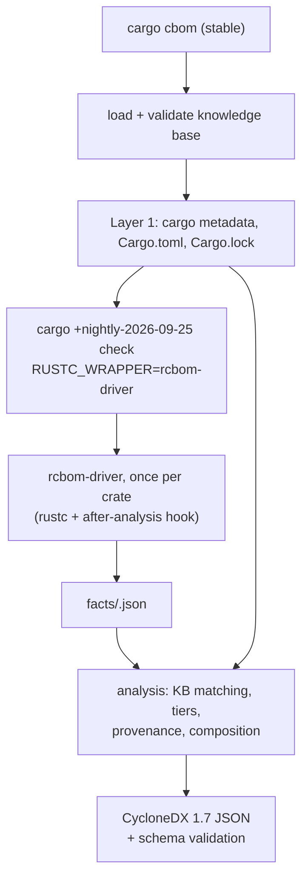

# cargo-cbom proof of concept: the complete workflow

*Written 9 October 2026 for cargo-cbom 0.1.0 (driver built on `nightly-2026-09-25`, rustc
1.100.0-nightly f7575a9da), knowledge base 0.2.0, facts version 7. Everything below describes the code in this
repository as it is; where a statement depends on the compiler version, the version is named.*

This document explains, from first principles, how the tool turns a Rust project into a
Cryptography Bill of Materials (CBOM). It assumes you can read Rust, but it does not assume you
know how Cargo drives the compiler, what happens inside `rustc`, what MIR is, or how CycloneDX
models cryptography. Part I builds that background. Part II follows one run of the tool from
the command line to the output file, step by step. Part III documents the formats (knowledge
base, facts, CBOM). Part IV works through a complete example with real compiler output. Part V
covers testing, evaluation and the design decisions.

Contents

- Part I. Background
  - 1. What the tool produces
  - 2. Packages, crates and Cargo
  - 3. How Cargo runs the compiler
  - 4. Toolchains, nightly features and the sysroot
  - 5. Inside rustc: from source text to machine code
  - 6. Source positions: spans
  - 7. Generics, traits and monomorphization
  - 8. MIR, the representation the tool reads
  - 9. Statics, consts and compile-time evaluation
  - 10. Crate metadata: what a compiled dependency carries
  - 11. Naming things across compilations
  - 12. Writing a compiler driver: rustc_driver, rustc_public and rustc_middle
  - 13. CycloneDX 1.7 and the Cryptography Registry
- Part II. One run, step by step
  - 14. Architecture
  - 15. Starting `cargo cbom`
  - 16. Layer 1: manifests and the build graph
  - 17. Preparing Layer 2
  - 18. The driver inside one compiler invocation
  - 19. The per-item scan
  - 20. Static and const initializers
  - 21. The reachability walk
  - 22. From span to file, line and column
  - 23. Argument origins (intraprocedural data flow)
  - 24. The analysis: from facts to assets
  - 25. Provenance classification
  - 26. Assembling and validating the CBOM
  - 27. `cargo cbom verify`
- Part III. Formats
  - 28. The knowledge base (`kb/seed.toml`)
  - 29. The facts files
  - 30. Reading the CBOM
- Part IV. A complete example
  - 31. One line of code, followed through every stage
- Part V. Testing, evaluation and design
  - 32. Tests, fixtures and scripts
  - 33. Design decisions and why
  - 34. Known limitations
  - 35. Glossary

---

# Part I. Background

## 1. What the tool produces

A **Software Bill of Materials (SBOM)** lists the components a piece of software is built from.
A **Cryptography Bill of Materials (CBOM)** extends this with *cryptographic assets*:
- the algorithms the software uses (AES-256-GCM, SHA-256, ...)
- their parameters (key size, nonce size, mode, curve)
- the protocols (TLS)
- the key material (a private key, a secret)

For each asset it records where in the source code it appears.

The tool writes the CBOM in **CycloneDX 1.7**, a JSON standard (section 13). For each asset it
records:

- the registry name and properties of the algorithm (`AES-256-GCM`, family `AES`, mode `gcm`, parameter set `256`);
- every place in the source where it appears: file, line, column, the function or static named there;
- what the code does with it at that place (encrypt, tag, keyderive, ...);
- whether that place is *reachable* from the program's entry point (`main`), or only *present* in a compiled crate;
- where the key material handed to it comes from (hard-coded, environment variable, random number generator, parameter, ...).

The tool has two layers, numbered as in the design document (`docs/rust-cbom-proposal2.md`):

- **Layer 1** reads the project's manifests and lockfile. It finds which cryptographic libraries are part of the build, which backend their features select, which native libraries they link, and the manifest line where each one enters the build. It runs no project code.
- **Layer 2** compiles the project with a modified compiler that records, in every crate, the places where code names a cryptographic function, type or constant. It then decides which algorithms these places are, with their parameters, uses, reachability and key provenance.

## 2. Packages, crates and Cargo

**Crate.** The unit the Rust compiler compiles in one invocation. A crate is a tree of modules
rooted at one source file (`src/main.rs` for a binary, `src/lib.rs` for a library). The compiler
turns one crate into one output file: an executable, or a library file (`.rlib`) that other
crates can use.

**Package.** The unit Cargo, Rust's build tool and package manager, works with. A package is a
directory with a `Cargo.toml` manifest. It contains one or more crates, called *targets*: at
most one library, plus any number of binaries, examples, tests and benchmarks. A package has a
*name* (`aes-gcm`) and a *version* (`0.10.3`). Its library crate has a *crate name*, which is
the package name with `-` replaced by `_` (`aes_gcm`), because `-` is not allowed in Rust
identifiers. The tool needs both names, and section 11 explains how they are linked.

**Workspace.** A set of packages built together, sharing one `Cargo.lock` and one output
directory (`target/`). The packages the user works on are the workspace *members*. Everything
else is a dependency.

**Dependencies** are declared in `Cargo.toml`:

```toml
[dependencies]
ring = "0.17"                                     # a version requirement
rustls = { version = "0.23", default-features = false, features = ["ring", "std"] }

[build-dependencies]                              # used only by the build script
cc = "1"

[dev-dependencies]                                # used only by tests, examples, benchmarks
proptest = "1"

[target.'cfg(unix)'.dependencies]                 # only on some platforms
libc = "0.2"
```

So there are three *kinds* of dependency:
- **normal:** linked into the program
- **build:** compiled for and run by the build script
- **development:** tests, examples and benchmarks only

A dependency can also be limited to some target platforms.

**Features** are named, optional parts of a package (`ring`, `std`, `tls12`). A package's
`[features]` table lists them, and the `default` feature lists those enabled unless a dependent
says `default-features = false`. Features can enable optional dependencies. For rustls 0.23.40,
for example, the default features are `aws_lc_rs`, `logging`, `prefer-post-quantum`, `std` and
`tls12`. The feature `aws_lc_rs` enables the dependency `aws-lc-rs`, the cryptographic backend.
Which features are enabled changes which algorithms are in the program, so Layer 1 reads them.

**Resolution and `Cargo.lock`.** A version requirement (`"0.17"`) admits many versions. Cargo
*resolves* all requirements of all packages into one concrete version per package, and writes
the result to `Cargo.lock`:

```toml
[[package]]
name = "ring"
version = "0.17.14"
source = "registry+https://github.com/rust-lang/crates.io-index"
checksum = "..."
dependencies = ["cc", "cfg-if", "getrandom", "libc", "untrusted", "windows-sys"]
```

Two incompatible requirements can make Cargo include two versions of the same package (Phase
0's realapp has `sha2` 0.10.9 and 0.11.0). They are two different crates to the compiler.

**Build scripts.** A package may have a `build.rs`. Cargo compiles it as a separate small
program (crate name `build_script_build`) and *runs* it before compiling the package, typically
to compile C code or generate Rust code. Build scripts execute arbitrary code on the build
machine. This is why Layer 2 must be run on trusted code, or inside a container.

**Procedural macros** are compiler plugins written in Rust (crate type `proc-macro`), loaded
into the compiler while it compiles the crates that use them. They also execute on the build
machine.

**`links`.** A package that binds a native (C) library declares `links = "name"` in its
manifest. ring declares `links = "ring_core_0_17_14_"`: it contains C and assembly code compiled
by its build script. The tool reports such packages as native components, because their code is
outside what it analyses.

**`cargo metadata`** prints, as JSON:
- every package in the dependency graph, with its manifest path, targets, `links` value and declared dependencies
- the *resolve* graph: for each package the concrete packages it depends on, with the dependency kinds, plus the features enabled for it

It runs no build script. With `--filter-platform <triple>` it drops dependencies that do not
apply to that platform. Layer 1 is built on this command.

## 3. How Cargo runs the compiler

Cargo does not compile anything itself. For every crate in the build it starts a separate
process of the Rust compiler, `rustc`, with a long command line. Cargo shows these with
`cargo build -v`. A typical one, shortened:

```
rustc --crate-name aes_gcm --edition=2021 src/lib.rs --crate-type lib \
      --emit=dep-info,metadata,link -C debuginfo=2 \
      -C metadata=8f7a... --out-dir target/debug/deps \
      --extern aead=target/debug/deps/libaead-1c2d....rmeta ... \
      --cfg 'feature="aes"' --cfg 'feature="alloc"' ...
```

The pieces the tool relies on:

- `--crate-name aes_gcm` and `--crate-type lib|bin|proc-macro|...` say what is being compiled. Build scripts are compiled with the crate name `build_script_build` (or `build_script_<name>`).
- `--emit` says what to produce. `cargo build` asks for `link` (the actual library or executable). `cargo check` asks only for `metadata` and `dep-info`: rustc analyses the code and writes a `.rmeta` file (section 10), but generates no machine code. `cargo check` is therefore much faster, and it is what the tool runs. Proc macros and build scripts are still fully compiled under `cargo check`, because they must run.
- `--cfg 'feature="..."'` passes the enabled features.

Cargo also sets **environment variables** for each rustc process. The tool reads:

| variable | value |
|---|---|
| `CARGO_PKG_NAME` | the package name (`aes-gcm`) |
| `CARGO_PKG_VERSION` | the package version (`0.10.3`) |
| `CARGO_MANIFEST_DIR` | the directory containing the package's `Cargo.toml` |
| `CARGO_PRIMARY_PACKAGE` | set (to `1`) only when the package is one the user asked to build: a workspace member, not a dependency |

**The working directory** of each rustc process is the workspace root for workspace members,
and the source file on the command line is relative to it (`src/main.rs`, or
`crates/foo/src/lib.rs` for a member in a subdirectory). For a registry dependency, the working
directory is the package's own directory, and the source file is given as an absolute path
(`/home/<user>/.cargo/registry/src/index.crates.io-.../ring-0.17.14/src/lib.rs`). Both are visible
in the facts files the driver writes: micro's records the working directory `fixtures/micro` and
files such as `src/main.rs`; ring's records `.../ring-0.17.14` and absolute file names. This
matters because rustc reports source positions with the path it was given (section 6).

**`RUSTC_WRAPPER`.** If this environment variable is set, Cargo runs
`$RUSTC_WRAPPER <path to rustc> <arguments...>` instead of `rustc <arguments...>`, for every
compiler invocation. That includes the version queries Cargo makes (`rustc -vV`,
`rustc - --print=file-names ...`). The wrapper can inspect and change the arguments, run the
real compiler, or replace it. Tools like Clippy, Miri and Kani use this mechanism, and so does
this one. Its driver (section 18) is installed as `RUSTC_WRAPPER`.

**Target directory and caching.** Cargo keeps outputs in a target directory and recompiles a
crate only when its inputs change: sources, flags, dependencies, environment. The tool uses a
separate target directory, so its builds never mix with the project's normal ones (section 17).

## 4. Toolchains, nightly features and the sysroot

A **toolchain** is a set of matching tools: `rustc`, `cargo`, the standard library, and optional
components. `rustup` installs toolchains side by side and selects one per invocation, with
`cargo +nightly-2026-09-25 ...` or `rustc +stable ...`.

- **stable** toolchains (`1.97.1`) only accept stable language features and compiler flags.
- **nightly** toolchains are built every night from the development branch. They accept unstable (`-Z...`) compiler flags and unstable library features (`#![feature(...)]`). A nightly is identified by its date: `nightly-2026-09-25`. The tool pins exactly one, because the compiler's internal interfaces change between nightlies.

**Components.** The toolchain's optional parts. The tool needs, for its pinned nightly:
- **`rustc-dev`:** the compiler's own libraries (`librustc_driver-*.so` and the `rustc_*` crates' metadata), so a program can link against the compiler and call it as a library. It also ships the compiler's sources, which is how this document's statements about rustc internals were checked.
- **`rust-src`:** the standard library's sources.
- **`llvm-tools`:** LLVM utilities, conventionally installed with rustc-dev.
- **`clippy`, `rustfmt`:** the lint and formatting tools, enforced on this repository.

**The sysroot** is the toolchain's root directory (`rustc --print sysroot`). It holds the
precompiled standard library (`lib/rustlib/<target>/lib/libstd-*.rlib` and friends) and the
compiler's shared library (`lib/librustc_driver-*.so`). A program that links the compiler
library needs two things:
- **`LD_LIBRARY_PATH`:** on Linux, set to `<sysroot>/lib`, so that the dynamic loader finds `librustc_driver-*.so`.
- **`--sysroot`:** the sysroot the compiler should use. Without the flag, rustc works it out itself (`rustc_session/src/filesearch.rs`, `default_sysroot`): if the program was started through a symbolic link, it looks two directories above that link; otherwise it looks two directories above the file of the loaded `librustc_driver` library. For the driver, the library comes from `<sysroot>/lib`, so the default would already be right. The driver passes `--sysroot` explicitly anyway, so that the standard library a crate is compiled against is always the one of the toolchain `cargo-cbom` asked `rustup` for. It does not then depend on how the dynamic loader found the library.

**`#![feature(rustc_private)]`** is the nightly feature that lets a crate use the compiler's
internal crates (`extern crate rustc_middle;`). The driver crate needs it, so it can only be
built with a nightly that has `rustc-dev`. Everything else in the repository builds on stable.

## 5. Inside rustc: from source text to machine code

rustc processes a crate in phases. Each phase produces a representation of the program that
the next phase consumes.

1. **Lexing and parsing.** The source text becomes tokens, then an **AST** (abstract syntax tree): a tree that mirrors the source syntax. Comments are discarded here; they never reach any later representation.
2. **Macro expansion and name resolution.** Macros (`vec![..]`, `println!(..)`, `#[derive(Clone)]`, attribute macros) are expanded into ordinary code, and every name is resolved to the item it denotes. Expansion records, for each generated piece of code, which macro produced it and where it was called (section 6).
3. **HIR** (high-level intermediate representation). A desugared AST. `for` loops, `?`, `async`, `if let` and similar constructs are rewritten into simpler forms (loops with `match`, calls to `Try::branch`, state machines).
4. **Type checking.** Every expression gets a type, every method call is resolved to the method it calls, and generic arguments are inferred. The result is stored alongside the HIR (*typeck results*).
5. **THIR, then MIR.** The typed tree is lowered to **MIR** (mid-level intermediate representation, section 8): a control-flow graph of simple statements, close to what the machine does but still with Rust types. Borrow checking runs on MIR.
6. **MIR optimization.** A pipeline of transformations: constant propagation, simplification, and at higher optimization levels inlining (section 8.6). The result is the *optimized MIR* of each function.
7. **Monomorphization collection.** Generic functions are turned into concrete copies, one per set of generic arguments actually used (section 7). The *mono item collector* walks from the entry points and decides which concrete functions must be generated.
8. **Code generation and linking.** Each concrete function's MIR is translated to LLVM IR, optimized by LLVM, and assembled to machine code; the linker produces the executable.

`cargo check` stops after step 6 (plus writing metadata). Steps 7 and 8 do not run.

**Queries and `TyCtxt`.** rustc does not run these phases as fixed passes over the whole crate.
It computes everything on demand through *queries*: "the type of this item", "the optimized MIR
of this function", "the vtable entries of this trait for this type". Queries are cached, and
can be asked for items of other crates (answered from their metadata, section 10). All queries
hang off one object, the **type context**, `TyCtxt<'tcx>`. A tool that has a `TyCtxt` can ask
the compiler anything the compiler knows about the crate being compiled and its dependencies.

**"After analysis".** rustc lets an embedding program run code at fixed points of a
compilation. The tool runs its analysis *after analysis*, the point at which type checking and
borrow checking of the whole crate have succeeded. At that point all MIR can be requested.

## 6. Source positions: spans

Every piece of every representation in rustc carries a **span**: the region of source code it
came from. A span is a pair of byte offsets, `lo` and `hi`, into one global address space that
concatenates all source files the compilation has loaded. It also holds a *syntax context*,
which records macro expansion (below).

The **source map** owns the loaded files and converts a byte offset into:
- a file name: the path as the compiler was given it, relative for the crate's own files, absolute for files of dependencies loaded from the registry;
- a line number, 1-based;
- a column, 1-based, counted in characters (not bytes) from the start of the line.

Two consequences:
- **Comments and formatting are irrelevant.** A span is an offset into the file as it is on disk. A comment spanning ten lines simply moves later code ten lines down, and the span reports the true line.
- **Every MIR statement knows its source position,** even after all the transformations of section 5.

**Macro expansion.** When a macro expands, its output tokens get spans too. Tokens the macro
*copied from its input* keep their original spans: in `hash_all!(data)`, the `data` inside the
expansion points at `data` in the call. Tokens the macro *wrote itself* get a span inside the
macro's definition, with a syntax context saying "produced by expansion E". For each expansion E
the compiler keeps **expansion data**:
- `call_site`: the span of the macro invocation (`hash_all!(...)`, `#[derive(Clone)]`)
- `kind`: one of three
  - `Macro(Bang, name)`: a function-like macro `name!(...)`
  - `Macro(Attr, name)`: an attribute macro
  - `Macro(Derive, name)`: a derive
  - `Desugaring(...)`: a compiler-introduced rewrite, such as `?`, `for` or `async`
- the macro's definition site

Expansions nest: `vec![...]` used inside `hash_all!` has a call site that is itself inside an
expansion. `span.from_expansion()` says whether a span was produced by expansion.
`span.source_callsite()` follows call sites outwards until it reaches the user's source: the
outermost invocation. Section 22 shows how the tool uses this.

## 7. Generics, traits and monomorphization

**Generic functions.** `fn seal<A: Aead + AeadCore + KeyInit>(key: &[u8], msg: &[u8]) -> Vec<u8>`
is written once for any type `A` implementing three traits. In its body, a call like
`A::new_from_slice(key)` cannot be resolved to a specific function: which `new_from_slice` runs
depends on `A`. The call is to the *trait method* `<A as KeyInit>::new_from_slice`.

**Instances.** At a call site `seal::<Aes256Gcm>(..)`, `A` is known. A (definition, generic
arguments) pair is an **instance**: `seal::<Aes256Gcm>` is one instance of `seal`,
`seal::<ChaCha20Poly1305>` another. **Monomorphization** substitutes the generic arguments into
the body ("instantiates" it). Inside `seal::<Aes256Gcm>` the call becomes
`<AesGcm<Aes256, U12, U16> as KeyInit>::new_from_slice`, which **resolves** to one specific
function: the `KeyInit` implementation for `AesGcm`.

This is why the tool reads monomorphized code. In RustCrypto the algorithm *is* a type
parameter, so in generic code the algorithm only exists per instance.

**Type aliases and defaults vanish.** `Aes256Gcm` is a type alias for
`AesGcm<Aes256, U12>`, and `AesGcm` has a third parameter with a default
(`TagSize = U16`). The compiler's types contain no aliases and always list every argument,
defaults included: `AesGcm<Aes256, UInt<UInt<UInt<UInt<UTerm, B1>, B1>, B0>, B0>, UInt<...>>`.

**typenum.** Older RustCrypto crates encode sizes as *types*, through the `typenum` crate, so
that sizes can be checked at compile time. A number is a binary chain: `UTerm` is 0, and
`UInt<U, B>` is `2 * U + B`, where `B` is `B0` (0) or `B1` (1). So:

```
UInt<UInt<UInt<UInt<UTerm, B1>, B1>, B0>, B0>
  = 2*(2*(2*(2*0 + 1) + 1) + 0) + 0
  = 2*(2*(2*1 + 1)) = 2*(2*3) = 12
```

That is the 12-byte nonce of AES-GCM. The analysis decodes these chains (section 24.4).

**Traits and trait objects.** A *trait object* `dyn Sealer` is a value whose concrete type is
only known at run time. It is a pair of pointers: one to the data, one to a **vtable**, a
table of function pointers, one per method of the trait, plus the type's size, alignment and
destructor. A call `s.seal(msg)` on a `dyn Sealer` jumps through the vtable: a *virtual call*.
Which functions *can* be called is decided where a concrete value is turned into a trait
object. That conversion is an **unsizing coercion**: `Box<AesSealer>` becomes
`Box<dyn Sealer>`, `&T` becomes `&dyn Trait`. At that point the compiler builds the vtable for
that concrete type. The tool does what rustc's own collector does: wherever it sees an unsizing
to `dyn Trait`, it adds every method of that vtable to the reachable set (section 21).

**Closures** are anonymous types implementing the `Fn`, `FnMut` or `FnOnce` traits. Calling a
closure is a call to `FnOnce::call_once` (or `call`, `call_mut`) on the closure type, which
resolves to the closure's body.

**Function pointers.** `let g: fn(&[u8]) -> Vec<u8> = hash;` turns the function item `hash`
into a pointer. This conversion is called **reification**, and it is a cast in MIR. Calling `g`
is an indirect call; to know what can be called, the tool records the reified function at the
cast.

**Drop glue.** When a value goes out of scope, its destructor runs: the `Drop` implementation if
any, then the fields'. The compiler generates this code, *drop glue*, per type
(`drop_in_place::<T>`).

**Shims.** Some instances have no body written by anyone; the compiler generates their MIR on
request. They are called *shims*:
- drop glue
- the *vtable shim* that adapts a by-value `FnOnce::call_once` to being called through a vtable
- the *closure-once shim* that calls an `Fn` closure as `FnOnce`
- function-pointer shims

`InstanceKind` distinguishes:
- `Item` (a user-written body)
- `Shim`
- `Virtual` (a vtable slot, resolved only at run time)
- `Intrinsic` (a compiler built-in such as `abort` or `atomic_xadd`)

## 8. MIR, the representation the tool reads

### 8.1 Bodies, locals, blocks

The MIR of a function (its **body**) consists of:

- **Locals**, numbered `_0`, `_1`, .... `_0` holds the return value; `_1` to `_n` are the function's `n` arguments; the rest are temporaries and user variables. Each has a type.
- **Basic blocks**, `bb0`, `bb1`, ...: straight-line lists of **statements**, each ending in one **terminator** that transfers control.

**Statements** include:
- `Assign(place, rvalue)`: compute a value, store it
- `StorageLive` / `StorageDead`: the life range of a local
- and a few others the tool ignores

**Terminators** include:
- `Call { func, args, destination, target }`: call `func` with `args`, store the result in `destination`, continue at `target`. **Every function call is a terminator**, so calls are easy to find.
- `Drop { place, ... }`: run drop glue on a place.
- `SwitchInt`: branch (from `if`, `match`).
- `Return`, `Goto`, `Assert`, `Unreachable`.

### 8.2 Places, operands, rvalues

- A **place** is a memory location: a local, plus a *projection* (field `.0`, dereference `*`, index `[i]`).
- An **operand** is a value used by a statement:
  - `Copy(place)` or `Move(place)`: read a place
  - `Constant(c)`: a constant
- An **rvalue** is the right-hand side of an assignment:
  - `Use(operand)`
  - `Ref(region, kind, place)`: `&place`, or `&mut place` when the kind is `Mut`
  - `AddressOf(kind, place)`: a raw pointer
  - `Cast(kind, operand, type)`
  - `Repeat(operand, n)`: `[x; n]`
  - `Aggregate(kind, operands)`: an array, tuple, struct or closure built from parts
  - `BinaryOp`, `UnaryOp`, `Discriminant`, `Len`, ...

**Casts that matter to the tool:**
- `PointerCoercion(ReifyFnPointer)`: a function item to a function pointer
- `PointerCoercion(ClosureFnPointer)`: a non-capturing closure to a function pointer
- `PointerCoercion(Unsize)`: an unsizing coercion, such as `Box<T>` to `Box<dyn Trait>`

### 8.3 Constants and allocations

A constant operand carries its own span and a value. The value can be:

- **evaluated** (`Val`): plain bytes, or, if the constant contains pointers, an **allocation**: a block of bytes plus **provenance**, the list of offsets in it that hold pointers, and what each pointer points to. Each pointer's target is a **global allocation**, one of:
  - `Static(def)`: a static item, such as `&ring::aead::AES_256_GCM`
  - `Function(instance)`: a function pointer
  - `VTable(type, trait)`: a vtable for that type and trait
  - `Memory(allocation)`: anonymous constant memory, which may itself contain pointers
- **unevaluated** (`Unevaluated`): a reference to a named `const` item, or to a *promoted* constant (below), whose value has not been computed into this body yet.

`const {alloc23: &ring::aead::Algorithm}` in printed MIR (section 31) is an evaluated
constant: a pointer whose provenance is allocation 23, which the compiler's MIR printer shows is
`(static: AES_256_GCM)`.

### 8.4 Promoted constants

In `let r = &[0u8; 12];` or `f(&AES_256_GCM)`, the compiler may move the referenced value
into a separate constant, so the reference can live forever (`'static`). This is called
**promotion**. The moved value becomes a small MIR body of its own, a *promoted*, numbered per
function (`main::promoted[0]`). The function then refers to it through an unevaluated constant.
Code that needs to see *what* a promoted refers to (a named `const`, for instance) must read
the promoted's own MIR.

### 8.5 Generic and monomorphic MIR

The MIR stored for a function is **generic**: it contains the generic parameters (`A`), and
calls like `<A as KeyInit>::new_from_slice` stay unresolved. To get the MIR of an *instance*,
the compiler substitutes the arguments into the generic MIR. `rustc_public`'s
`Instance::body()` does exactly that, and also evaluates every constant in it
("monomorphized and all constants evaluated").

### 8.6 MIR optimization levels: GVN and inlining

How much the MIR is optimized depends on the flag `-Zmir-opt-level`. When it is not given,
rustc uses 1 when the optimization level (`-C opt-level`) is 0, as in a debug build, and 2
otherwise (`rustc_session/src/config.rs`, `OptLevel::mir_opt_level`). Two passes that run only
at MIR opt-level 2 or higher change what the tool can see.

**GVN** (global value numbering, `rustc_mir_transform/src/gvn.rs`, enabled at level >= 2).
It finds operands whose value is known at compile time and replaces them by constants.
The constants it creates have no source position: `try_as_constant` builds them with
`span: DUMMY_SP`, the compiler's "no location" span. This includes the function operand of
every call, whose value, the function item, is always known. So at level 2 no call has a source
position. The printed MIR shows it: minisign's call `scrypt::scrypt(..)` at
`src/secret_key.rs:138` has its callee printed with `+ span: no-location` at level 2, and with
`+ span: src/secret_key.rs:138:9: 138:23` at level 1.

**The MIR inliner** (`rustc_mir_transform/src/inline.rs`) replaces a call by the callee's body,
and with it the call site. Its rule, unless `-Zinline-mir` overrides it:
- never at MIR opt-level 0 or 1;
- at level 2, only when the optimization level is 2 or 3 *and* incremental compilation is off;
- always at level 3 or higher.

A separate pass, `ForceInline`, always inlines functions marked `#[rustc_force_inline]`. That
is one of the compiler's internal `rustc_*` attributes (`rustc_feature/src/builtin_attrs.rs`),
not something crypto crates use.

**Why this matters.** A project can raise the optimization level even for debug builds;
minisign 0.10.0 has `[profile.dev] opt-level = 3`. Cargo compiles workspace members and other
path dependencies incrementally in the dev profile, and registry dependencies never. Under that
profile, *every* crate gets MIR opt-level 2, and each registry dependency is also inlined.

An experiment on minisign shows which pass matters. It used a copy of the driver without the
fixed MIR level, and counted the call sites recorded in the crates `minisign`, `scrypt` and
`pbkdf2`:

| MIR flags | minisign | scrypt | pbkdf2 |
|---|---|---|---|
| none (level 2, from the profile) | 0 | 0 | 0 |
| `-Zinline-mir=no` (level 2, no inliner) | 0 | 0 | 0 |
| `-Zmir-enable-passes=-GVN` (level 2, no GVN) | 4 | 9 | 2 |
| `-Zmir-opt-level=1` (what the driver passes) | 4 | 10 | 2 |

The calls are still in the MIR at level 2, but without positions, and the driver drops every
site that has no position (section 22). GVN alone accounts for all the missing calls; the
inliner additionally removes one call inside `scrypt`, which is not compiled incrementally.

**Level 1 transforms too.** The passes that run at level 1 but not at level 0 are
`RemoveZsts`, `CopyProp`, `SingleUseConsts`, `InstSimplify`, `LowerSliceLen`,
`RemoveStorageMarkers`, `UnreachableEnumBranching` and the `SimplifyCfg`,
`SimplifyConstCondition` and `RemoveNoopLandingPads` variants (each is enabled by
`mir_opt_level() >= 1` in `rustc_mir_transform`). Three of them change what the tool reads:
- `RemoveZsts` (`remove_zsts.rs`) replaces every operand of a zero-sized type by a constant
  without a source position. A function item is zero-sized, so a callee held in a local
  (`let f = Sha256::digest; f(d)`) loses its position. A unit struct is zero-sized too, so
  `let rng = OsRng;` disappears and `OsRng` passed by value becomes an anonymous constant.
- `CopyProp` and `SingleUseConsts` merge locals and move constants into their uses, removing
  the definitions the argument origins follow (section 23).

The driver therefore passes `-Zmir-opt-level=0` (section 18): the least transformed MIR
rustc produces, whatever the project's profile. At level 0 none of these passes run. GVN and
the inliner do not either, and every constant keeps the position of the source that wrote
it.

## 9. Statics, consts and compile-time evaluation

- A **`static`** is a single memory location with a fixed address for the whole program: `pub static AES_256_GCM: Algorithm = Algorithm { ... };` in ring. Code that uses it holds a pointer to that one location. In MIR the pointer is a constant whose provenance is `Static(AES_256_GCM)`, so the static's identity survives into every function that names it.
- A **`const`** is a value, copied into every place that uses it: `pub const SHA256: Algorithm = Algorithm { ... };` in aws-lc-rs. After evaluation, a function using it contains a copy of the bytes, and nothing records that they came from `SHA256`. Only the MIR *before* evaluation still has `Unevaluated(SHA256)`, or a promoted constant whose body names it.

This difference is why the tool reads aws-lc-rs (consts) differently from ring (statics), and
why it reads MIR before evaluation in some places (sections 19 and 20).

**Compile-time evaluation (CTFE).** The initial value of a static or const is computed at
compile time by an interpreter inside rustc, which runs a special MIR body for the item
(`mir_for_ctfe`). The result is an allocation, available through `eval_initializer` /
`eval_static_initializer`. A static's evaluated value keeps pointers to other statics (rustls's
`DEFAULT_CIPHER_SUITES` points at its suites). But a value copied *by value* from another
static loses that name: rustls builds `TLS13_AES_256_GCM_SHA384` with
`RingHkdf(hkdf::HKDF_SHA384, hmac::HMAC_SHA384)`, copying ring's algorithm descriptors. To
recover such names the tool reads the static's `mir_for_ctfe` and its promoteds (section 20).

**Extern statics** declared in `extern "C" { static X: T; }` blocks belong to C code and have no
Rust initializer. Asking for their initializer makes rustc panic, so the tool never does.

**Trivial constants of dependencies.** A constant whose MIR is a single assignment of a value
to the return place (`Ordering::Less = -1`: the discriminant of an enum variant is an anonymous
constant; `pub const N: u32 = 5`) is *trivial*. For such a constant, rustc stores only the value
in the metadata (`trivial_const`), and neither its CTFE MIR nor its promoted constants. Asking a
dependency for them panics inside the query. The tool asks `trivial_const` first and, when it
returns a value, reads the statics that value points at instead (`statics::ctfe_mir`).

## 10. Crate metadata: what a compiled dependency carries

When rustc compiles a library crate, it writes **metadata** (in the `.rmeta` file, and inside
the `.rlib`). This is everything a dependent crate needs to compile against it: item
signatures, types, trait implementations, spans and source file names.

Whether the metadata also holds a function's optimized MIR is decided per function by
`should_encode_mir` (`rustc_metadata/src/rmeta/encoder.rs`). For functions, methods and
closures it is written when:
- the flag `-Zalways-encode-mir` is set; or
- all three of these hold:
  - the compilation generates code: it was asked for a library, not only `--emit=metadata`;
  - the function is reachable from outside the crate;
  - dependents may need its body, because it is generic (it must be monomorphized in the crate that instantiates it) or it is *cross-crate inlinable*. That covers `#[inline]` functions, closures and constructors, plus, in optimized non-incremental builds, small functions rustc judges cheap enough (`rustc_mir_transform/src/cross_crate_inline.rs`).

Separately, the MIR used for compile-time evaluation (section 9) is always written for consts
and `const fn`s.

Two consequences:
- **Under `cargo check` nothing generates code**, so without the flag the dependencies' metadata would hold *no* optimized MIR at all, not even of generic functions. A `cargo check` does not need it, since it never monomorphizes. The driver passes **`-Zalways-encode-mir`** to every crate it compiles, so every function's optimized MIR is written even under `cargo check`. The reachability walk (section 21) reads it from there, for generic and non-generic functions of dependencies alike.
- **The standard library** is precompiled in the sysroot, with code generation, optimization, and without the flag. Its exported generic functions, `#[inline]` functions and small inlinable functions have MIR (that is how `Vec<T>`, iterators and `thread::spawn::<F>` get monomorphized in user crates). Its other non-generic functions do not. The walk can follow generic std code, but not non-generic std internals.

## 11. Naming things across compilations

The tool must recognise the same item in facts written by different rustc processes, and
match crates to Cargo packages. rustc offers several identifiers:

| identifier | example | stable across processes? | use in the tool |
|---|---|---|---|
| `DefId` | a pair (crate number, item index) of small integers, printed `DefId(c:i)` | **no**: crate numbers are assigned per compilation, in the order crates are loaded | only inside the driver |
| def path string | `ring::aead::algorithm::AES_256_GCM` | yes, when printed as the *defining* path, crate first (below) | human-readable `path` and `symbol` |
| def-path hash | `f6ce076f005a77e65957e17b002ad5d4` (ring's `AES_256_GCM`) | **yes**: 128 bits; the first 64 are the crate's `StableCrateId`, the last 64 a hash of the item's path inside the crate | `id` of statics, consts, generic owners |
| `StableCrateId` | `f6ce076f005a77e6` (ring 0.17.14 in this build) | **yes**: a 64-bit hash of the crate name, the `-C metadata` values Cargo passes (which encode the package's identity and version), whether the crate is an executable, and the compiler version (`rustc_span/src/def_id.rs`, `StableCrateId::new`) | tells two versions of one crate apart |
| mangled symbol name | `_RNvCscTT69CrhWaT_5micro9ring_seal` (`micro::ring_seal`) | **yes**: the linker symbol of an instance (Rust v0 mangling), unique per instance | `id` of monomorphic function owners |
| crate name | `aes_gcm` | yes, but two versions share it | KB matching, together with the `StableCrateId` |

A **visible path** is the path a user would write, which may go through a re-export, and
which depends on the crate doing the printing. The `KeyInit` trait is defined in
`crypto_common`, re-exported by `aead`, and again by `aes_gcm` (`pub use aead::{..., KeyInit,
...}`): printed from a crate that imports `aes_gcm`, its method reads
`aes_gcm::KeyInit::new_from_slice`, even when the call is on a ChaCha20-Poly1305 key. Printed
from inside the defining crate, local items have no crate prefix at all (`crypto::ring::..` in
rustls). So the same item could be printed differently in two facts files.

The driver prints **defining paths** instead: `def_path_str` with visible paths turned off
(`with_no_visible_paths!`) and trimming off (`with_no_trimmed_paths!`), with the crate name put
in front of local items (`path_of` in the driver). `KeyInit::new_from_slice` is then
`crypto_common::KeyInit::new_from_slice` wherever it is printed, `Default::default` is
`core::default::Default::default`, and ring's descriptor is `ring::aead::algorithm::AES_256_GCM`.
Def-path hashes are written as 32 hex digits, zero-padded, so their first 16 are the
`StableCrateId` exactly. Matching never relies on a full path: it uses the crate (name and
`StableCrateId`), the item's last path segment, or regular expressions written against the
defining paths (section 28).

## 12. Writing a compiler driver: rustc_driver, rustc_public and rustc_middle

- **`rustc_driver`** is the library form of rustc. `run_compiler(args, callbacks)` runs a whole compilation with a command line and calls back into the embedding program at fixed points; the tool uses `after_analysis`. The callback can tell the compiler to continue (write outputs normally) or stop.
- **`rustc_middle`** is the compiler's internal crate holding `TyCtxt`, the internal MIR and types. It is fully capable and completely unstable: names and signatures change between nightlies.
- **`rustc_public`** (formerly `stable_mir`) is the compiler team's *tool-facing* API: a set of plain data types (Body, Ty, Instance, Span, ...) mirroring the internal ones, plus functions that answer queries. Its 2026 project goal is to be published on crates.io with compatibility guarantees. Today it still requires nightly and `rustc_private`. Its macro `run_with_tcx!(args, callback)` runs the compiler and calls `callback(tcx)` after analysis, inside a context where `rustc_public` calls work. `rustc_internal::internal(tcx, x)` and `rustc_internal::stable(x)` convert between `rustc_public` values and `rustc_middle` ones.

The driver uses `rustc_public` for everything it offers, and `rustc_middle` for what it does not
offer in this version:
- the macro call-site chain of spans (`source_callsite`, expansion data)
- the source text of a span (`span_to_snippet`)
- the CTFE MIR and promoted MIR of statics, consts and inline consts (`mir_for_ctfe`, `promoted_mir`), and the evaluated value of a static (`eval_static_initializer`)
- unevaluated const references, and the resolution of a generic associated const for an instance (`Instance::try_resolve`)
- vtable entries (`vtable_entries`)
- the instantiated self type of an inherent method's impl (`impl_of_assoc`, `type_of`, `normalize_erasing_regions`)
- a callee's where-clauses (`clauses_of`) and the traits rustc knows by name (`get_diagnostic_name`: `Default`, `From`, `TryFrom`, `Into`, ...)
- defining paths (`def_path_str` under `with_no_visible_paths!`), def-path hashes and `StableCrateId`s
- public-API visibility (`effective_visibilities`) and linkage attributes (`codegen_fn_attrs`: `#[no_mangle]`, `#[used]`)
- whether a body is a closure or a coroutine (`is_closure_like`, `is_coroutine`) and its parent (`parent`)

One behaviour of this `rustc_public` version matters: `Instance::has_body()` answers for the
instance's *definition*, not the instance. For a shim, the definition is a trait method without
a body (`FnOnce::call_once`), so it answers `false` even though `Instance::body()` builds the
shim's MIR without trouble. The walk uses `body()` instead (section 21). This was found when
xh's TLS setup, inside a `std::thread::spawn` closure, came out unreachable.

## 13. CycloneDX 1.7 and the Cryptography Registry

A CycloneDX document (a "BOM") is JSON with these top-level fields:

- `bomFormat: "CycloneDX"`, `specVersion: "1.7"`, `version: 1`, `serialNumber: "urn:uuid:..."`.
- `metadata`: the tool that wrote it (`tools.components`), the subject (`component`), and free `properties`.
- `components`: everything inventoried. Each has a `type` (`application`, `library`, `cryptographic-asset`, ...), a `name`, an optional `version`, a document-unique `bom-ref`, and optionally a `purl` (package URL: `pkg:cargo/ring@0.17.14` names a crate on crates.io), `evidence` and `properties`.
- `dependencies`: a list of `{ ref, dependsOn: [...], provides: [...] }` relating `bom-ref`s. `dependsOn` is "uses"; `provides` says a component *implements* the listed assets (ring provides `crypto:algorithm:AES-256-GCM`).

**Properties** are `{ name, value }` pairs for anything the standard has no field for. Names
should be namespaced; the tool uses the prefix `rcbom:`.

**Evidence occurrences** say where a component was found: `evidence.occurrences` is a list of
objects with the fields `location` (required, "the location or path to where the component was
found"; the format is not specified), `line`, `offset`, `symbol` and `additionalContext`
(free text).

**Cryptographic assets** (`type: "cryptographic-asset"`) carry `cryptoProperties`, whose
`assetType` is one of `algorithm`, `certificate`, `protocol` or `related-crypto-material`:

- `algorithmProperties`:
  - `primitive`: one of `ae` (authenticated encryption), `hash`, `mac`, `kdf`, `signature`, `key-agree`, `kem`, `block-cipher`, `drbg`, ...
  - `algorithmFamily`: a registry family (`AES`, `SHA-2`, `HMAC`, ...)
  - `parameterSetIdentifier`: e.g. `256`
  - `mode`: e.g. `gcm`
  - `ellipticCurve`: a registry curve id (`nist/P-256`, `other/Curve25519`)
  - `cryptoFunctions`: a subset of `generate`, `keygen`, `encrypt`, `decrypt`, `digest`, `tag`, `keyderive`, `sign`, `verify`, `encapsulate`, `decapsulate`, `other`, `unknown`
- `protocolProperties`: `type` (`tls`, ...), `version`, `cipherSuites: [{ name, algorithms, identifiers }]`, ...
- `relatedCryptoMaterialProperties`: `type` (`private-key`, `secret-key`, `public-key`, `nonce`, `salt`, ...), `size` in bits, `algorithmRef`, ...

The **Cryptography Registry** (a JSON file published with CycloneDX 1.7, vendored here as
`schema/cryptography-defs.json`, with its JSON Schema `schema/cryptography-defs.schema.json`)
fixes the vocabulary:
- **Families** and their *variant patterns*, such as `AES[-(128|192|256)][-(GCM|CCM)][-{tagLength}][-{ivLength}]`, `HMAC[-{hashAlgorithm}]`, `PBKDF2[-{hashAlgorithm}][-{iterations}][-{dkLen}]` and `Argon2(id|i|d)[-{memoryKiB}][-{passes}][-{parallelism}]...`. Bracketed parts are optional, so `AES-GCM`, `AES-256` and `AES-256-GCM` are all valid names, at different specificity.
- **Named elliptic curves.**

The JSON schema enforces `algorithmFamily` and `ellipticCurve` against these lists. The
schema's family enum lags the registry JSON, which also lists ANSI-KDF, RSA-X931, SP800-56C,
SSH-KDF and TLS-PRF: an asset of such a family (the TLS 1.2 PRF of aws-lc-rs,
`TLS12-PRF-SHA-256`) leaves the optional `algorithmFamily` out and gives the family as the
property `rcbom:algorithm-family`, as key material does. The tool names assets by these
patterns, and validates every CBOM it writes against the official schemas (section 26).

---

# Part II. One run, step by step

## 14. Architecture



| crate | built with | role |
|---|---|---|
| `crates/rcbom-facts` | both | the data types the driver writes and the analysis reads (JSON, versioned) |
| `crates/rcbom-driver` | pinned nightly | the `RUSTC_WRAPPER`; all compiler-facing code |
| `crates/rcbom-kb` + `kb/seed.toml` | stable | knowledge base: loader, validation, the seed |
| `crates/rcbom-manifest` | stable | Layer 1 |
| `crates/rcbom-analysis` | stable | matching, provenance, CycloneDX assembly |
| `crates/cargo-cbom` | stable | the command line, schema validation, `verify` |

**Why two toolchains.** Only the driver needs compiler internals, and therefore a pinned
nightly. Keeping it in its own Cargo project (`crates/rcbom-driver`, with its own
`rust-toolchain.toml`) keeps the unstable surface in one place. Everything else, including all
decisions about cryptography, builds on stable and is tested without a compiler. The driver
and the analysis communicate only through the facts files.

## 15. Starting `cargo cbom`

Cargo treats any executable named `cargo-<name>` on the `PATH` as a subcommand: `cargo cbom args`
runs `cargo-cbom cbom args`. The CLI (`crates/cargo-cbom/src/main.rs`) drops the extra `cbom`
argument, then parses:

| option | meaning |
|---|---|
| `--manifest-path P` | the project's `Cargo.toml` (default `./Cargo.toml`) |
| `--features a,b` | features to enable, as with cargo |
| `-o FILE` | output file (default: standard output) |
| `--driver PATH` | the driver binary. Without it, the first path that exists among: `$RCBOM_DRIVER`; `rcbom-driver` next to the `cargo-cbom` executable; `crates/rcbom-driver/target/release/rcbom-driver` and then `.../debug/rcbom-driver` in this repository. If none exists, the run stops with an error |
| `--manifest-only` | Layer 1 only: no compilation |
| `--no-walk` | no reachability walk (the ablation, section 21) |
| `verify CBOM [--self-test] [--manifest-path P]` | the position checker (section 27); it re-reads the workspace at `P` (default `./Cargo.toml`), so it must be run against the workspace the CBOM describes |

The run then:
1. loads the knowledge base (section 28), which is compiled into the binary from `kb/seed.toml`, and validates it;
2. asks `rustc -vV` for the host triple (`x86_64-unknown-linux-gnu`);
3. runs Layer 1 (section 16);
4. unless `--manifest-only`, runs Layer 2 (sections 17 to 23) and loads the facts;
5. runs the analysis (sections 24 and 25);
6. assembles the CBOM, validates it against the schemas and writes it (section 26);
7. prints a summary on standard error (one line per asset: name, reachable or present, number of occurrences, uses).

## 16. Layer 1: manifests and the build graph

Code: `crates/rcbom-manifest/src/lib.rs`.

**Step 1: run `cargo metadata`.**
`cargo metadata --format-version 1 --manifest-path <P> --filter-platform <host triple> [--features ...]`.
This resolves the dependency graph for the host platform with the requested features, executing
no project code.

**Step 2: compute the build graph and each package's scope.** Starting from the workspace
members (scope *required*), a breadth-first walk follows the resolved dependencies:

- a **normal** dependency of a package keeps that package's scope, unless the package is a procedural macro;
- a **build** dependency, or any dependency of a procedural macro, gets scope *build*: it runs on the build machine and does not ship;
- a **development** dependency is not followed;
- an **optional** dependency is followed only if a feature enabled for the depending package activates it: a feature listing `dep:x`, `x` or `x/f`, or the implicit feature `x` itself. The resolve graph of `cargo metadata` also lists an optional dependency that a *weak* feature only mentions: rustls-webpki has `alloc = ["ring?/alloc"]`, which adds `alloc` to ring if something else enables ring, and enables nothing by itself. Followed, that edge would put ring (and its native library) into every program that uses rustls with aws-lc-rs.

A package reached by several routes keeps its strongest scope (*required* beats *build*). The
walk also remembers the first parent through which each package was reached, to report a chain
like `realapp -> age -> scrypt`. The number of packages in the build graph is recorded in the
CBOM (`rcbom:run:packages`).

**Step 3: knowledge-base lookup.** For each package in the build graph that is not the
program's own (a workspace member, or a path dependency: no registry or git source; a member
called `signature` is not RustCrypto's `signature`):
- If the knowledge base has an entry for this package name *and* a version range containing this version, the package gets that entry's **role** (`algorithm`, `trait` or `protocol`, section 28) and its **candidates**, and is marked *supported*.
- If the name matches but the version does not, the package still gets the role (it is a crypto crate) but is marked **unsupported-version**. Its APIs will not be matched, because they may differ (sha2 0.11 vs 0.10).

**Step 4: backends.** For a supported package whose knowledge-base entry has a `backends` table
(rustls: `{ ring = "ring", aws_lc_rs = "aws-lc-rs" }`, feature to backend package), the
backends are the packages of all the table's features that are enabled for the package in the
resolve graph, sorted. Usually there is one. If there are several (rustls with both `ring` and
`aws_lc_rs`), the features alone do not decide which one the program uses: rustls then picks
no provider by itself (`CryptoProvider::from_crate_features` in `rustls/src/crypto/mod.rs`
returns none), the program must choose one in code, and Layer 2 reads that choice (section 24.6).
A package in an unsupported version gets no backend, because the table describes the features of
the supported versions only.

**Step 5: evidence positions.** For each crypto package:

- **Declarations.** For every workspace member that depends on it directly, the tool finds the dependency's key in that member's `Cargo.toml`. It looks in the table matching the dependency kind: `dependencies`, `build-dependencies`, `dev-dependencies`, or the same under `target.'<cfg>'.` when the dependency is platform-specific. A platform-specific table is cited only if its `cfg` holds for the host: the expression is evaluated against `rustc --print cfg --target <host>` (`cargo_platform::Platform::matches`). The resolve edge alone does not tell: `[dependencies] sha2 = ..` and `[target.'cfg(windows)'.dependencies] sha2 = { .., features = ["oid"] }` make one edge that lists both tables. Renamed dependencies (`foo = { package = "bar" }`) are found by the name actually written. The manifest is parsed with `toml_edit`, which records each key's byte range, so the position is exact whatever the layout: inline tables, `[dependencies.sha2]` headers, comments. The byte offset becomes a 1-based line and a 0-based character column. The context records the dependency kind, requested features and `default-features = false`.
- **Lockfile.** The line of `name = "<package>"` whose next line is `version = "<version>"` in `Cargo.lock`, with the chain from a member.
- **Native libraries.** For any package with `links`, the position of the `links` key in its own `Cargo.toml`.

**Step 6: locations.** A file path becomes a CBOM `location` string as follows (`Manifest::location`):
1. Normalize it lexically: `.` components are dropped, and `dir/..` is folded. rustls includes `src/crypto/aws_lc_rs/../ring/kx.rs` through a `#[path]` attribute, which becomes `src/crypto/ring/kx.rs`.
2. Find the package whose directory contains the file; the most specific one wins.
3. If that package is a dependency, write `<package>-<version>/<path inside the package>`, such as `rustls-0.23.45/src/crypto/ring/mod.rs`.
4. Otherwise write the path relative to the workspace root, such as `src/main.rs`.
5. A file in no package (the standard library, generated code) keeps its path. For the standard library that path is already machine-independent: the driver names a file under `<sysroot>/lib/rustlib/src/rust/` the way rustc names it in its own outputs, `/rustc/<commit>/library/core/src/ops/function.rs`, with the full commit hash of the toolchain (from the sysroot's `rustc -vV`). rustc itself reads that name from the standard library's metadata and replaces it with the installed rust-src path, so the driver maps it back. A CBOM thus names no local directory of the machine that made it.

`Manifest::resolve` is the inverse, used by `verify`, which also reads `/rustc/<commit>/<path>`
from the pinned toolchain's `<sysroot>/lib/rustlib/src/rust/<path>`. Standard-library code rarely
yields an occurrence of its own, though. Its stored MIR was optimized when the toolchain was
built, at the release profile's MIR level 2, where GVN gives callee operands no span (section
8.6). `None::<Sha256>.unwrap_or_default()` reaches `Sha256::default()` inside core, and the
walk drops that site for having no position (`RCBOM_DEBUG=1` lists such sites). What does appear
is the span of a call *terminator* in standard-library code, in an `instantiated by` detail (`<closure as FnOnce>::call_once at
/rustc/f7575a9da8e4a4fca3b5668d5a2ea7476db44b3f/library/core/src/ops/function.rs:250`).

The Layer 1 result is a list of packages, each with: name, version, directory, member or not,
scope, enabled features, `links`, role, supported, candidates, backends, evidence, chain, and
resolved dependencies. The dependencies are kept twice: all normal and build edges (`deps`, for
the CycloneDX dependency graph), and the *runtime* edges only (`runtime_deps`: normal edges of a
package that is not a procedural macro, whose code ships with it; used for usage propagation).
Development-only edges are in neither. The manifest also records the *root* package: the
package of the `Cargo.toml` given, unless that is a virtual workspace (one with no package of its
own).

## 17. Preparing Layer 2

Code: `run_driver` in `crates/cargo-cbom/src/main.rs`.

1. **Find the driver** binary (section 15).
2. **Find the sysroot** of the pinned toolchain: `rustc +nightly-2026-09-25 --print sysroot`. If the toolchain is missing, the run stops with the `rustup` command that installs it.
3. **Compute the crate lists** from the knowledge base:
   - `RCBOM_KB_CRATES`: every crate the knowledge base knows, as crate names (underscores);
   - `RCBOM_STOP_CRATES`: those with role `algorithm` or `trait`. The walk does not enter their function bodies; calls *into* them are the facts, their internals are the implementation (section 21);
   - `RCBOM_LOCAL_DIRS`: the directories of the program's own packages (workspace members and path dependencies), one per line. A crate whose root file lies in one of them is neither a knowledge-base nor a stop crate in the driver, whatever its name: both lists hold crate names, and a member called `signature` would otherwise be taken for RustCrypto's `signature`, its code skipped by the walk. The driver identifies crates by number and stable id for this, so the member and the real `signature` crate can coexist.
4. **Choose directories.**
   - `<target dir>/rcbom/target` is a separate cargo target directory, so the tool's build never touches the project's own build;
   - `<target dir>/rcbom/facts` receives the facts files. Here `<target dir>` is the one `cargo metadata` reports, normally `<workspace>/target`.
5. **Invalidate stale facts.** A *stamp* file (`<target dir>/rcbom/stamp`) holds:
   - the driver's path and modification time
   - the compiler's `rustc -vV` output (version and commit)
   - the knowledge-base crate list and the stop-crate list
   - the requested features
   - the `--no-walk` setting, the profile, and the local package directories

   If the stamp differs from the current run, the whole `rcbom` directory is deleted. This matters because cargo recompiles only crates whose inputs changed, and the driver runs only when a crate is recompiled. Facts of unchanged crates are kept and reused, which makes a repeated run take under a second, but they must have been produced by the same driver, knowledge-base filter and options: the stamp records every input of the driver other than the sources.
6. **Run cargo:**

   ```
   cargo +nightly-2026-09-25 check --workspace --message-format=json-render-diagnostics \
         --profile release --manifest-path <P> --target-dir <target dir>/rcbom/target [--features ...]
   ```

   The profile is `release` unless `--profile` says otherwise: the code that ships. In the
   default `dev` profile, `cfg(debug_assertions)` code is compiled too, and it can hold crypto
   the shipped program never runs (rust-embed hashes files at run time only in debug builds;
   rustls has a `debug_assert_ne!` naming X25519). The profile is recorded in the CBOM
   (`rcbom:run:profile`).

   with the environment:

   | variable | value |
   |---|---|
   | `RUSTC_WRAPPER` | the driver |
   | `RCBOM_OUT` | the facts directory |
   | `RCBOM_KB_CRATES`, `RCBOM_STOP_CRATES`, `RCBOM_LOCAL_DIRS` | the lists above |
   | `RCBOM_SYSROOT` | the sysroot |
   | `LD_LIBRARY_PATH` | `<sysroot>/lib` prepended, so the driver can load `librustc_driver` |
   | `RCBOM_NO_WALK` | `1` with `--no-walk`; otherwise removed from the environment, so a value inherited from the caller's shell cannot turn the walk off |

   `--workspace` analyses every member. If cargo fails, the run fails with "the project did not build with nightly-2026-09-25 and rcbom-driver".
7. **Collect the build's units.** With `--message-format=json-render-diagnostics`, cargo prints
   one JSON message per unit of the build on standard output (its diagnostics still go to
   standard error), including the units it did not need to rebuild. Each `compiler-artifact`
   message lists the unit's output files, such as `.../deps/libaes_gcm-1a2b3c4d5e6f7a8b.rmeta`,
   whose name without `lib` and extension is the unit `aes_gcm-1a2b3c4d5e6f7a8b`. Only facts files
   of these units are loaded (section 24). A crate compiled by an earlier build with other
   dependencies or features has another unit id; its old facts file stays in the directory but is
   never read again, so it cannot add occurrences from code that no longer exists.

## 18. The driver inside one compiler invocation

Code: `main` in `crates/rcbom-driver/src/main.rs`. Cargo starts the driver once per compiler
invocation, as `rcbom-driver /path/to/rustc <arguments>`.

1. **Remove the rustc path.** If the first argument names a file called `rustc`, it is removed and remembered.
2. **Decide whether to analyse.** The driver *passes through* (runs the real rustc with the arguments unchanged and exits with its status) when any of these holds:
   - there is no `--crate-name` (version queries such as `rustc -vV`);
   - a `--print` option is given (target-information queries, which produce no crate);
   - the crate is a build script (`build_script_*`);
   - the crate type is `proc-macro`;
   - `RCBOM_OUT` is not set.

   Build scripts and proc macros run on the build machine and are not part of the program; analysing them would add noise and nothing else.
3. **Complete the command line** for analysed crates:
   - `--sysroot <RCBOM_SYSROOT>` unless already present (section 4);
   - `-Zalways-encode-mir`: all MIR goes into the metadata (section 10);
   - `-Zmir-opt-level=0`: the least transformed MIR, whatever the profile, so that no pass erases a position or merges the definitions argument origins follow (section 8.6);
   - `-Zspan-free-formats`: types print closures by their path (`{closure@micro::seal::{closure#0}}`) instead of by file and position. Instance names become owner names and `instantiated by` details, and a closure in code a build script generated into `OUT_DIR` would otherwise carry the build directory's absolute path into the CBOM.
4. **Run the compiler** with `rustc_public::run_with_tcx!(args, callback)`. rustc parses, expands, type-checks and borrow-checks the crate; at *after analysis* it calls the callback with the `TyCtxt`.
5. **In the callback:**
   - Swap the process panic hook for a silent one. rustc's own hook treats any panic as an internal compiler error (ICE) and fails the compilation, even when the analysis catches the panic. With the silent hook, a panic in the analysis of one item is caught by `catch_unwind`, counted, and reported as `rcbom-driver: <crate>: N items could not be analysed`. With `RCBOM_DEBUG` set, the hook prints each caught panic with the driver's frames of its backtrace instead; the driver then also prints each site it drops for having no source position, each call it drops because its callee has none, and how long each phase took (and any item over a second).
     A caught panic is a bug of the driver, and `scripts/e2e.sh` fails on any. It is also not always harmless: a panic raised *inside* a compiler query leaves that query marked as running. In an incremental build (cargo compiles workspace members incrementally), rustc checks, when it saves its incremental state, that no query is still running, and aborts the compilation (`assertion failed: all_inactive(&query.state)`). So the driver checks before asking a query that would panic (extern statics and trivial constants of dependencies, section 9).
   - Run `analyze(tcx)` (sections 19 to 21).
   - Restore the hook. A guard value does it when it goes out of scope, so the hook comes back however `analyze` ends.
   - Return `Continue`, so the compiler finishes normally and writes the `.rmeta` that dependent crates need.
6. **Exit** with status 0 if the compilation succeeded, 1 if it failed (`run_with_tcx!` returns an error; rustc has printed why).

`analyze` builds a `CrateInfo` record:
- `name`: the crate name
- `stable_id`: the `StableCrateId` as 16 hex digits
- `package`, `version`: from `CARGO_PKG_NAME` and `CARGO_PKG_VERSION`
- `manifest_dir`: from `CARGO_MANIFEST_DIR`
- `cwd`: the current directory
- `primary`: whether `CARGO_PRIMARY_PACKAGE` is set
- `crate_types`
- `unit`: Cargo's id for this compilation unit, the value of `-C extra-filename` (`-1a2b3c4d5e6f7a8b`)

It then collects **sites** in three passes:
1. static and const initializers (section 20);
2. the per-item scan (section 19);
3. if there are roots, the reachability walk (section 21).

Sites that are identical in every field are kept once. A call seen by both the per-item scan and
the walk is *not* identical: the two copies differ in their tier (`Present` and `Reachable`), so
the facts file holds both, and the analysis merges them by position (section 24.3). The result
is written as JSON to `$RCBOM_OUT/<crate name><unit>.json` (`aes_gcm-1a2b3c4d5e6f7a8b.json`).
The unit id is also in cargo's own artifact names, which lets `cargo cbom` load exactly the
units of the current build (section 17).

Library crates that only build scripts use (`cc`, `shlex`, `version_check`) are ordinary library
crates to the compiler, so the driver analyses them too and writes their facts. Nothing in them
matches the knowledge base. Their sites go through the analysis like any other: Layer 1 lists
these packages (with scope *build*), and they have no knowledge-base role, so neither the
package lookup nor the role filter of section 24.3 removes them. They simply match nothing.

A **site** is one place in the source where code names something of interest. It records:
- the owner (the function or static whose body contains it)
- the span (section 22), and its source text when it is on one line outside a macro
  (`Sha512_256::digest`, `seal_in_place_append_tag`, `aead::AES_256_GCM`)
- the expansion, if the code came from a macro: its kind (function-like, derive, attribute,
  desugaring), the macro's name as rustc records it, and the position inside the macro
- the target: a call, a static reference, or a const reference
- the tier: `Present`, or `Reachable` when found by the walk
- for sites inside generic instances, the chain of calls that created the instance (`via`)

## 19. The per-item scan

The per-item scan looks at every function of the crate being compiled, without following any
call. It answers "what does this crate's code name?". The walk (section 21) adds "and is that
code reachable from `main`?".

For every item that is a function and has a body (`rustc_public::all_local_items()`, kind
`Fn`, `has_body()`; closures and `async` bodies are included):

1. **Body.** The item's MIR, `item.body()`. This is the optimized MIR *as stored*: generic code keeps its parameters, and named consts are not yet evaluated. The scan deliberately does not use the monomorphic instance body for non-generic functions: their types are the same, but evaluation would erase named consts (section 9).
2. **Owner id.**
   - A function that needs no monomorphization (no generic parameters) is converted to its single `Instance`, and its owner id is that instance's mangled symbol name. This is the same id the walk uses, so the analysis can tell whether a function seen here was also reached.
   - A generic function is identified by its def-path hash; the walk records that hash for every instance of it it reaches.
3. **Calls** (`Scanner`, a `rustc_public` MIR visitor; section below).
4. **Statics and consts** (`statics::fn_data_sites`, section 20): every static and named const the body and its promoted constants name, with the span that names it.

**Which calls are recorded.** For each `Call` terminator whose function has type
`FnDef(def, generic args)` (a direct call to a known function):

- *Monomorphic only.* If the generic arguments still contain a generic parameter or an unresolved projection (`<A as KeyInit>::new_from_slice` in the generic body of `seal`, `Hkdf::<<Kdf as Kdf>::HashImpl>` in hpke), the call is skipped. The walk sees the instances.
- *Generic arguments as type trees.* Each type argument becomes a `TyTree` (section 29): ADTs (structs, enums, unions) with their crate (name and `StableCrateId`), defining path and arguments; references; slices; arrays with their length; tuples; `dyn` traits; generic parameters and projections; anything else as text. Const arguments are evaluated to integers when possible.
- *Interesting calls*:
  - a callee in a knowledge-base crate (`aes_gcm`, `ring`, `crypto_common`, ...);
  - a callee in `core`, `std` or `alloc` only when it constructs or converts to a crypto type: `Default::default`, `From::from`, `TryFrom::try_from`, `FromStr::from_str` with a `Self` type from a knowledge-base crate, or `Into::into`, `TryInto::try_into` whose target type is one (`<Argon2 as Default>::default()`, `StaticSecret::from([7u8; 32])`, `SigningKey::try_from(b)`, `bytes.into()`). The trait is recognised by rustc's diagnostic name for it. `Result::unwrap`, `Vec::push`, `Clone::clone` or drop glue handling a crypto value are not uses;
  - a callee in another crate whose generic arguments mention a knowledge-base type, only when that argument stands for a parameter bounded by a trait of a knowledge-base crate (`fn seal<A: Aead>` called as `seal::<Aes256Gcm>`). The bound is read from the callee's where-clauses (`clauses_of`). A container holding a crypto value (`Mutex::new(cipher)`) is not evidence.
- *Span.* The span of the callee operand: the path `UnboundKey::new`, or the method name `encrypt` in `cipher.encrypt(..)`, not the whole call expression. When the callee is a function item held in a place, the span where the item was named: in a local (`let f = Sha256::digest; f(d)`), following copies; in a field of a struct or tuple built in the function (`(h.f)(&SHA384, d)` with `h = Holder { f: digest }`), following the field into the literal; in a closure's capture (`let f = digest; move |x| f(&SHA256, x)`), following the capture into the parent function, to the operand of the aggregate that builds the closure. A call whose callee has no such position is not recorded (`RCBOM_DEBUG` reports it).
- *Calls through a function pointer* whose only origin in the body is a knowledge-base function reified there (`let h: fn(..) = digest::digest; h(&SHA512, d)`) are recorded as calls to that function, at the position that names it.
- *Functions used as values* (a knowledge-base function passed as an argument, `iter.map(Sha256::digest)`, or reified to a pointer) are recorded where they are named, as a call without arguments.
- *Recorded data:*
  - `callee`: the defining path, the crate and the def-path hash
  - `method`: the last path segment
  - `self_ty` and `args`: the generic arguments, split by `split_self`:
    - for a trait method, `Self` is the first generic argument;
    - for a method of an inherent `impl`, the impl's self type is rebuilt from the impl's own generic arguments. `Hkdf::<Sha256>::new` has the generic arguments `[H, I]`, while its self type is `Hkdf<Sha256, Hmac<Sha256>>`;
    - for `Into::into`, the target type is put in `self_ty`, since it is the type constructed.
  - `arg_origins`: for each value argument, where it comes from (section 23)
  - `const_args`: for each value argument, its integer value if it is an integer constant (`2048`), or if its origin is one: a literal (`let bits = 2048; RsaPrivateKey::new(&mut rng, bits)`), a named const or associated const the compiler evaluates (`const ITERATIONS: u32 = 600_000`, `Rounds::N`), or an enum variant, whose value is its discriminant (`Argon2::new(Algorithm::Argon2i, ..)` is 1, through `const VARIANT: Algorithm = Algorithm::Argon2d` too)
  - `arg_lens`: for each value argument, the array length behind it if its type says so (`&mut [0u8; 32]` passed as `&mut [u8]`)

The scanner also collects every static an evaluated constant of the body points at, for the
walk (section 21); it records no static sites itself.

## 20. Static and const sites

Code: `crates/rcbom-driver/src/statics.rs`. All static and const sites come from the MIR
*before* evaluation, which still names each item with the span that names it.

**In functions** (`fn_data_sites`): the function's `optimized_mir` and its promoted bodies are
read with `rustc_middle`'s MIR visitor (`Refs`). For each constant operand:
- a pointer to a static (`&ring::aead::AES_256_GCM`), possibly through anonymous memory, gives
  a `Static` site at the operand's span;
- a named const or associated const (`aws_lc_rs::aead::AES_256_GCM`, `Self::ALG`) gives a `Const`
  site. In the walk, a generic associated const (`<T as Tr>::ALG`) is resolved with the
  instance's arguments to the impl's item (`Instance::try_resolve`);
- an inline const block (`const { &SHA512 }`) is read too, and what it names is recorded at its
  own position inside the block. Its MIR is written in the block's own generic parameters, which
  the operand's arguments (`uv.args`) map to the enclosing function's: the block is read with
  those arguments, instantiated with the instance's. This matters in the standard library, whose
  stored MIR was optimized with callees inlined: an inlined callee's inline const keeps the
  callee's generics (`transmute_copy::<Src, Dst>` inlined into a function with one parameter).
  A dependency's trivial constant has no MIR to read; the statics its value points at are
  recorded instead (section 9).

A site is kept when the item is local, belongs to a knowledge-base crate, or leads to one: a
static whose evaluated value points, through any depth of statics, at a knowledge-base static
(`static_interesting`), or a non-generic const of a dependency whose evaluated value does
(`pub const ALG_C: &Algorithm = &SHA384;` in a crate outside the knowledge base). Extern statics
are never evaluated. `static_interesting` is a search through the statics the initializers point
at, and remembers only the answer for the static it was asked about. Statics can point at each
other (`N1 = Node { next: &N2, alg: Some(&SHA256) }`, `N2 = Node { next: &N1, alg: None }`); an
answer for N2 computed while N1 was still being searched would miss what N1 leads to, so such
partial answers are not kept.

**In statics and consts** (`local_data_sites`): for every static, const and associated const of
the crate (from the HIR body owners), the item's CTFE MIR (`mir_for_ctfe`) and promoted bodies
are read the same way. Each item named becomes a site owned by the item: an *edge* from the item
to what it mentions. All edges are kept, whatever crate the target belongs to. rustls's
`SUPPORTED_SIG_ALGS` reaches ring's descriptors only through rustls-webpki's statics, so dropping
edges to crates outside the knowledge base would break the chain.

A static or const whose value is built by a `const fn` (`static TABLE: Table = make_table();`,
`const PICKED: &Algorithm = pick();`) names nothing in its own MIR. The driver therefore also
evaluates the initializer of every static and every non-generic const and associated const
(`eval_static_initializer`, `const_eval_poly`), and adds an edge to every static its value points
at that the MIR did not name. These edges have no
source position of their own and are written separately, as `data_edges` (section 29).

These edges form the **data graph** the analysis closes over (section 24.2). They also locate
algorithms used inside tables. rustls's `TLS13_AES_256_GCM_SHA384` names `hkdf::HKDF_SHA384`
at `tls13.rs:50`, and that is where the occurrence is reported.

## 21. The reachability walk

Code: `Walker` and `Edges`. The walk computes which concrete functions can run when the program
runs. It follows the same principles as rustc's mono item collector, and Kani's port of it.

**Roots**, in a workspace member (`CARGO_PRIMARY_PACKAGE`):
- a binary's entry function, `main`, as an instance;
- a library's exported functions that need no monomorphization (public at the crate boundary, by rustc's effective visibilities), and its exported statics. A public *generic* function cannot be a root, because it has no instance until something instantiates it;
- in either, what the linker keeps whatever calls it: functions with `#[no_mangle]` or `#[export_name]` (rustc's `contains_extern_indicator`), and statics with `#[used]`, such as a constructor placed in `.init_array` that runs before `main`.

Dependencies have no roots; their code is reached from the members' walks, through their MIR
in metadata. With `RCBOM_NO_WALK` there are no roots. A package with both a library and a binary
walks both: the library's public API counts as reachable even if the binary does not call it,
because other programs can.

**Worklist.** A first-in first-out queue of instances and a set of instances already seen.
`Virtual`, `Intrinsic` and LLVM-intrinsic instances are never queued: a virtual call is resolved
through vtables instead, and intrinsics have no meaningful body. When an instance is first
queued, the walk records which instance led to it and from which source position: its *parent*.
For a site inside a generic instance, the `via` chain lists the parents, starting from the
instance itself, while the instance has generic arguments: it stops at the first non-generic
instance, or after 4 steps. Its purpose is to say where the generic arguments came from. A call
in the standard library's optimized MIR can have no position (a dummy span); its step then has
none, and reads `instantiated by core::iter::adapters::map::map_fold::<..>` without `at`.
Functions queued from a static's value (step 5) have no parent, so their sites have no `via`.

**Visiting an instance:**

1. Ask for its body with `Instance::body()`: monomorphic, constants evaluated. If there is none (no MIR in the metadata, as for most non-generic std functions, section 10), stop.
2. If its definition's crate is a *stop crate* (role `algorithm` or `trait`, and not one of the program's own crates, section 17), do not scan it: calls into it were recorded by the caller's scan, and an algorithm's internals are not evidence. Only follow its edges (step 6) to code it calls *back*: a callee outside the stop crates and the standard library, or a stop-crate or standard-library function instantiated with such code. ring's `agree_ephemeral` passes the user's key-derivation closure to its internal `agree_ephemeral_`, which calls it.
3. Record the instance's owner id among the walked functions (`fns`), and, for an instance of a function written in source (`InstanceKind::Item`), the def-path hash of that function, which owns the per-item scan's sites of a generic function.
4. Scan the body with the same `Scanner` as section 19, but with tier `Reachable` and with the `via` chain. Which body:
   - a function without generic parameters is scanned in its *item* body, as the per-item scan does: the types are the same, and the instance body has its named consts evaluated away (age's `SSH_ED25519_RECIPIENT_KEY_LABEL` would read as a literal at its line, where the item body names the const);
   - a generic function's instance, and a closure's, are scanned in the instance body, where the types are concrete (`<AesGcm<Aes256, ..> as KeyInit>::new_from_slice` is visible and recorded). Their argument origins look up each constant the instance body has evaluated in the item's MIR at the same span (read with `rustc_middle`, since converting a generic body to `rustc_public` fails on a constant whose layout depends on a parameter), and name it from there: in `fn verify<B: AsRef<[u8]>>(..)`, aws-lc-rs's `&ECDSA_P256_SHA256_ASN1` is a bare pointer to anonymous memory in the instance, and the const in the item. Associated consts found there resolve with the instance's arguments.

   Static and const sites come from the definition's MIR before evaluation, with the instance's arguments (`fn_data_sites`, section 20): in the instance body, `Self::ALG` is already evaluated to a pointer to the static, and a site taken from it would put the static's name at the position of `Self::ALG`.
5. For every static the body references (read from the instance body, where a const that points at a static has become that pointer): remember it, and, if interesting, add it to the reachable statics. Also evaluate the static's initializer and walk the *function pointers and vtables* inside its value, and recursively the statics it points to, which are added to the reachable statics in the same way. rustls keeps its providers and cipher suites as `&dyn` objects inside statics; this is how their methods become reachable.
6. **Find the outgoing edges** (`Edges` visitor), each with the span where it occurs:
   - `Call` to a known function: `Instance::resolve(def, args)` gives the concrete callee. A trait method on a concrete type resolves to the right impl method; a `dyn` method resolves to `Virtual` and is dropped.
   - `Drop { place }`: the drop glue of the place's type, `Instance::resolve_drop_in_place(ty)`, unless it is an empty shim.
   - `Cast(ReifyFnPointer)` from a function item: `Instance::resolve_for_fn_ptr`.
   - `Cast(ClosureFnPointer)` from a closure: `Instance::resolve_closure(.., FnOnce)`.
   - `Cast(Unsize)`: find the (concrete type, `dyn Trait`) pair inside the source and target types, through references, raw pointers and smart pointers like `Box` or `Arc`. Then ask the compiler for the vtable entries of that trait for that type (`vtable_entries`) and add every method instance, plus the type's drop glue. Every method that a later virtual call could reach is thus walked. This over-approximates, which is safe: it can add a method that is never called, but cannot miss one called through this vtable.
   - Constants whose value contains `Function` pointers, `VTable`s or nested memory: those functions, and, as for an unsizing coercion, each vtable's methods and its type's drop glue.
7. Queue every new callee.

The walk stops when the queue is empty, or after `RCBOM_MAX_INSTANCES` instances (default
200,000), in which case the facts say `truncated` and the CBOM carries a note.

**The `Reach` record** in the facts holds:
- `roots`: their names
- `instances`: how many were seen
- `truncated`
- `statics`: the interesting statics referenced from reachable code
- `fns`: the owner ids of all walked functions, and the def-path hashes of their definitions

**What a walked function can be:**
- the user's own code
- any dependency's code (thanks to `-Zalways-encode-mir`)
- generic standard-library code: iterators, `thread::spawn`, boxed closures
- shims: drop glue, the vtable shim of `Box<dyn FnOnce>`, closure-once shims

Standard-library functions whose MIR is not in the sysroot's metadata (most non-generic ones) are not walked (section 10).

**The `has_body` detail.** Step 1 uses `body()` rather than `has_body()`, because in this
`rustc_public` version `has_body()` answers `false` for shims (section 12). Before this was
fixed, every closure passed to `std::thread::spawn` was cut off at the thread's
`Box<dyn FnOnce>`. The `fixtures/threads` program guards against a regression.

## 22. From span to file, line and column

Code: `locate` and `raw_loc` in the driver.

**`raw_loc(span)`** asks the source map for:
- the file name, as given to the compiler (`prefer_local_unconditionally()`, which returns the path as written on the command line rather than a remapped one): relative for the crate's own files (`src/main.rs`), absolute for dependency files loaded from the registry
- the start and end line, 1-based
- the start and end column, 1-based, in characters

**`locate(span)`:**
- If the span is **not** from a macro expansion, the position is `raw_loc(span)`.
- If it **is**, the position is that of `span.source_callsite()`: the outermost invocation, in the user's source. The macro is described by the outermost expansion data, found by following call sites outwards while they are themselves inside expansions. Its kind decides the recorded name:
  - a function-like macro (kind `Bang`), with its name as rustc records it (`hash_all`, `ml::sha512_of`), even when the code came from an inner `vec![..]`;
  - a derive (kind `Derive`), positioned at `Name` inside `#[derive(..)]`;
  - an attribute macro (kind `Attr`), positioned at the attribute;
  - a desugaring (`?`, `for`, `async`, kind `Desugaring`) with no name: its call site is ordinary code.

  The original position inside the macro definition is kept as `expansion.def_site`.

A site whose line is 0 (a span with no location, as in compiler-generated shim code) is
dropped.

**The source text.** For a span on one line that is not from a macro expansion, the driver also
records the text it covers (`span_to_snippet`, at most 120 characters): `Sha512_256::digest`,
`seal_in_place_append_tag`, `aead::AES_256_GCM`. The CBOM carries it (`code:` in
`additionalContext`), and `verify` requires the source at the position to start with it
(section 27).

**The source line.** For every site, including those from macros, the driver also records the
whole line holding the position, without leading and trailing whitespace (`line_text`): the
span is reduced to its first character (`shrink_to_lo`), widened to the line around it
(`span_extend_to_line`), and read with `span_to_snippet`. For code from a macro, the span is
first replaced by the outermost call site, as for the position. The CBOM carries it (`line:`),
and `verify` requires the line at the position to be exactly that. The column and the text at
it do not always pin a position down: in rcgen,

```rust
            KeyPairKind::Ec(kp) => kp.public_key().as_ref(),
            KeyPairKind::Ed(kp) => kp.public_key().as_ref(),
```

the second line is Ed25519 (`kp` is an `Ed25519KeyPair`), the first is not. Both lines have
`public_key` at column 30, and the call names the same trait method
(`ring::signature::KeyPair::public_key`); what differs is the text before it.

**The final CBOM position** is computed by the analysis:
- `location` is computed from the file (section 16, step 6), with relative names joined to the rustc process's working directory first;
- `line` is the start line;
- `offset` is the start column minus one, a 0-based character column. This follows CBOMkit's convention for the CycloneDX `offset` field. rustc counts columns after removing a byte-order mark at the start of a file, and so does `verify`.

## 23. Argument origins (intraprocedural data flow)

Code: `crates/rcbom-driver/src/origins.rs`. For every recorded call, each value argument gets an
**origin**: a small tree saying where the value comes from *within the enclosing function*.
"Intraprocedural" means the analysis does not look into the callees, and looks into the
caller only for what a closure or `async` body captured (below).

**Places.** Definitions and uses are tracked per *place*: a local with its field path, where a
path step is a dereference, a field or an enum (or coroutine) variant. `cfg.key` is
`(_3, [field 0])`; a closure's first capture is `(_1, [deref, field 0])`; a value an `async`
body keeps across an `.await` is a field of a variant of the coroutine's state,
`(_1, [field 0, deref, variant 3, field 0])`. Indexing or slicing (`key[31]`, `key[..16]`, a
slice pattern) ends a path with an *element* step: some part of the array, whichever it is.

**Definitions.** For a body, the driver lists every definition, with the program point (block,
statement) where it happens:
- the function's arguments, at entry;
- `Assign(place, rvalue)`: a definition of the place;
- the `destination` of a `Call`: a definition by that call;
- a **write through a reference** (`*r = [7u8; 32]`, `(*r).f = x`): a definition of what `r`
  points to, found from the definitions of `r` (`&mut key`, `&raw mut key`, reborrows, copies);
- an **out-parameter**: when a call's argument is a mutable reference or raw pointer to a place
  (`&mut nonce`, `&mut nonce[..]` through `index_mut`), that call also defines the place.
  `rng.fill_bytes(&mut nonce)` defines `nonce`, `pbkdf2_hmac(.., &mut out)` defines `out`. A
  call that returns a mutable reference is taken as handing out a borrow (`index_mut`,
  `as_mut`), not as writing its argument.

The targets of a reference are found by following its definitions (`&mut key`, reborrows
`&mut (*r)`, copies, casts). A reborrow also lists the reference it went through, as a place
with a dereference step; that one stands for the same target and is not counted as another.

**Reaching definitions.** A standard forward data-flow analysis over the body's control-flow
graph decides which definitions can reach each point, with kills:
- an assignment to a place overwrites it and its parts (a *strong* update): earlier
  definitions of them do not reach past it;
- a write through a reference with a single possible target is strong too; with several
  targets it may or may not land on each (*weak*: nothing is killed);
- a write to an element (`key[31] = 1`, through `&mut key[3]`, a fill of `&mut key[..16]`)
  changes part of the array: it is weak, and is no initialization;
- an out-parameter call through a reference with a single target replaces the place's earlier
  *initializations*: a constant (`let mut nonce = [0u8; 12]`) or a standard-library constructor
  taking only constants (`String::new()`, `Vec::with_capacity(32)`, `Default::default()`).
  Other earlier definitions survive it, and a constant written after the fill is not affected.
  Through a reference with several targets (`let r = if c { &mut a } else { &mut b };
  OsRng.fill_bytes(r)`) it may fill either, so each keeps its initialization.

The analysis is solved per body, with one bit per definition. Each block's effect is computed
once: applying its definitions in order amounts to `out = (in - kill) | gen`, where `kill` holds
every definition one of them kills, and `gen` those of its own definitions that no later one in
the block kills. Blocks are then visited in their MIR order, first in first out, until no entry
set changes. It runs only for a body in which an origin is asked for, on the first request:
most bodies the scanner visits have no call that needs one. Computed for every body, it took
103 s for minisign's own `Blake2b::compress`, an unrolled function whose level-0 MIR has
thousands of overflow-check blocks, and that function has no call that needs it.

So `let mut key = [7u8; 32]; Aes256Gcm::new_from_slice(&key); key.fill(0);` reads as hard-coded
(the later `fill` does not reach the call), and `fill_bytes(&mut key); *r = [7u8; 32];` with
`r = &mut key` reads as hard-coded only. A call's own out-parameter definitions happen at the
call, so they are never origins of its own arguments: `RsaPrivateKey::new(&mut rng, 2048)` writes
`rng`, but `rng` came from before.

**Computing the origin of a place at a point.** Two kinds of reaching definitions count:
- definitions of the place, or of a whole it is part of: the value is *one of* these, `Any([...])`;
- definitions of a part of it (`key[31] = 1`, `cfg.key = ..` when `cfg` is read): the value is
  *also made of* these. The result is `All([one of the former, the parts...])`: after
  `let mut key = env_key(); key[31] = 1;`, the key is the environment's bytes with one byte set.

A definition of a whole is left out when a definition of a more specific place covering the read
lies on every way from it to the read: after `c = Cfg { key: env_key(), .. }; c.key = [8u8; 32];`,
`c.key` is the constant only. (The check is a search of the control-flow graph from the first
definition to the read that may not pass the second.)

A definition gives:

| definition / operand | origin |
|---|---|
| a function argument | `Param { index }`; in a closure, `_1` is the closure itself and the real parameters start at `_2` |
| a closure's or coroutine's capture (`_1` read through a capture field) | the origin of what the parent body put there: the operand of the aggregate that built the closure or coroutine, in the parent's MIR (`tcx.parent`), at the point where it was built |
| `Use(place)`, `CopyForDeref(place)` | the origin of that place, with the rest of the path |
| `Ref`, `AddressOf`, `Reborrow` of a place | the origin of the place (a reference stands for what it points to) |
| `Cast(operand)`, `Use(constant)` | the origin of the operand |
| `Repeat(constant, n)` (`[0u8; 12]`) | `Const { len }` with the statement's span; `len` is a byte count, given only when the elements are bytes |
| `Aggregate` read through one of its fields (`cfg.key` of `Cfg { key: .., rounds: 100_000 }`) | the origin of that field's operand only |
| `Aggregate` of constants only, read whole | `Const { len }` (an array of bytes) or `Const` without length |
| `Aggregate` of a struct or variant without fields (`OsRng`, `Option::None`) | `Unit { path }`, naming the type or variant |
| a closure aggregate passed on (`unwrap_or_else(|_| "x".into())`) | the closure followed: the origin of its return value, at every `return`, with its captures' origins; wrapped as `Call { callee: "<closure>", args: [that] }` |
| other aggregates, read whole (`[user, b"pepper"]`) | `All` of the parts' origins: the value is made of all of them |
| other aggregates, read at an element (`[a, b][i]`) | `Any` of the parts' origins |
| an enum variant without fields (`Algorithm::Argon2i`) | `Unit { path, value }`, naming the variant, with its discriminant as `value` |
| arithmetic (`key[0] & 248`, `seq ^ IV`), checked or not | `All` of the operands' origins; a unary operation, its operand's |
| a call result (or out-parameter) | `Call { callee, krate, self_ty, args, span }`: the callee's defining path, its crate, the ADT it belongs to (`argon2::Argon2` for `<Argon2 as Default>::default`), the origins of its arguments, and where the callee is named (the position the call's own site has, if any). A call through a pointer to a function reified in the body names that function; through any other pointer, `<indirect>` |
| a constant pointer to a static | `Data { def }` (the static) |
| a named const (`aws_lc_rs::aead::AES_256_GCM`) | `Data { def, value }`; an associated const is resolved to the impl's item when the arguments are known (`S384::ALG`, `Self::ALG` in `impl Scheme for S384`); an integer or field-less enum const carries the value the compiler evaluates (`const ITERATIONS: u32 = 600_000`) |
| a promoted constant or inline const block | `Data` of what its own MIR names (`&AES_256_GCM` promoted, `const { &SHA512 }`); if it names nothing (`const { pick() }`, a `const fn` result), the statics its evaluated value points at; else `Const { len }` (literal data such as `&[42u8; 32]`) |
| in a generic instance or closure, a constant the instance body has evaluated | what the item's MIR has at the same span, as in the three rows above (section 21) |
| an integer constant | `Const { value }` |
| a constant of a field-less struct | `Unit { path }` |
| a function item | `Unit { path }`: a value without data (`iter.map(Sha256::digest)`) |
| `()` | `Unknown` |
| any other constant | `Const { len }`, with its span |
| anything else (discriminant reads, lengths) | `Unknown` |

**Bounds.** Hops through calls, aggregates and closures count towards a depth of 10; moves,
borrows and casts are free. At most 8 alternatives, call arguments or aggregate parts are kept
per node, and at most 400 nodes per tree. A bound that cuts the tree leaves an explicit
`Truncated` node, which the analysis reports as `unknown`; a loop back to a place being
computed (`x = f(x)`) is `Unknown`, since the other definitions say where the value starts.

The tree is knowledge-base agnostic: it says "the result of `std::env::var`", not
"environment". The analysis classifies it (section 25).

**Array lengths** (`arg_lens`) are found separately: the type of the operand, or, following
`Use`, `Cast`, `Ref`, `AddressOf` and `CopyForDeref` definitions, the type of the local behind
it. If that type is an array or a reference to one, its length is recorded.

## 24. The analysis: from facts to assets

Code: `crates/rcbom-analysis/src/lib.rs` and `matcher.rs`. The analysis runs on stable, after
the build. Its inputs are:
- the knowledge base
- the Layer 1 manifest
- the facts files of the build's units (section 17, step 7), read in sorted order (by crate,
  `StableCrateId` and unit), so that the result never depends on the order the file system
  lists them in. A file with a different `facts_version` is an error, and the message asks for
  the driver to be rebuilt.

### 24.1 Crates and support

A map from (crate name, `StableCrateId`) to (package, version) is built from the facts files'
`CrateInfo`. A crate is **supported** when its package and version have a knowledge-base entry
(section 16, step 3) and the package is not the program's own (a member or path dependency). Every knowledge-base match requires the matched item's crate to be
supported. Every type tree carries crate identities, so a sha2 0.11 type never matches a
sha2 0.10 entry.

### 24.2 The data graph and the reachable data

- **Edges:** for every site owned by a static or const whose target is a static or const, an edge from the owner (by def-path hash) to the target; plus the `data_edges` (section 20).
- **Reached functions:** the union of all `Reach.fns`.
- **Seeds:**
  - every `Reach.statics`;
  - every static or const named by a function-owned site that is reachable: either tier `Reachable`, or owned by a function in the reached set. This includes consts the walk could not see, because their values were evaluated away.
- **Reachable data:** everything the seeds reach through the edges, a transitive closure.

### 24.3 From one site to occurrences

For each site of each facts file:

1. **File.** The span's file, joined to the facts file's `cwd` if relative.
2. **Tier.**
   - A site owned by a static or const is reachable if that item is in the reachable data, otherwise present.
   - A site owned by a function is reachable if its owner id is among the walked functions, otherwise it keeps its own tier.

   So a call recorded by the per-item scan in a function the walk also reached is reachable.
3. **Owning package** of the file (section 16, step 6). Files in no package (standard library) are skipped.
4. **Composition between descriptors.** If a static that matches a knowledge-base static names another one that does (ring's `ECDSA_P256_SHA256_FIXED` names `SHA256`), the second becomes a *component* of the first. This happens wherever the site is, even inside ring, but it only annotates assets that end up with evidence. Edges to consts count as well as edges to statics, since aws-lc-rs's descriptors are partly consts.
5. **Implementation filter.** If the owning package has role `algorithm` or `trait`, the site is skipped. The code of aes-gcm or ring *is* the algorithm's implementation; evidence is where other code uses it.
6. **Protocols** (section 24.6). A call the protocol crate makes into itself (rustls building its own configuration) adds to the protocol's suites and groups, but is not an occurrence, and the site ends there.
7. **Usage of the callee.** A call into a knowledge-base crate uses it, whatever matches: the callee's package becomes `Present` or `Reachable` (rage uses rsa's OAEP through age).
8. **Matching:** `site_matches` gives a list of (asset, kind of evidence, use, symbol, details); sections 24.4 and 24.5.
9. **Provenance** of the call's key material (section 25), attached to each match except components: a key belongs to the asset called, not to its parts.
10. **Occurrences.**
    - Assets are told apart by name, primitive and whether they are key material (`matcher::asset_key`): BLAKE3 keyed (a MAC) is not BLAKE3 the hash, and the HMAC secret of `EncodingKey::from_secret` is not the HMAC algorithm.
    - One occurrence per asset, position (location, line, column) and symbol. The same call seen by the per-item scan and the walk, or generic code seen once per instance, merges into one: the tier becomes reachable if either is, and functions, details and provenance are united. Two different things named at one position stay two occurrences: the static and the call a macro produces at its call site, or one file included twice through `#[path]` and naming ring's descriptor in one module and aws-lc-rs's in the other.
    - The details: the provenance; `expanded from <file>:<line>` for macro code; `instantiated by <caller> at <file>:<line>` for each `via` step; and last, the source line and the source text at the position (`line: \`...\`; code: \`...\``).
    - The asset accumulates the match's parameters (several values when occurrences disagree), components and providers (the packages implementing it: the crate of the matched item, and the crate of a type read as a parameter, such as the `aes` of `cbc::Encryptor<aes::Aes128>`). Several knowledge-base entries can name one asset (aws-lc-rs's `cipher::AES_256`, a block cipher, and its QUIC header-protection `quic::AES_256`, both `AES-256`): their functions add up, and when their notes differ, the asset has none and each occurrence carries its entry's (`note: QUIC header protection`).
    - **Usage** of crypto packages is updated: the providers, and the owning package if it is a crypto crate, become `Present` or `Reachable`.

### 24.4 Matching a static or const reference

1. If the referenced item matches a knowledge-base `[[static]]` entry, the reference is a **`static`** occurrence of that asset. When the entry's descriptor permits only one operation, and the program calls into the descriptor's package to perform that operation (from reachable code, for a reachable occurrence), the occurrence carries it as its use: a verification algorithm (`ECDSA_P256_SHA384_ASN1`) named where `UnparsedPublicKey::verify` is called is used to verify, and that is the only evidence of verification when the call itself receives the algorithm as a parameter (jsonwebtoken's `verify_ring`). Without such a call the descriptor is only named: rcgen keeps ring's verification `ED25519` as a tag of its Ed25519 signing scheme and never verifies. A descriptor of two operations (`AES_256_GCM`: encrypt and decrypt) leaves the use to the calls. Every other knowledge-base static in its closure (the data graph from this item) becomes a **`component`** occurrence at the same place, and is recorded as a component of the first.
2. If it matches no entry (rustls's `DEFAULT_CIPHER_SUITES`, the micro fixture's `DIGESTS` table), every knowledge-base static in its closure is a candidate. One that another candidate of a different asset leads to is a **`component`** of it, with the detail `part of <asset> (<that descriptor> -> <this one>)`, even if the item also leads to it directly (rcgen's `PKCS_ECDSA_P256_SHA256` leads to `ECDSA_P256_SHA256_ASN1`, which names `SHA256`: SHA-256 is part of ECDSA-P-256-SHA-256). The others are **`via-static`** occurrences at this place, with a use as for a `static` occurrence. The detail names the two ends only, the item referenced here and the descriptor: `rustls::crypto::ring::DEFAULT_CIPHER_SUITES -> ring::aead::quic::AES_128`.

A `[[static]]` entry matches when the item's crate is one of the entry's crates, the crate is
supported, the item's path inside its crate matches the entry's `module` (if any), and the
entry's regular expression matches the item's *last* path segment. The regular expression's
capture groups fill the asset name: `^AES_(128|192|256)_GCM$` gives `AES-{1}-GCM`, so
`AES_256_GCM` becomes `AES-256-GCM`.

### 24.5 Matching a call

Several matchers run on the same call site, in order:

1. **Function entries** (`match_fn`, `[[fn]]` in the knowledge base). Two forms:
   - A plain entry matches when the callee's crate is the entry's, the crate is supported, and the entry's regular expression matches the callee path with its crate prefix removed (`scrypt::scrypt` becomes `scrypt`), with or without the generic arguments of its impl (`argon2::Argon2::<'key>::new` is also `Argon2::new`).
   - An entry with `self_type` matches a call whose `Self` type is an ADT named `self_type`, of the entry's crate and supported, when the regular expression matches the *full* callee path. `<Argon2 as Default>::default` has the callee `core::default::Default::default`.

   Parameters come from the entry's `params`:
   - `{ const_arg = N }`: the integer value of argument N (through `map` and `scale` if given: the Argon2 variant is argument 0 of `Argon2::new`, `0` = d, `1` = i, `2` = id);
   - `{ arg_len = N }`: the array length behind argument N;
   - `{ arg = N, ... }`: generic argument N, as for types (step 2): `pbkdf2_hmac_array::<Sha256, 32>` has its output length as generic argument 1;
   - `{ value = "..." }`: a fixed value, the crate's default (`scrypt::Params::recommended()` is log_n 17, r 8, p 1);
   - `{}`, no source: the value is the call's to give that this value is passed to (below). The `len` of `scrypt::Params::new(log_n, r, p, len)` is the output length of the password-hash API only, while `scrypt(.., &params, out)` derives `out.len()` bytes, so the `Params` entries leave `dk_len` to that call. Such a parameter is not reported as unresolved.

   The asset name is the entry's template filled with them (`fill`, section 28): `PBKDF2-{hash}-{iterations}-{dk_len}` becomes `PBKDF2-SHA-256-1000-32`, or `PBKDF2-SHA-256` when the iteration count is only known at run time. The use is the knowledge base's use of the method (section 28), or else the entry's `use` (`keygen` for `RsaPrivateKey::new`); without one, the call sets the asset up (`<method>: setup, not a use`). Evidence kind: **`call`**.

   A value of the same family built in an argument names what the call computes (`fn_site_match`). `scrypt::scrypt(pw, salt, &params, out)` names nothing but its output length; the work factor is in the `Params` value. If an argument's origin is a call that a `[[fn]]` entry of the call's family matches (directly, or through standard-library plumbing such as `.unwrap()`, `.ok()` and `?`, followed by their receiver) and that builds a type the call names or a type of the callee's own crate, the call takes that entry's asset, with the constructor's parameters and its own on top: `Params::new(15, 8, 1, 32)` passed to a `scrypt` call with a 64-byte `out` is `scrypt-32768-8-1-64`, since `scrypt` derives `out.len()` bytes and the `Params` length only serves the password-hash API. The call keeps its own entry's functions and use. The constructor's own occurrence (a setup) is named like the calls its value is passed to, when they all compute one asset: the `Params::new` above is an occurrence of `scrypt-32768-8-1-64` too (the analysis finds those calls before matching any site, `Ctx::consumers`). A constructor whose value reaches no such call in its function (minisign builds its `Params` in a helper) names what it fixes, `scrypt-32768-8-1`.
2. **Types** (`match_types`, `[[type]]` entries) over the `self_ty` (unless a `self_type` function entry already matched it) and the generic arguments. A depth-first walk of each type tree visits every ADT. An ADT matches an entry when the entry's crate is the ADT's crate, the entry's `name` is the ADT path's last segment, its path inside the crate matches the entry's `module` (if any), and the crate is supported. On a match:
   - each parameter is evaluated:
     - `{ arg = N, map = {...} }`: generic argument N is an ADT whose last segment is looked up (`Aes256` gives `256`);
     - `{ arg = N, typenum = true }`: generic argument N is a typenum chain or a const, decoded to an integer (section 7), times `scale`, through `map` if given (`28 * 8 = 224` maps to `512/224` for SHA-512's core);
     - `{ arg = N, asset = true }`: the first knowledge-base type found inside generic argument N, by name. This is how `HmacCore<Sha256..>` becomes `HMAC-SHA-256`;
     - `{ parent_arg = N, ... }`: the same on the *enclosing* type's argument N. In `CtVariableCoreWrapper<Sha256VarCore, U32, ..>` the output size 32 is an argument of the wrapper, not of the core, giving `SHA-{bits}` with `bits = 32 * 8 = 256`;
     - `{ ..., path = [i, j] }`: the argument's own argument i, then that one's argument j. ChaCha's variant and rounds are inside `StreamCipherCoreWrapper<ChaChaCore<U10>>`;
   - the asset name is the entry's template with the parameters filled (section 28);
   - parameters already spelled out in the name or the parameter set are not repeated as properties. A parameter the name leaves out stays one: with the iteration count unknown, `PBKDF2-{hash}-{iterations}-{dk_len}` stops after the hash, and the output length is `rcbom:param:dk_len`. An optional part left out at its default value is implied by the name;
   - ADTs found *inside* a matched ADT's arguments are its **components** (SHA-256 inside HMAC-SHA-256), except in arguments read as parameters (the `Aes256` of `AesGcm<Aes256, ..>` is part of the name, not a component).

   A type match on the receiver can be made more precise by the receiver's constructor: if the call's receiver was built (through references, `unwrap` and the like: calls into the standard library or a knowledge-base crate, never the program's own functions, whose result is not their argument) by a call that a `[[fn]]` entry of the same family matches, that entry's asset is used instead (`match_constructor`). `argon2.hash_password(..)` with `argon2` from `Argon2::default()` is Argon2id-19456-2-1, not plain Argon2; a `blake3::Hasher` from `Hasher::new_keyed(k)` is keyed BLAKE3, a MAC.

   Otherwise, a value argument can do the same (`argument_constructor`). rsa's `RsaPublicKey::encrypt(&mut rng, Oaep::new_with_label::<Sha256, _>(label), msg)` names only `Oaep` in its type, and an `Oaep` holds its digest as a run-time value: the type alone gives RSA-OAEP. The argument's origin is the call `Oaep::new_with_label`, whose callee position the driver records with the origin (`Origin::Call.span`). The analysis looks up the site of that very call (same function instance, same file, line and column), matches it, and uses its asset, RSA-OAEP-SHA-256, when it is a `[[fn]]` entry of the same family and the call builds a value of an ADT the matched call names in its types (`Oaep::new_with_label` builds an `Oaep`, which `encrypt::<R, Oaep>` names; `blake3::derive_key`, a free function, builds no `Hasher`, so `hasher.update(&blake3::derive_key(..))` stays a plain BLAKE3 hash). If two arguments lead to constructors of the family with different names, the call does not say which, and the type's asset stays.

   A type match of the family a `[[fn]]` entry of step 1 already matched is skipped: the constructor `Oaep::new_with_label::<Sha256, _>` is RSA-OAEP-SHA-256, and its `Oaep` self type is not also an RSA-OAEP that is part of it.

   Each type match becomes an occurrence of one of three kinds:
   - if it is a component of an enclosing match, or of a function entry matched in step 1 (the hash inside `pbkdf2_hmac::<Sha256>`): **`component`**, with the detail `part of <outer>`;
   - else, if the callee belongs to a knowledge-base crate, or is a standard-library constructor or conversion of a knowledge-base type (`StaticSecret::from(..)`, `SigningKey::try_from(..)`): **`call`**, with the use of the method, or the detail `<method>: setup, not a use` when the method is not a use (`new_from_slice`, `generate_nonce`);
   - else (the user's own generic function called with a crypto type, `seal::<Aes256Gcm>`): **`instantiation`**, with the detail `chosen as generic argument of seal`.
3. **ring / aws-lc-rs linking.** If nothing matched, and the callee belongs to a knowledge-base crate (or is a standard-library constructor of one of its types), the descriptors the call names are looked for in its argument origins (`provenance::data_in_args`), in two places tried in turn:
   - the call's own arguments, at the top (`digest(&SHA256, msg)`, `UnboundKey::new(&AES_256_GCM, key)`);
   - if those give no occurrence (none is named, or none applies to the method, below), the chain of calls that built its receiver (argument 0): each call's own arguments, then its receiver, and so on (`key.seal_in_place_append_tag(..)` with `key` from `LessSafeKey::new(UnboundKey::new(&AES_256_GCM, ..))`), down to the first call that names a descriptor. That one says what the value is: `prk.expand(&[info], &AES_256_GCM)` makes an AES-256-GCM key; the `Salt::new(HKDF_SHA256, ..)` that built `prk`, further down, is another algorithm's. The `expand` call itself names `AES_256_GCM`, which `keyderive` does not apply to, so it is an HKDF-SHA-256 use, from its receiver's chain.

   Other arguments are data, not the algorithm: a buffer that `digest(&SHA256, ..)` filled does not make a seal SHA-256, and a key derived with `HKDF_SHA256` does not make `UnboundKey::new` an HKDF call. The program's own static or const naming exactly one descriptor (`digest(TABLE.alg, ..)` with `TABLE.alg = &SHA256`) names that descriptor; a table of several (`DIGESTS[i]`) is chosen at run time and names none. For each descriptor found, the call becomes a **`call`** occurrence of that asset, when either the method is a use *for that asset's primitive* (`seal_in_place_append_tag` is `encrypt`, which applies to AEADs; `expand` is `keyderive`, which does not apply to the AES-256-GCM whose key length it is given) or the call has key-material roles (`UnboundKey::new(alg, key)`). The detail is `algorithm from <descriptor> in the arguments`.

### 24.6 Protocols

If a call matches a `[[protocol]]` entry (crate and supported, regular expression on the
callee path without its crate; for rustls, `ClientConfig::builder`, `ServerConfig::builder`,
`crypto::{ring,aws_lc_rs}::default_provider` and `CryptoProvider::install_default`):

- **Versions:** each entry version whose required feature is empty or enabled in the protocol package (rustls: 1.3 always, 1.2 with `tls12`).
- **Backend,** in this order of precedence:
  1. the providers the program's own reachable calls name (`crypto::ring::default_provider` means ring, `crypto::aws_lc_rs::default_provider` means aws-lc-rs), over all matching calls outside the protocol crate; when the protocol has no reachable occurrence, those named by any of its calls;
  2. otherwise, the provider modules of the reachable cipher suites (`crypto::ring::tls13::TLS13_AES_128_GCM_SHA256` is ring's);
  3. otherwise, the Layer 1 backends.

  Several backends are listed comma-separated. A provider named only in dead code does not count.
- **Cipher suites:** the protocol crate's statics in the reachable data whose last segment matches the entry's `suites` regular expression, minus `*_INTERNAL` helpers.
- **Groups:** those matching `groups` that are *offered*: referenced by a reachable static that is not itself a group, or by the program's own reachable code (`kx_groups: vec![kx_group::MLKEM1024]`). `X25519MLKEM768` is listed by `DEFAULT_KX_GROUPS` and counts; `MLKEM768`, referenced only by `X25519MLKEM768` as its post-quantum half, does not. Groups a reachable default list names are counted even when the program replaces that list in a struct update (`..default_provider()`), which the analysis does not see: an over-approximation.
- **Occurrence** at the call, unless the call is inside the protocol crate itself (rustls calling its own builder).

### 24.7 After all sites

1. **Composition** from descriptor statics (step 4 of section 24.3) is added to assets that have evidence.
2. **Same-line merge.** When one source line has two algorithm assets of the same family and primitive, and the name of one extends the other at a part boundary (`PBKDF2-SHA-256` and `PBKDF2-SHA-256-1000-32`, or the bare family name `Argon2` and `Argon2id-19456-2-1`), the less specific one is merged into the more specific one: its function, details and provenance are moved over, and its occurrence is removed. `PBKDF2-SHA-256-1000` and `PBKDF2-SHA-256-10000-32` are two assets, not one. Assets left without occurrences are dropped.
3. **Protocols** without occurrences are dropped; suites and groups are sorted; duplicate occurrences are merged, keeping the stronger tier.
4. **Occurrences** are sorted by package, location, line and column.
5. **Usage:**
   - a protocol's backend packages are used at the protocol's tier; a protocol crate passes nothing else on (rustls depends on every backend it can use);
   - a crypto package that a used crypto package (not a protocol) depends on *directly* through a runtime edge (section 16; build and development dependencies excluded) is used at the same tier (aes, ctr and ghash under aes-gcm). This repeats until nothing changes, so usage flows along chains of crypto packages, but never through a non-crypto package in between. An interface crate (role `trait`) passes its usage on only when the program calls into it directly: aes-gcm using `aead` does not run `aead`'s `getrandom` through crypto-common and rand_core, while `OsRng` called directly does;
   - crypto packages still without usage are `declared-not-used`.

## 25. Provenance classification

Code: `crates/rcbom-analysis/src/provenance.rs`.

1. **Roles.** Every `[[role]]` entry whose regular expression matches the call gives argument roles: argument index to `key`, `nonce`, `iv`, `salt`, `password`, `ikm` or `rng`. A call is matched by its defining path, with and without generic arguments, and as `<Self type>::<method>` (`x25519_dalek::x25519::StaticSecret::from` for `<StaticSecret as From<[u8; 32]>>::from`). Method calls count the receiver as argument 0: in `cipher.encrypt(nonce, msg)`, the nonce is argument 1.
2. **Classification** of each role argument's origin tree, collecting a set of classes, each with a short detail. For a call, the rows are tried in this order:

   | origin | class |
   |---|---|
   | `Const` | **hard-coded**: "N bytes", "literal at line L" |
   | `Call` of `<closure>` (a closure of this function, which the driver followed; section 23) | the classes of what the closure returns |
   | `Data` naming an algorithm descriptor (an item a `[[static]]` entry matches, in any version of its crate) | nothing: it says which algorithm, not what the key material is (`UnboundKey::new(&AES_256_GCM, key)`) |
   | `Data` naming any other static or const | **hard-coded**: "static P" |
   | `Param` | **parameter**: "argument i of the enclosing function" |
   | `Unit` (a value of a field-less type, an enum variant, a function item) | the kind of a `[[source]]` entry matching its path (`rand_core::os::OsRng` is **rng**), else nothing: it carries no data |
   | `Call` matching a `[[source]]` entry | that source's kind: **environment** (`std::env::var`, args), **file** (`std::fs::read`), **rng** (`thread_rng`, `RngCore::fill_bytes`, `getrandom`, `AeadCore::generate_nonce`, ring/aws-lc-rs `rand`, `OsRng`, ...), **derived** (the output of a key derivation: HKDF `expand`/`extract`, ring's `Okm::fill` and `pbkdf2::derive`, `hash_password`, `diffie_hellman`, `agree_ephemeral`, scrypt, PBKDF2). Its arguments are not looked into: what goes into a KDF is not what comes out |
   | an **rng** source whose receiver was built by a `[[seeded]]` constructor (`StdRng::seed_from_u64(42)`) | the classes of the seed: as predictable as it |
   | `Call` to a knowledge-base function whose primitive is `kdf` | **derived** |
   | `Call` matching a `[[passthrough]]` entry | the classes of the listed arguments only: the result of `anyhow::Context::context` (argument 0, not the message), `base64::Engine::decode` (argument 1, not the engine), `GenericArray::from_slice` and secrecy's `expose_secret` (argument 0), `copy_from_slice`, `push_str`, `extend` (argument 1, the data copied in), `fmt::Arguments::new` (the formatted values, not the literal pieces) |
   | `Call` to `Default::default` with no arguments | **hard-coded**: "default value" (`GenericArray::default()`, `[u8; 32]::default()`: a fixed value) |
   | `Call` with no arguments | **computed**: by code outside this function |
   | `Call` into `core`, `std` or `alloc` to indexing or slicing (`Index::index`, `get`, `split_at`, ...), or to a method whose other arguments are what an error carries (`ok_or`, `ok_or_else`, `map_err`, `expect`, `expect_err`, `inspect`, `inspect_err`) | the classes of its **receiver** only (argument 0): in `&key[..32]` the range is not key material, in `.expect("message")` the message is not the data |
   | `Call` into `core`, `std` or `alloc` to `unwrap_or`, `unwrap_or_else`, `or`, `or_else`, `map_or`, `map_or_else`, `get_or_insert`, `get_or_insert_with` | the classes of all its arguments: either one supplies the value |
   | other `Call` into `core`, `std` or `alloc` (`b"..".iter().chain(secret.iter())`, `1_000u64.wrapping_add(seq)`, `u64::from_str_radix(s, 16)`) | a function of its arguments, as for a knowledge-base crate (next row) |
   | `Call` into a knowledge-base crate to indexing or slicing | the receiver only |
   | other `Call` into a knowledge-base crate (constructors and computations such as `Nonce::assume_unique_for_key`, `UnboundKey::new(&AES_256_GCM, key)`, `SaltString::encode_b64`) | a function of its arguments: **hard-coded** only when *every* argument carrying data can be (descriptors and field-less values carry none; an argument of unknown origin can never be), otherwise the classes of the arguments that are not hard-coded. Crypto crates read no hidden input: generators are sources, matched above |
   | `Call` into any other crate, with arguments (the program's own `hkdf(ssh_key, LABEL, &[])`, a dependency outside the knowledge base) | **computed**: what it returns is decided outside this function |
   | `Any` | the union of its alternatives |
   | `All` (a value built from parts: an array or struct literal, arithmetic, a value with elements written afterwards) | a function of its parts, as for a computation: hard-coded only when every part can be (`[user, b"pepper"].concat()` varies with `user`; a random key with its first byte clamped stays random) |
   | `Truncated` | **unknown**: "origin search bound reached" |
   | `Unknown` | nothing |

   Why "every argument" for a computation: age derives an X25519 key with its own helper,
   `hkdf(ssh_key, SSH_ED25519_RECIPIENT_KEY_LABEL, &[]).into()`. The label and the empty salt
   are constants, the key is not; taking the union of the arguments' classes reported a
   hard-coded key. A function of a parameter and a constant varies with the parameter. Why
   **computed** for functions outside the knowledge base: what they return can come from
   anything (a generator, a file), and provenance stops at function boundaries.

   Why the receiver rule for some std calls: in `derive_key_material(..).ok_or(DecryptError::KeyDecryptionFailed)?` the error constant is not the key; in `.expect("message")` the message is not the data. Any other std call is a computation of its inputs: taking only its receiver read `b"0123456789abcdef".iter().chain(secret.iter())` as a hard-coded key and `1_000u64.wrapping_add(seq)` as a hard-coded nonce. Fallbacks are the exception because they can supply the value (`env::var("K").unwrap_or_else(|_| "literal".into())` is "environment or hard-coded").
3. **Array lengths:** if the role argument's array length is known, its origin is the data itself (a constant or a static, not something computed from one), and a hard-coded class has no byte count yet, the length is added.
4. **Recording:** each occurrence gets details like `nonce: hard-coded (12 bytes, literal at line 41)` and a list of (role, class) pairs. The asset aggregates these into `rcbom:provenance:<role>` properties, and adds a finding when a `key`, `nonce`, `iv`, `salt`, `password` or `ikm` is hard-coded (`hard-coded-<role>`), or a generator is seeded with a constant (an `rng` that is hard-coded: `predictable-rng`, as for `RsaPrivateKey::new(&mut StdRng::seed_from_u64(42), 2048)`). The finding is `rcbom:finding` when the evidence is in reachable code, and `rcbom:finding:present` when it is only in code not reachable from the entry points: age-core's `[0; 12]` nonce in realapp sits in functions `main` never calls.

## 26. Assembling and validating the CBOM

Code: `crates/rcbom-analysis/src/cbom.rs` and `crates/cargo-cbom/src/validate.rs`.

**Library and application components.**
- *Which packages:* workspace members (`type: application`), packages with a knowledge-base role, and packages with `links` (`type: library`).
- *Fields:* `bom-ref` and `purl` are `pkg:cargo/<name>@<version>`, plus `name` and `version`.
- *Evidence:* the Layer 1 occurrences.
- *Properties:*
  - `rcbom:scope`: `required` or `build-only`
  - `rcbom:crypto-role`
  - `rcbom:kb-coverage = unsupported-version` when applicable
  - `rcbom:backend`: the Layer 1 backends, comma-separated
  - `rcbom:native-links` and `rcbom:ffi-boundary`
  - `rcbom:usage`: `unknown` for any crypto package in an unsupported version (its uses could not have been seen), trait crates included, and for every crypto package with `--manifest-only` (no use was looked for); otherwise `reachable`, `present` or `declared-not-used`, except for trait crates, which get none

**Algorithm assets.**
- `bom-ref`: `crypto:algorithm:<name>`; when two algorithm assets share a name (BLAKE3 the hash and BLAKE3 keyed, a MAC), both get `:<primitive>` added.
- `algorithmProperties`: `primitive`, `algorithmFamily` (unless the 1.7 enum lacks the family: then the property `rcbom:algorithm-family`), `parameterSetIdentifier` and `mode` if known, `ellipticCurve` if known, and `cryptoFunctions`. The functions are the uses observed at occurrences (`rcbom:functions:source = observed`): for a reachable asset, those at its reachable occurrences, since code that only exists in a dependency is not the program's use. If none was observed, they are the knowledge base's defaults (`knowledge-base`).
- Occurrences as in section 30.
- Properties:
  - `rcbom:detection:method = type-resolved`, `rcbom:confidence = high`
  - `rcbom:reachability`: `reachable` if any occurrence is reachable, else `present`
  - `rcbom:functions:source`
  - `rcbom:kb:version`
  - `rcbom:only-as-component = true` when the asset never appears directly
  - `rcbom:param:<name>` for each parameter not already in the name (`nonce_bytes = 12`); values that differ between occurrences are listed, separated by ` | `
  - `rcbom:note`
  - `rcbom:registry-name = unmatched` when the name matches no pattern of the Cryptography Registry (`schema/cryptography-defs.json`, checked by `rcbom_kb::registry`): a family name for a variant the code does not determine (`Argon2` without its constructor), or a variant the registry does not list (`ChaCha8-Poly1305`)
  - `rcbom:provenance:<role>`, `rcbom:finding`, `rcbom:finding:present` (section 25)
  - `rcbom:occurrences`: the count
  - `rcbom:algorithm-family`, for a registry family that `algorithmFamily` cannot say (`TLS-PRF`) and for key material

**Key-material assets.** When the knowledge-base entry has `material` (an RSA key from `RsaPrivateKey::new`, a JWT HMAC secret), the asset has `assetType: related-crypto-material` with `relatedCryptoMaterialProperties { type, size }`, a property `rcbom:algorithm-family`, and the `bom-ref` `crypto:material:<type>:<name>`. A key generated without a scheme has no registry algorithm name: RSA keys can serve PKCS#1, PSS or OAEP.

**Protocol assets.**
- `bom-ref`: `crypto:protocol:<name>`.
- `protocolProperties { type, version (the highest), cipherSuites: [{ name }] }`.
- Properties: `rcbom:protocol:versions`, `rcbom:protocol:groups`, `rcbom:backend`, `rcbom:reachability`.

**Candidate assets.** For a supported `algorithm`-role package in scope *required* that is
`declared-not-used`, each knowledge-base candidate not already an asset becomes an asset. It
has the bom-ref `crypto:candidate:<package>@<version>:<name>`. Its primitive and family come
from the crate's first `[[type]]` entry; if it has none, its first `[[static]]` entry; if none,
its first `[[fn]]` entry. It carries the Layer 1 evidence and the
properties `rcbom:detection:method = manifest`, `rcbom:confidence = low` and
`rcbom:usage = declared-not-used` (`unknown` with `--manifest-only`). Candidates are family-level
names (`SHA-2`), not registry variant names, and carry no registry check. The micro fixture's
unused `sha1` dependency produces one.

**Dependencies.**
- For every included package: `dependsOn` lists the included packages reachable from it through packages that are not included. So aes-gcm depends on aes even though both reach other non-crypto crates in between.
- `provides` lists the assets the package implements, the protocol for a protocol crate (rustls provides `crypto:protocol:TLS`), and the candidates for a crate that has them.
- For every asset with components: `dependsOn` lists the component assets.

**Metadata.**
- `tools`: cargo-cbom and its version.
- `component`: the root package (section 16); for a virtual workspace, the member that comes first when packages are sorted by name and version. It has `type: application`, `name`, `version`, and the `bom-ref` `pkg:cargo/<name>@<version>#root`, and no `purl`.
- Properties:
  - `rcbom:run:toolchain`, `rcbom:run:target`, `rcbom:run:features`, `rcbom:run:profile`, `rcbom:run:packages` (the packages in the build graph)
  - `rcbom:run:sandbox`
  - `rcbom:kb:version`
  - `rcbom:run:reachable-instances`
  - `rcbom:run:note`, e.g. a truncated walk

**Serial number.** The document is serialized without a serial number, and a 128-bit FNV-1a
hash of that text is formatted as a UUID (version digit 8). Identical inputs give an identical
document, serial included. A second run on unchanged code is byte-identical.

**Validation.** The document is validated against the vendored CycloneDX 1.7 schemas
(`schema/bom-1.7.schema.json` and the three schemas it references, the cryptography registry
included), with JSON Schema draft 7. References are resolved from the vendored copies, so
validation never needs the network. Any error stops the run, and nothing is written.

## 27. `cargo cbom verify`

Code: `crates/cargo-cbom/src/verify.rs`. It re-checks every occurrence that has a `line`,
independently of how the driver computed it, from the CBOM and the source files only.

1. **Load the CBOM**, and re-run Layer 1 with the features recorded in the CBOM (`rcbom:run:features`), to map locations back to files (section 16, step 6). `cargo metadata` runs with `--locked`, so it cannot rewrite the `Cargo.lock` whose lines are being checked. A second `cargo metadata` call gives, for each package, the crate names its dependencies have in its code (`sha2`, and `sha2_11` for a renamed `sha2` 0.11).
2. **Read each cited file.** A byte-order mark at the start of a Rust file is dropped, as rustc does before counting columns, and the `\r` of a CRLF line is dropped from every line. A small lexer marks which characters of a Rust file are code: not inside a comment (`//`, nested `/* */`), a string literal (also byte, C and raw strings) or a character literal. A small TOML lexer does the same for manifests: comments, single- and multi-line strings, arrays, inline tables, table headers and dotted keys.
3. **For each occurrence:** take line `line`; the text from character `offset` on is *at*. One asset may have only one occurrence per position and symbol (the generator merges by that key). Then:
   - `[manifest]` in `Cargo.toml`: the position must be exactly the start of a key whose last segment is the symbol (a quoted key at its opening quote; not in a comment or a string), in the table the context names: `declared by P (dependencies)` requires the key path `dependencies.<symbol>` or `target.<cfg>.dependencies.<symbol>` (also as `[dependencies.<symbol>]` or `<symbol>.version = ..`), in the manifest whose `package.name` is P; `native library L` requires `[package] links = "L"`. A manifest context in any other kind of file is rejected.
   - `[manifest]` in `Cargo.lock`: the line must be `name = "<symbol>"` and the next one `version = "<v>"`, with the name and version from the context (`locked sha2 0.10.9`): two locked versions of one package are told apart.
   - any other occurrence must start a token (not inside an identifier, not after `r#` or `::`; a single `:`, as in `W { n:Sha256::digest(d) }`, is fine) and be in code (not in a comment or a literal). If its context records the source line (`line: \`...\``), the line, without leading and trailing whitespace, must be exactly that line. If it records the source text (`code: \`...\``), *at* must start with exactly that text. The code text is read first, as the backquoted text at the very end; the line is then what remains between `line: \`` and the last backquote, since a line may itself contain backquotes.
   - The tags (`[macro m!]`, `[derive D]`, `[attribute a]`, `[component]`) are read from the leading `[..]` of the context only, never from the recorded line, which can contain such text in a comment.
   - `[macro m!]`: *at* must start with `m!`, optionally path-qualified.
   - `[derive D]`: *at* must start with `D`, optionally path-qualified (`serde::Serialize`); only `D`'s last path segment is compared.
   - `[attribute a]`: *at* must start with an attribute naming `a` (`#[a]`, `#[path::a(..)]`).
   - otherwise (code): *at*, continued over the next lines (rustfmt breaks long paths), must be a path whose **last** segment is the symbol's name (its last segment without generic arguments) or an import alias of it. Generic arguments in the path are balanced (`Hmac::<Sha256>::new_from_slice`, `<sha2::Sha512 as Digest>::digest`), so the path cannot run on into the next expression; comments between segments are skipped (`sha2::Sha256 // ..` then `::digest(d)`), raw identifiers are read without `r#`, and a path may start with `::`. Aliases are read from the `use` and `extern crate` items of the file, where `IDENT as NAME` renames (`as _` does not); if the name is not found there, from those of every file of the file's package and of the crate the path goes through (`pub use ring::digest::digest as hash_it;` in `src/algs.rs`).
   - a `[component] .. part of X` occurrence must be where an occurrence of X is, or, after a same-line merge, on the same line as an asset whose name is strictly longer and extends X at a `-` boundary (or extends it as its family, `Argon2` into `Argon2id-19456-2-1`).
   - a path qualified by a type the source imports from a crate of the CBOM (`Hmac::<Sha256>::new_from_slice` for the symbol `digest::mac::Mac::new_from_slice`): if that qualifier and every type in the path's generic arguments resolve, through the file's `use` items and the dependencies of the package owning the file, to library components of the CBOM, one of those packages, or a package it depends on, must provide the asset (`dependencies[].provides`). This tells `Aes256Gcm::new_from_slice` from `Hmac::<Sha256>::new_from_slice` on the next line. When a name is bound to several crates in the file (`use sha1::Sha1 as H;` in one module, `use sha2::Sha256 as H;` in another, or two `#[cfg]` alternatives), any of them may provide the asset. When something may be the program's own (a type parameter or definition of the file, a `crate::`, `self::` or `super::` import, a glob import, a local alias) the rule makes no check.
   - a standard-library location (`/rustc/<commit>/library/..`) must name the pinned toolchain's commit (`commit-hash` of `rustc +nightly-2026-09-25 -vV`); the file is read from the toolchain's rust-src.
4. **Report** mismatches and fail if there are any.

Known limits: `#[cfg(..)]` is not evaluated, so a shifted position that lands on an identical
statement the configuration removes (`#[cfg(any())] let d = Sha256::digest(data);` right above
the same statement) is accepted by the self-test; the generator never cites such code, since
rustc does not compile it. Imports are read per file, not per scope. Of a dependency key, the
kind of table is checked, not which `[target.'cfg(..)'.*]` table it is in, nor the features the
context lists (the context records neither).
5. **`--self-test`:** shift every verified position by +1 line, −1 line, +1 column and −1 column, and count how many shifted positions the check rejects (each accepted one is printed). A shift that would leave the first line or column is skipped. A correct checker rejects every shifted position: a shifted position names something else, the same name with other text (`Sha512_224::digest` on the line after `Sha512_256::digest`), or the same text on another line (`KeyPairKind::Ec(kp) => kp.public_key()` above `KeyPairKind::Ed(kp) => kp.public_key()`, section 22). The command reports the counts; `scripts/e2e.sh` fails unless every shift of every fixture is rejected.

---

# Part III. Formats

## 28. The knowledge base (`kb/seed.toml`)

The knowledge base is data. It is compiled into the binary from `kb/seed.toml` and validated
at load time:
- every `primitive`, `cryptoFunctions` and `[[fn]] use` value must be a CycloneDX value, and every algorithm entry's `family` a CycloneDX `algorithmFamily` or a family of the registry JSON (`TLS-PRF`, written as a property);
- every entry's crate must have a `[[crate]]` entry;
- every regular expression must compile;
- `required` is allowed on `[[type]]` parameters only.

The seed (version 0.2.0) has 36 crates, 38 types, 42 statics, 27 functions, 1 protocol, 11 uses,
35 roles, 4 sources, 6 passthroughs and 1 seeded-generator entry. Paths in its regular
expressions are *defining* paths, crate first (section 11).

**`version`.** Recorded in every CBOM (`rcbom:kb:version`).

**`[[crate]]`: Layer 1 catalogue.**

```toml
[[crate]]
package = "rustls"                 # Cargo package name
versions = ">=0.23, <0.24"          # semver requirement: which versions the entries describe
role = "protocol"                   # algorithm | trait | protocol
candidates = []                     # coarse assets reported if Layer 2 sees no use
backends = { ring = "ring", aws_lc_rs = "aws-lc-rs" }   # feature -> backend package
```

The roles:
- `algorithm`: crates that implement primitives (aes-gcm, ring, sha2, ...), including random number generation (rand, rand_chacha, getrandom). Code inside them is not evidence, and the walk does not scan them.
- `trait`: interface crates (aead, digest, cipher, crypto-common, universal-hash, password-hash, signature). Calls go through them; they are not scanned either. rand_core is an `algorithm` crate, although it defines the generator traits: its `OsRng` is the operating system's generator, and calls getrandom (usage propagation, section 24.7).
- `protocol`: crates that configure primitives (rustls, jsonwebtoken). Their code is evidence and is walked.

**Asset names** (`asset` in the entries below) are templates in the registry's notation
(`matcher::fill`):
- `{name}` is a parameter's value;
- a placeholder left without a value drops its `-{..}` segment when only literal text follows
  (`AES-{key}-GCM` becomes `AES-GCM`), and ends the name when another placeholder follows,
  because later parts are positional (`PBKDF2-{hash}-{iterations}-{dk_len}` with the iterations
  unknown is `PBKDF2-SHA-256`, not `PBKDF2-SHA-256-32`, which would read as 32 iterations);
- `[..]` is an optional part, written only when all its placeholders have values and one of them
  differs from the entry's `defaults` (`AES-{key}-GCM[-{tag_bits}-{nonce_bits}]` with
  `defaults = { tag_bits = "128", nonce_bits = "96" }`).

Common fields of the algorithm entries: `family`, `primitive`, `mode`, `parameter_set`,
`curve` (a registry curve id), `functions` (defaults when no call reveals a use), `note`
(becomes `rcbom:note`), `unresolved` (a parameter that cannot be recovered statically, reported
and never guessed; `{missing}` in it lists the placeholders of the name that got no value at the
call, and the property is left out when all resolved: scrypt's `Params::new(log_n, 8, 1, 32)`
with a run-time `log_n` reports `N`), `material` and `size` (key material instead of an
algorithm), `defaults`, and for `[[fn]]` entries `use`.

**`[[type]]`: an ADT that is an algorithm** (RustCrypto style).

```toml
[[type]]
crate = "aes_gcm"                   # crate name of the ADT
name = "AesGcm"                     # last path segment of the ADT
asset = "AES-{key}-GCM[-{tag_bits}-{nonce_bits}]"
family = "AES"
primitive = "ae"
mode = "gcm"
functions = ["encrypt", "decrypt"]
parameter_set = "{key}"
defaults = { tag_bits = "128", nonce_bits = "96" }
params = { key = { arg = 0, map = { Aes128 = "128", Aes192 = "192", Aes256 = "256" } },
           nonce_bytes = { arg = 1, typenum = true }, tag_bytes = { arg = 2, typenum = true },
           nonce_bits = { arg = 1, typenum = true, scale = 8 },
           tag_bits = { arg = 2, typenum = true, scale = 8 } }

[[type]]
crate = "rsa"
name = "SigningKey"
module = "^pkcs1v15::"              # the path inside the crate, when the name is ambiguous
asset = "RSA-PKCS1-1.5-{hash}"
family = "RSASSA-PKCS1"
primitive = "signature"
functions = ["sign"]
params = { hash = { arg = 0, asset = true } }
```

Parameter sources:

| form | meaning |
|---|---|
| `{ arg = N, map = {..} }` | generic argument N is an ADT; its last segment is looked up |
| `{ arg = N, typenum = true, scale = k, map = {..} }` | generic argument N is a typenum chain or const; decoded, times k, through `map` if given |
| `{ arg = N, asset = true }` | the asset name of the first knowledge-base type inside generic argument N |
| `{ parent_arg = N, ... }` | as above, on the enclosing type's generic argument N |
| `{ ..., path = [i, j] }` | the argument's own argument i, then that one's argument j (`ChaChaCore` and its rounds inside `StreamCipherCoreWrapper<ChaChaCore<U10>>`) |
| `{ const_arg = N, map = {..}, scale = k }` | (function entries) the integer value of value argument N |
| `{ arg_len = N }` | (function entries) the array length behind value argument N |
| `{ .., required = true }` | (type entries) the entry matches only if the parameter resolves: `cbc::Encryptor<C>` is AES-CBC only when `C` is one of the mapped AES types, not `Blowfish` |

An argument read by a `map` or `typenum` parameter is part of the name, not a component.

**`[[static]]`: a static or const that is an algorithm descriptor** (ring and aws-lc-rs
style).

```toml
[[static]]
crate = ["ring", "aws_lc_rs"]       # one crate or a list
name = "^ECDSA_P(256|384|521)_SHA(1|224|256|384|512)_(ASN1|FIXED)$"   # regex over the last segment
asset = "ECDSA-P-{1}-SHA-{2}"       # {1}, {2}: capture groups
family = "ECDSA"
primitive = "signature"
functions = ["verify"]              # verification algorithms; the `_SIGNING` ones are another entry
curve = "nist/P-{1}"

[[static]]
crate = "aws_lc_rs"
name = "^AES_(128|192|256)$"
module = "^cmac::"                  # aws-lc-rs has AES_128 in aead::quic, cipher, cmac, key_wrap
asset = "CMAC-AES-{1}"
family = "CMAC"
primitive = "mac"
functions = ["tag"]
```

Each descriptor's `functions` say what it can do: ring's and aws-lc-rs's `ECDSA_P256_SHA256_ASN1`
is a verification algorithm (`["verify"]`), `ECDSA_P256_SHA256_ASN1_SIGNING` a signing one
(`["sign"]`); the analysis uses a single function as the use of the descriptor where it is named
(section 24.4). `asset_by_method` names the asset by the method of the call that links the
descriptor (section 24.5, step 3), when the operation decides the algorithm: aws-lc-rs's
`key_wrap::AES_256` is `AES-256-KW` for `wrap` and `AES-256-KWP` for `wrap_with_padding`.

**`[[fn]]`: a function or method that is an algorithm use.**

```toml
[[fn]]
crate = "pbkdf2"
path = "^pbkdf2_hmac$"              # regex over the callee path without the crate prefix
asset = "PBKDF2-{hash}-{iterations}-{dk_len}"
family = "PBKDF2"
primitive = "kdf"
functions = ["keyderive"]
params = { hash = { arg = 0, asset = true }, iterations = { const_arg = 2 }, dk_len = { arg_len = 3 } }

[[fn]]
crate = "argon2"
self_type = "Argon2"                # matches a call whose Self is argon2's Argon2
path = "Default::default$"          # regex over the full callee path
asset = "Argon2id-19456-2-1"        # argon2 0.5: Argon2id, m = 19 MiB, t = 2, p = 1 (params.rs)
family = "Argon2"
primitive = "kdf"
functions = ["keyderive"]

[[fn]]
crate = "rsa"
path = "RsaPrivateKey::new$"
asset = "RSA-{bits}"
family = "RSA"
primitive = "pke"
functions = ["keygen"]
use = "keygen"                      # what the call does: it is not a listed use method
material = "private-key"            # key material, not an algorithm
size = "{bits}"
params = { bits = { const_arg = 1 } }
```

A `[[fn]]` entry also names the asset a receiver's or an argument's constructor makes (section
24.5): an `Argon2` built by `Argon2::default()`, a `blake3::Hasher` built by
`Hasher::new_keyed`, the `scrypt::Params` passed to `scrypt::scrypt`. A parameter with a fixed
`value` is the crate's default, which a call the value is passed to can override; one with no
source (`{}`) only that call gives (the output length of `scrypt`):

```toml
[[fn]]
crate = "scrypt"
path = "Params::recommended$"
asset = "scrypt-{N}-{r}-{p}-{dk_len}"
family = "scrypt"
primitive = "kdf"
functions = ["keyderive"]
params = { N = { value = "131072" }, r = { value = "8" }, p = { value = "1" }, dk_len = {} }
```

**`[[protocol]]`: a call that configures a protocol stack.**

```toml
[[protocol]]
crate = "rustls"
path = "(ClientConfig|ServerConfig)::builder|crypto::(ring|aws_lc_rs)::default_provider$|CryptoProvider::install_default$"
name = "TLS"
type = "tls"                        # CycloneDX protocolProperties.type
versions = { "1.3" = "", "1.2" = "tls12" }   # version -> feature that enables it ("" = always)
suites = "^TLS(13)?_[A-Z0-9_]+$"    # names of the crate's cipher-suite statics
groups = "^(X25519MLKEM768|...|SECP384R1|...)$"   # names of its key-exchange group statics
```

**`[[use]]`: what a method name means.**

```toml
[[use]]
function = "keyderive"              # a CycloneDX cryptoFunction
primitives = ["kdf", "key-agree"]   # only for assets of these primitives (empty: any)
methods = ["expand", "extract", "diffie_hellman", "derive", "finalize", "fill", ...]
```

`update` on a hash is `digest` and on a MAC is `tag`; `expand` is a key derivation for HKDF,
not for an AES key whose length it is given. A method not listed (`new`, `new_from_slice`,
`generate_nonce`) sets an asset up and is not a use. A method listed under two uses makes
either, and the call does not say which: a stream cipher's `apply_keystream` is the same
operation for encryption and decryption, and reads `use: encrypt or decrypt`; the asset's
`cryptoFunctions` then has both.

**`[[role]]`: key-material arguments.**

```toml
[[role]]
path = "LessSafeKey::(seal_in_place\\w*|open_in_place|open_within)$"   # regex over the callee
args = { "1" = "nonce" }                     # value argument index -> role
```

**`[[source]]`: calls whose result is external input, randomness or a key derivation.**

```toml
[[source]]
kind = "environment"                # environment | file | rng | derived
path = "^std::env::(var|var_os|vars|vars_os|args|args_os)$"
```

The pattern is matched against the callee's defining path, `<Self type>::<method>`, and the type
of a field-less value (`OsRng`).

**`[[passthrough]]`: calls whose result carries only some arguments' data.**

```toml
[[passthrough]]
path = "^base64::engine::Engine::(decode|decode_vec|decode_slice|decode_slice_unchecked)$"
args = [1]                          # the input, not the engine (argument 0)
```

**`[[seeded]]`: random generators built from a seed.**

```toml
[[seeded]]
kind = "seed"
path = "SeedableRng::(seed_from_u64|from_seed)$"
```

## 29. The facts files

One JSON file per analysed crate, `<crate name><unit>.json` (the unit is cargo's
`-C extra-filename`; `<crate name>-<stable id>.json` for a compilation without one), with the types of `crates/rcbom-facts/src/lib.rs` (version
`FACTS_VERSION = 7`):

```text
CrateFacts {
  facts_version: 7,
  krate: { name, stable_id, package, version, manifest_dir, cwd, primary, crate_types, unit },
  sites: [Site],
  data_edges: [{ owner: Owner, target: DefRef }],   // static or const -> static, from evaluated values only
  reach: null | { roots: [String], instances, truncated, statics: [DefRef], fns: [String] },
}
Site {
  tier: "Present" | "Reachable",
  owner: { kind: "Fn" | "Static", name, id, krate: CrateRef },
  span: Loc,                                   // where the name appears (outermost macro call)
  text: null | String,                         // the source text of span (one line, no macro)
  line_text: null | String,                    // the source line of the position, trimmed
  expansion: null | { kind: "Bang" | "Derive" | "Attr" | "Desugaring", macro_name, def_site: Loc },
  target: Call | Static | Const,
  via: [{ caller, span: Loc }],                // calls that created this generic instance
}
Loc       { file, line, col, end_line, end_col }      // line, col: 1-based; col in characters
CrateRef  { name, stable_id }
DefRef    { krate: CrateRef, path, id }               // path: defining path; id: def-path hash
Target.Call   { callee: DefRef, method, self_ty: null | TyTree, args: [TyTree],
                const_args: [null | int], arg_origins: [Origin], arg_lens: [null | int] }
Target.Static { def: DefRef }
Target.Const  { def: DefRef }
TyTree = Adt { krate: CrateRef, path, args: [TyTree] } | Ref(TyTree) | Slice(TyTree)
       | Array(TyTree, null | int) | Tuple([TyTree]) | Const(null | int) | Dyn([path])
       | Param(name) | Other(text)
Origin = Const { value, len, span } | Data { def: DefRef, value? } | Param { index }
       | Call { callee, krate, self_ty: null | path, args: [Origin], span: null | Loc }
       | Unit { path, krate, value? } | Any([Origin]) | All([Origin]) | Truncated | Unknown
                                     // value: an integer const's value, an enum variant's
                                     // discriminant; Any: one of these; All: made of all of these
```

Section 31 shows a real site.

## 30. Reading the CBOM

Each occurrence of an asset:

| field | content |
|---|---|
| `location` | the file: workspace-relative (`src/main.rs`), or `<package>-<version>/<path>` inside a dependency (`rustls-0.23.45/src/crypto/ring/mod.rs`, which lives under `~/.cargo/registry/src/index.crates.io-*/` on the analysing machine); for Layer 1, `Cargo.toml`, `Cargo.lock` or `<package>-<version>/Cargo.toml` |
| `line` | 1-based line in that file |
| `offset` | 0-based character column on that line |
| `symbol` | what is named there, by its defining path: the callee (`aead::Aead::encrypt`, `crypto_common::KeyInit::new_from_slice`), the static or const (`ring::aead::algorithm::AES_256_GCM`), or for Layer 1 the dependency key or `links` |
| `additionalContext` | `[tier] [kind] [macro..]? in <enclosing item>; use: <function>; <details>; line: \`<source line>\`; code: \`<source text>\`` |

The tags, in order:
- **Tier:** `[reachable]` or `[present]`.
- **Kind:**
  - `[call]`: a call to a crypto API
  - `[instantiation]`: a crypto type chosen as generic argument of the program's own function
  - `[static]`: an algorithm descriptor named here
  - `[via-static]`: a table named here that leads to descriptors
  - `[component]`: part of another asset used here
  - `[manifest]`: Layer 1 evidence
- **Macro, optional:** `[macro m!]`, `[derive D]` or `[attribute a]` when the code comes from a macro called at this position.

A `[manifest]` occurrence has no tier, enclosing item or source text; its context is one of:
- in a `Cargo.toml`, at the dependency's key: `[manifest] declared by <package> (<table>)`, the table being `dependencies`, `dev-dependencies` or `build-dependencies`, then `; features [..]` and `; default-features = false` when the declaration sets them;
- in `Cargo.lock`, at the package's `name` line: `[manifest] locked <name> <version>; reached via <root> -> .. -> <name>`;
- in a `Cargo.toml` with `links`: `` [manifest] native library `<L>`; code behind the FFI boundary is not analysed ``.

Details that may follow:
- `use: encrypt`, or `new_from_slice: setup, not a use`
- `key: environment (std::env::var) or hard-coded (literal at line 17)`
- `part of HMAC-SHA-256`
- `algorithm from ring::aead::AES_256_GCM in the arguments`
- `instantiated by <caller> at <file>:<line>` (without `at` when the call has no position, in the standard library's optimized MIR)
- `note: QUIC header protection`, when the asset's knowledge-base entries have different notes
- `expanded from <file>:<line>`
- last, `line: \`let d = Sha512_256::digest(data);\``: the source line of the position, trimmed. It may contain backquotes (in a literal or a comment), so it is read back as everything between `line: \`` and the last backquote before `; code:`, or before the end.
- last, `code: \`Sha512_256::digest\``: the exact source text at the position, when it is on one line outside a macro. The symbol says *what* is named, the code text *how* it is written there, the line *where*; `verify` checks all three.

**Why most occurrences of an application can be in dependencies.** A program that calls
`jsonwebtoken::encode` does its cryptography inside jsonwebtoken and ring. Realapp's
`src/main.rs` has 10 lines, while its CBOM cites `rustls-0.23.45/src/crypto/ring/mod.rs:181`:
line 181 of rustls's own 204-line file. The location always names the file the line belongs to.

---

# Part IV. A complete example

## 31. One line of code, followed through every stage

The micro fixture (`fixtures/micro/src/main.rs`) contains, at lines 37 to 43 (line numbers
added on the left; the file is unchanged):

```rust
37  // Pattern 3: ring selects the algorithm through a static constant.
38  fn ring_seal(key: &[u8], msg: &mut Vec<u8>) {
39      use ring::aead::{Aad, LessSafeKey, Nonce, UnboundKey, AES_256_GCM};
40      let k = LessSafeKey::new(UnboundKey::new(&AES_256_GCM, key).unwrap());
41      let nonce = Nonce::assume_unique_for_key([0u8; 12]); // hard-coded nonce, for provenance later
42      k.seal_in_place_append_tag(nonce, Aad::empty(), msg).unwrap();
43  }
```

**Stage 1: Cargo invokes the driver.** `cargo +nightly-2026-09-25 check` reaches the crate
`micro` and runs `rcbom-driver .../rustc --crate-name micro --crate-type bin src/main.rs ...
-C extra-filename=-e87b3d69f49ed255 ...`, with `CARGO_PRIMARY_PACKAGE=1`, from `fixtures/micro`.
The driver adds `--sysroot ...`, `-Zalways-encode-mir` and `-Zmir-opt-level=0`, and runs the
compiler.

**Stage 2: MIR.** After analysis, the optimized MIR of `ring_seal` is the following. It was
printed by the same compiler with the same MIR flags:

```
cargo +nightly-2026-09-25 rustc --bin micro -- \
      -Zunpretty=mir -Zmir-include-spans=yes -Zmir-opt-level=0 -Zalways-encode-mir
```

The output below is verbatim, except that four kinds of line were removed: the `debug` and
`scope` declarations, the `StorageLive`/`StorageDead` markers (which only delimit where a local
is in use), and the `+ const_:` lines that repeat each constant's type and value.

```text
fn ring_seal(_1: &[u8], _2: &mut Vec<u8>) -> () {
    let mut _0: ();                      // return place in scope 0 at src/main.rs:38:44: 38:44
    let _3: ring::aead::LessSafeKey;     // in scope 0 at src/main.rs:40:9: 40:10
    let mut _4: ring::aead::UnboundKey;  // in scope 0 at src/main.rs:40:30: 40:73
    let mut _5: std::result::Result<ring::aead::UnboundKey, ring::error::Unspecified>; // in scope 0 at src/main.rs:40:30: 40:64
    let mut _6: &ring::aead::Algorithm;  // in scope 0 at src/main.rs:40:46: 40:58
    let _7: &ring::aead::Algorithm;      // in scope 0 at src/main.rs:40:46: 40:58
    let _8: &ring::aead::Algorithm;      // in scope 0 at src/main.rs:40:47: 40:58
    let mut _9: &[u8];                   // in scope 0 at src/main.rs:40:60: 40:63
    let mut _11: [u8; 12];               // in scope 0 at src/main.rs:41:46: 41:55
    let _12: ();                         // in scope 0 at src/main.rs:42:5: 42:66
    let mut _13: std::result::Result<(), ring::error::Unspecified>; // in scope 0 at src/main.rs:42:5: 42:57
    let mut _14: &ring::aead::LessSafeKey; // in scope 0 at src/main.rs:42:5: 42:6
    let mut _15: ring::aead::Nonce;      // in scope 0 at src/main.rs:42:32: 42:37
    let mut _16: ring::aead::Aad<[u8; 0]>; // in scope 0 at src/main.rs:42:39: 42:51
    let mut _17: &mut std::vec::Vec<u8>; // in scope 0 at src/main.rs:42:53: 42:56
        let _10: ring::aead::Nonce;      // in scope 1 at src/main.rs:41:9: 41:14

    bb0: {
        _8 = const {alloc23: &ring::aead::Algorithm}; // scope 0 at src/main.rs:40:47: 40:58
                                         // mir::ConstOperand
                                         // + span: src/main.rs:40:47: 40:58
        _7 = &(*_8);                     // scope 0 at src/main.rs:40:46: 40:58
        _6 = &(*_7);                     // scope 0 at src/main.rs:40:46: 40:58
        _9 = &(*_1);                     // scope 0 at src/main.rs:40:60: 40:63
        _5 = UnboundKey::new(move _6, move _9) -> [return: bb1, unwind continue]; // scope 0 at src/main.rs:40:30: 40:64
                                         // mir::ConstOperand
                                         // + span: src/main.rs:40:30: 40:45
    }

    bb1: {
        _4 = Result::<UnboundKey, Unspecified>::unwrap(move _5) -> [return: bb2, unwind continue]; // scope 0 at src/main.rs:40:30: 40:73
                                         // mir::ConstOperand
                                         // + span: src/main.rs:40:65: 40:71
    }

    bb2: {
        _3 = LessSafeKey::new(move _4) -> [return: bb3, unwind continue]; // scope 0 at src/main.rs:40:13: 40:74
                                         // mir::ConstOperand
                                         // + span: src/main.rs:40:13: 40:29
    }

    bb3: {
        _11 = [const 0_u8; 12];          // scope 1 at src/main.rs:41:46: 41:55
        _10 = Nonce::assume_unique_for_key(move _11) -> [return: bb4, unwind continue]; // scope 1 at src/main.rs:41:17: 41:56
                                         // mir::ConstOperand
                                         // + span: src/main.rs:41:17: 41:45
    }

    bb4: {
        _14 = &_3;                       // scope 2 at src/main.rs:42:5: 42:6
        _15 = move _10;                  // scope 2 at src/main.rs:42:32: 42:37
        _16 = Aad::<[u8; 0]>::empty() -> [return: bb5, unwind continue]; // scope 2 at src/main.rs:42:39: 42:51
                                         // mir::ConstOperand
                                         // + span: src/main.rs:42:39: 42:49
                                         // + user_ty: UserType(0)
    }

    bb5: {
        _17 = &mut (*_2);                // scope 2 at src/main.rs:42:53: 42:56
        _13 = LessSafeKey::seal_in_place_append_tag::<[u8; 0], Vec<u8>>(move _14, move _15, move _16, move _17) -> [return: bb6, unwind continue]; // scope 2 at src/main.rs:42:5: 42:57
                                         // mir::ConstOperand
                                         // + span: src/main.rs:42:7: 42:31
    }

    bb6: {
        _12 = Result::<(), Unspecified>::unwrap(move _13) -> [return: bb7, unwind continue]; // scope 2 at src/main.rs:42:5: 42:66
                                         // mir::ConstOperand
                                         // + span: src/main.rs:42:58: 42:64
    }

    bb7: {
        _0 = const ();                   // scope 0 at src/main.rs:38:45: 43:2
        return;                          // scope 0 at src/main.rs:43:2: 43:2
    }
}
...
alloc23 (static: AES_256_GCM, size: 40, align: 8) {
```

How to read it:

- `_1` and `_2` are the arguments `key` and `msg`; `_0` is the return value (`()`). Every other local is a variable or a temporary, with its type and the span of the expression it holds: `_3` is `k` (40:9 to 40:10), `_10` is `nonce`.
- A position is written `line:column: line:column`, start and end, 1-based, columns in characters. The end column is exclusive: 40:47 to 40:58 covers the 11 characters `AES_256_GCM`.
- `// scope N at ...` after a statement or terminator is the span of the whole source expression it came from. `// + span: ...` under `mir::ConstOperand` is the span of one constant operand in it. For a call, the first constant operand is the function itself, so its span is the callee's name: `seal_in_place_append_tag` at 42:7 to 42:31, while the whole call `k.seal_in_place_append_tag(nonce, Aad::empty(), msg)` is 42:5 to 42:57. The driver records the callee operand's span (section 19).
- `const {alloc23: &ring::aead::Algorithm}` is a constant pointer. Its provenance is allocation 23, which the printer lists at the end as `(static: AES_256_GCM, ...)`: the pointer is `&AES_256_GCM`. `_7 = &(*_8)` and `_6 = &(*_7)` are reborrows of it, as the borrow checker sees `&AES_256_GCM` passed to a function taking `&'static Algorithm`.
- `[const 0_u8; 12]` is a `Repeat` rvalue: the array literal `[0u8; 12]`, at 41:46 to 41:55.
- `_15 = move _10` moves `nonce` into a temporary for the call. The origins follow such moves like any other assignment (section 23).
- `Aad::empty()` is called at bb4 and its result `_16` is passed to the seal. At MIR level 1, `RemoveZsts` would have replaced `move _16` by an anonymous constant without a source position, since `Aad<[u8; 0]>` is zero-sized (section 8.6).
- Every call is a terminator: `-> [return: bb1, unwind continue]` says where execution continues when the call returns, and that a panic unwinds to the caller.

**Stage 3: sites.** `ring_seal` is a non-generic function reached from `main`, so both the
per-item scan and the walk see it. Each records the same six sites, once as `Present` and once
as `Reachable` (section 18):

| site | position | text | why it is recorded |
|---|---|---|---|
| `Static ring::aead::algorithm::AES_256_GCM` | 40:47 | `AES_256_GCM` | a pointer to a static of the knowledge-base crate `ring`, found in the MIR before evaluation (`fn_data_sites`) |
| `Call ring::aead::unbound_key::UnboundKey::new` | 40:30 | `UnboundKey::new` | the callee's crate, `ring`, is a knowledge-base crate |
| `Call ring::aead::less_safe_key::LessSafeKey::new` | 40:13 | `LessSafeKey::new` | same |
| `Call ring::aead::nonce::Nonce::assume_unique_for_key` | 41:17 | `Nonce::assume_unique_for_key` | same |
| `Call ring::aead::Aad::<[u8; 0]>::empty` | 42:39 | `Aad::empty` | same; it matches nothing in the analysis |
| `Call ring::aead::less_safe_key::LessSafeKey::seal_in_place_append_tag` | 42:7 | `seal_in_place_append_tag` | same |

The two `Result::unwrap` calls are not recorded: their callee is in `core`, and they neither
construct nor convert to a crypto type (section 19).

The `Reachable` copy of the `seal_in_place_append_tag` site, as written to
`fixtures/micro/target/rcbom/facts/micro-e87b3d69f49ed255.json` (the unit id is the
`-C extra-filename` above; the `Present` copy differs only in its tier). Repeated crate records
are elided as `...`:

```json
{
  "tier": "Reachable",
  "owner": { "kind": "Fn", "name": "micro::ring_seal", "id": "_RNvCscTT69CrhWaT_5micro9ring_seal",
             "krate": { "name": "micro", "stable_id": "96455c7400928135" } },
  "span": { "file": "src/main.rs", "line": 42, "col": 7, "end_line": 42, "end_col": 31 },
  "text": "seal_in_place_append_tag",
  "line_text": "k.seal_in_place_append_tag(nonce, Aad::empty(), msg).unwrap();",
  "expansion": null,
  "target": { "Call": {
    "callee": { "krate": { "name": "ring", "stable_id": "f6ce076f005a77e6" },
                "path": "ring::aead::less_safe_key::LessSafeKey::seal_in_place_append_tag",
                "id": "f6ce076f005a77e6884b201a82e58044" },
    "method": "seal_in_place_append_tag",
    "self_ty": { "Adt": { "krate": { "name": "ring", ... },
                          "path": "ring::aead::less_safe_key::LessSafeKey", "args": [] } },
    "args": [ { "Array": [ { "Other": "u8" }, 0 ] }, { "Adt": { "path": "alloc::vec::Vec", ... } } ],
    "const_args": [ null, null, null, null ],
    "arg_origins": [
      { "Call": { "callee": "ring::aead::less_safe_key::LessSafeKey::new", "krate": "ring",
                  "self_ty": "ring::aead::less_safe_key::LessSafeKey", "args": [
        { "Call": { "callee": "core::result::Result::<T, E>::unwrap", "krate": "core",
                    "self_ty": "core::result::Result", "args": [
          { "Call": { "callee": "ring::aead::unbound_key::UnboundKey::new", "krate": "ring",
                      "self_ty": "ring::aead::unbound_key::UnboundKey", "args": [
            { "Data": { "def": { "path": "ring::aead::algorithm::AES_256_GCM",
                                 "id": "f6ce076f005a77e65957e17b002ad5d4", ... } } },
            { "Param": { "index": 0 } } ],
            "span": { "file": "src/main.rs", "line": 40, "col": 30, ... } } } ],
          "span": { "file": "src/main.rs", "line": 40, "col": 65, ... } } } ],
        "span": { "file": "src/main.rs", "line": 40, "col": 13, ... } } },
      { "Call": { "callee": "ring::aead::nonce::Nonce::assume_unique_for_key", "krate": "ring",
                  "self_ty": "ring::aead::nonce::Nonce", "args": [
        { "Const": { "value": null, "len": 12,
                     "span": { "file": "src/main.rs", "line": 41, "col": 46, ... } } } ],
        "span": { "file": "src/main.rs", "line": 41, "col": 17, ... } } },
      { "Call": { "callee": "ring::aead::Aad::<[u8; 0]>::empty", "krate": "ring",
                  "self_ty": "ring::aead::Aad", "args": [],
                  "span": { "file": "src/main.rs", "line": 42, "col": 39, ... } } },
      { "Param": { "index": 1 } }
    ],
    "arg_lens": [ null, null, null, null ]
  } },
  "via": []
}
```

How the argument origins were built (section 23), at the point just before the call in bb5:
- Argument 0 is `move _14`; the definition of `_14` reaching that point is `_14 = &_3` (a reference stands for what it points to); `_3` is defined by `LessSafeKey::new(move _4)`; `_4` by `unwrap(move _5)`; `_5` by `UnboundKey::new(move _6, move _9)`. `_6 = &(*_7)` and `_7 = &(*_8)` lead to `_8`, the constant pointer to the static (`Data`); `_9 = &(*_1)` leads to argument 0 of `ring_seal` (`Param { index: 0 }`).
- Argument 1 is `move _15`; `_15 = move _10`; `_10` comes from `assume_unique_for_key(move _11)`; `_11 = [const 0_u8; 12]`, a `Repeat` of a byte constant, so `Const { len: 12 }` with the statement's span (41:46).
- Argument 2 is `move _16`, the result of `Aad::empty()`, a call without arguments.
- Argument 3 is `move _17`; `_17 = &mut (*_2)`: the function's argument 1 (`msg`), `Param { index: 1 }`.
- `args` holds the call's two generic arguments, `[u8; 0]` (the `Aad` contents type) and `Vec<u8>` (the buffer type, with its allocator `Global`, elided above). `self_ty` is the `Self` of the inherent method, `LessSafeKey`.
- Each `Call` origin carries the position of its callee's name (`span`), the position the scanner gives that call's own site: `UnboundKey::new` at 40:30 is also a site of its own (stage 3). The `unwrap` at 40:65 is not a site, but the origin still records where it is.

**Stage 4: matching.** In the analysis, this call site:
1. matches no `[[fn]]` entry;
2. has no knowledge-base type in its self type (`LessSafeKey`) or arguments;
3. so the ring linking of section 24.5 applies. The call's own arguments name no descriptor at the top; along its receiver's construction (argument 0: `LessSafeKey::new`, then `unwrap`, then `UnboundKey::new`), `UnboundKey::new` has `Data(ring::aead::algorithm::AES_256_GCM)` as a direct argument. That matches the `[[static]]` entry `^AES_(128|192|256)_GCM$` (crate `ring`, supported: ring 0.17.14 is in `>=0.17, <0.18`), giving `AES-256-GCM`. The method `seal_in_place_append_tag` is listed under the use `encrypt`, which applies to the primitive `ae`, so the occurrence is kind `call`, use `encrypt`.

Provenance:
1. The role entry `LessSafeKey::(seal_in_place\w*|open_in_place|open_within)$` gives argument 1 the role `nonce`.
2. Its origin is `Call(Nonce::assume_unique_for_key, [Const(len 12, line 41)])`. The callee is no source, no key derivation and no passthrough; it is a function of the ring crate, of a knowledge-base crate, and its only argument is hard-coded, so the classification gives **hard-coded, 12 bytes, literal at line 41**.

**Stage 5: the CBOM occurrence** (`results/fixtures/micro.cbom.json`):

```json
{
  "location": "src/main.rs",
  "line": 42,
  "offset": 6,
  "symbol": "ring::aead::less_safe_key::LessSafeKey::seal_in_place_append_tag",
  "additionalContext": "[reachable] [call] in micro::ring_seal; use: encrypt; algorithm from ring::aead::algorithm::AES_256_GCM in the arguments; nonce: hard-coded (12 bytes, literal at line 41); line: `k.seal_in_place_append_tag(nonce, Aad::empty(), msg).unwrap();`; code: `seal_in_place_append_tag`"
}
```

`offset` 6 is column 7 minus one: line 42 starts with four spaces and `k.`, so the method name
begins at character index 6.

The asset `AES-256-GCM` in micro's CBOM has seven occurrences, all in `src/main.rs`. Each
context ends with the source line and the code text (`line: ..; code: ..`), left out here:

| line | offset | context (abridged) |
|---|---|---|
| 12 | 17 | `[reachable] [call] in micro::seal::<..>; new_from_slice: setup, not a use; key: parameter (argument 0 of the enclosing function); instantiated by <micro::AesSealer as micro::Sealer>::seal at src/main.rs:25; code: \`A::new_from_slice\`` |
| 13 | 16 | `[reachable] [call] in micro::seal::<..>; generate_nonce: setup, not a use; instantiated by ...; code: \`A::generate_nonce\`` |
| 14 | 11 | `[reachable] [call] in micro::seal::<..>; use: encrypt; nonce: rng (aead::AeadCore::generate_nonce); instantiated by ...; code: \`encrypt\`` |
| 25 | 8 | `[reachable] [instantiation] in <micro::AesSealer as micro::Sealer>::seal; chosen as generic argument of micro::seal; code: \`seal::<Aes256Gcm>\`` |
| 40 | 29 | `[reachable] [call] in micro::ring_seal; algorithm from ring::aead::algorithm::AES_256_GCM in the arguments; key: parameter (argument 0 of the enclosing function); code: \`UnboundKey::new\`` |
| 40 | 46 | `[reachable] [static] in micro::ring_seal; code: \`AES_256_GCM\`` |
| 42 | 6 | the occurrence above |

Lines 12 to 25 are the RustCrypto path through the generic `seal`; lines 40 to 42 are the ring
path. The asset as a whole has:
- `algorithmProperties { primitive: ae, algorithmFamily: AES, mode: gcm, parameterSetIdentifier: 256, cryptoFunctions: [encrypt] }`
- `rcbom:param:nonce_bytes = 12` and `rcbom:param:tag_bytes = 16` (from the RustCrypto occurrences of the same asset; the standard sizes, so the name has no optional `-{tag_bits}-{nonce_bits}` part)
- `rcbom:provenance:key = parameter`: in both `ring_seal` and `seal`, the key is the enclosing function's argument
- `rcbom:provenance:nonce = hard-coded,rng`: the ring use above, and the RustCrypto use whose nonce comes from `generate_nonce`
- `rcbom:finding = hard-coded-nonce`

**Stage 6: verification.** `cargo cbom verify` opens `fixtures/micro/src/main.rs` and takes
line 42. The character before index 6 (`.`) does not continue a token; index 6 is code (not in a
comment or a literal); the line, trimmed, is the recorded line; the text from index 6 starts
with the recorded `seal_in_place_append_tag`; and it is a path whose last segment is the
symbol's name. Shifted to line 41 or 43, or to column 5 or 7, the check fails, and the
self-test counts each of these four shifts as rejected.

**The generic case, for contrast.** Lines 11 to 14 define `fn seal<A: Aead + AeadCore + KeyInit>`.
In its stored MIR, the calls are `<A as KeyInit>::new_from_slice(..)` (at 12:18) and
`<A as AeadCore>::generate_nonce::<&mut OsRng>(..)` (at 13:17); `A` is still a parameter.
The per-item scan skips them (section 19). The walk reaches the instance
`seal::<AesGcm<Aes256, U12, U16>>` (U12 and U16 stand for the typenum chains of section 7) from
`<AesSealer as Sealer>::seal` (line 25), itself reached through the vtable of `Box<dyn Sealer>`.
Monomorphized, the calls carry the concrete type, so the CBOM has:

```json
{ "location": "src/main.rs", "line": 14, "offset": 11, "symbol": "aead::Aead::encrypt",
  "additionalContext": "[reachable] [call] in micro::seal::<..>; use: encrypt; nonce: rng (aead::AeadCore::generate_nonce); instantiated by <micro::AesSealer as micro::Sealer>::seal at src/main.rs:25; line: `cipher.encrypt(&nonce, msg).expect(\"encrypt\")`; code: `encrypt`" }
```

and the same line for ChaCha20-Poly1305 through `ChaChaSealer` (line 30). The two occurrences
share position, symbol and code text (one line of generic code, two instances), and belong to
two assets. Without the walk (`--no-walk`), these occurrences do not exist.

---

# Part V. Testing, evaluation and design

## 32. Tests, fixtures and scripts

**Enforced checks** (`scripts/check.sh`):
- `cargo fmt --check` and `cargo clippy --all-targets -- -D warnings`, for the stable workspace and for the driver;
- the unit tests:
  - knowledge-base parsing and validation; the registry patterns (valid and invalid names)
  - manifest key positions and lockfile lookup; path normalization
  - typenum decoding, AES-GCM parameter recovery, HMAC composition, version gating
  - name templates: dropped segments, positional cut-off, optional parts with defaults
  - provenance: descriptors are not key material
  - the verifier's lexer (comments, strings, raw strings, char literals, lifetimes) and path reader (turbofish, qualified paths, line breaks)
  - schema validation with a negative control

**End-to-end** (`scripts/e2e.sh [--realapp] [--regress]`, which runs `check.sh` first). It
builds the driver and the CLI, generates each fixture's CBOM, and fails on:
- a position that does not verify, or a shifted position the self-test does not reject;
- a panic the driver caught (`items could not be analysed` in the log): each is a bug of the driver;
- any difference from the fixture's golden file `expected.txt`: the whole CBOM as sorted text lines (`scripts/summary.py`), with every asset, crypto property, rcbom property, occurrence (position, symbol, full context), library component (with its purl), dependency entry, tool and run property, each line keyed by its component's name *and* bom-ref (two components can share a name: the HMAC algorithm and an HMAC key; sha2 0.10.9 and 0.11.0), and any field the script does not know printed whole; only the serial number, a hash of the rest, is left out;
- for the labelled fixtures, a score that is not perfect (recall, precision, full names, provenance, crates), or that differs in any field from the committed `expected-score.json`;
- for `phase0/realapp` (with `--realapp`), an algorithm of the Phase 0 oracle (`phase0/cbom-realapp.json`) that is no longer reported (knowledge-base growth may add assets; they are listed).

`RCBOM_BLESS=1` rewrites the golden files and committed scores instead of comparing, after a
deliberate change, to be reviewed with `git diff`. With `RCBOM_RESULTS=<dir>`, outputs are
kept in `<dir>`; `results/fixtures` was made this way.

**Designed fixtures:**
- `micro`:
  - generic wrapper, `dyn` dispatch
  - ring statics, `Hmac<Sha256>` composition
  - a `macro_rules!` crypto call
  - comments and a multi-line method chain
  - an aliased import, a static table of algorithms
  - dead code, an unused dependency
- `libonly`: a library with public API roots, a public generic function, private dead code.
- `threads`: crypto reached only through `std::thread::spawn`, a `Box<dyn FnOnce>` and a function pointer.
- `regress/*` (with `--regress`): 30 small programs, 19 from the first three independent audits of the pipeline, 2 from the corpus runs after them and 9 from a second round of audits and the review of its outputs, each with commented cases that once produced a wrong CBOM, a driver panic, or a shifted position the verifier accepted (`fixtures/regress/README.md` lists them).

**Labelled fixtures.**
- *Labels:* each `labels.toml` lists core and extended assets per line, components, uses, parameters, provenance per role, negative lines, capabilities and crates, each with a written reason.
- *Scoring:* `scripts/score.py labels.toml cbom.json` scores *any* CycloneDX CBOM:
  - **recall:** core (asset, line) pairs found with an accepted name; names are accepted exactly as listed (the full registry name, then the valid less specific registry names)
  - **precision:** reported pairs in `src/main.rs` that match a label
  - **fully named:** found with the label's full registry name
  - **provenance:** labelled (asset, line, role) origin sets of core assets stated exactly, reading the kinds and not the details in parentheses
  - **crates:** labelled crypto packages present as components
- *Supporting scripts:*
  - `scripts/rusi_to_cbom.py` converts rusi's report so rusi can be scored the same way;
  - `scripts/review_sheet.py` prints the labels beside the source lines for a second annotator (`docs/rusi-fixtures-review.md`).

**Real projects** (`scripts/corpus.py <out> <projects> [--rusi <rusi>]`). For each project:
- the number of packages in a host build (`cargo metadata --filter-platform <host>`);
- the wall time and peak memory of a plain `cargo check` (same toolchain, its own empty target directory) against those of `cargo cbom` (its `target/rcbom` removed first). The peak memory is that of the largest process in the tree, from `getrusage(RUSAGE_CHILDREN)`;
- the position check with self-test;
- asset, reachable-algorithm, occurrence and finding counts;
- rusi's results (`<project>.rusi-report.json`).

**Ablation** (`scripts/ablation.py <out> <projects>`): each project with and without
`--no-walk`, counting occurrences, reachable ones, ones inside generic instances, and own-source
(asset, line) pairs.

All outputs behind `docs/poc-evaluation.md` are in `results/`; `results/README.md` explains how
to regenerate each part.

## 33. Design decisions and why

| decision | reason |
|---|---|
| A `RUSTC_WRAPPER` driver on `rustc_public` | the compiler already resolves every generic call, constant and static; re-implementing that from source text is what syntax-based tools cannot do (rusi reports `AES-GCM`, `Ring-AEAD` where this reports `AES-256-GCM`) |
| One pinned nightly | compiler internals change between nightlies; one pin makes builds reproducible |
| `cargo check`, not `cargo build` | MIR is complete after analysis; no machine code is needed, and checking is faster |
| A separate target directory; facts by cargo unit | the tool's build never touches the project's; facts of a unit an earlier build compiled differently are never read |
| Facts as versioned JSON; analysis on stable | the nightly surface stays small; matching logic is testable without a compiler |
| `-Zalways-encode-mir` | under `cargo check`, dependencies' metadata would otherwise hold no optimized MIR at all, and the walk could not enter them |
| `-Zmir-opt-level=0` | at level 2, GVN erases every call's position and the inliner removes calls (found on minisign); at level 1, `RemoveZsts` erases zero-sized values (a callee in a local, `OsRng`) and copy propagation merges the definitions argument origins follow (section 8.6) |
| `--profile release` by default | what ships: `cfg(debug_assertions)` code is not compiled (rust-embed's run-time hashing, found on rage) |
| `-Zspan-free-formats` | closures print by path, so no build directory gets into owner names (found with code generated into `OUT_DIR`) |
| The program's own crates identified by directory, per crate | a member named like a knowledge-base crate (`signature`) is analysed as the program's code, even next to the real crate of that name |
| Silent panic hook during analysis, restored by a guard; `RCBOM_DEBUG` prints | a caught analysis panic must not fail the user's build (found on xh's FFI statics); each one is a bug to find (rage: inline consts read with the wrong generics, trivial constants with no MIR) |
| Item bodies for the per-item scan, instance bodies for the walk's calls, unevaluated MIR for every static and const site | item bodies keep named consts (aws-lc-rs); instance bodies resolve generics; evaluated constants have lost the names and the positions that name them |
| Static/const initializer MIR, and evaluated values for what it does not name | values lose names when copied (rustls) and consts have no identity (aws-lc-rs); a `const fn` builds a value its static's MIR does not show |
| Defining paths, zero-padded ids | the same item reads the same in every facts file; the analysis's result does not depend on which crate printed it |
| Callee-name spans and the source text there | positions point at the name a reader looks for (`encrypt`, `UnboundKey::new`); the text tells two calls of one name apart (`Sha512_256::digest`, `Sha512_224::digest`) |
| Outermost macro call site, with the macro's kind | the position must be in the user's source, where the reader can see it; the kind is data, not packed into the name |
| 0-based character column in `offset` | CBOMkit's convention for the same CycloneDX field |
| `<package>-<version>/<path>` for dependencies | portable, machine-independent, and resolvable back to a file |
| Stop crates, entered only for callbacks | an algorithm's internals are not evidence of its use; the user's code they call back is |
| Vtable over-approximation for `dyn` | sound for what is walked: a method callable through a vtable is never missed |
| Structural matching on type trees with crate identity | robust to printing, re-exports, aliases and elided defaults; respects version ranges |
| Registry names, checked against the registry | interoperability with other CBOM consumers; partial knowledge gives a shorter valid name instead of a guess, and a name the registry has no pattern for is flagged |
| Assets keyed by name, primitive and material | a keyed hash is not the hash, a key is not its algorithm |
| One occurrence per position and symbol | two different things named at one position stay two pieces of evidence |
| Provenance as origin trees, classified on stable | the driver stays knowledge-base agnostic; classification rules are data |
| Reaching definitions over field paths | a definition that cannot reach the use, or that wrote another field, is not an origin |
| Receiver-only rule for std calls, passthroughs as data | error values and messages (`ok_or(e)`, `expect(msg)`, `context(msg)`) are not data (found on age) |
| Out-parameters kill initializations, not later writes | buffers filled by an RNG are not hard-coded (`[0u8; 12]` then `fill_bytes`); a constant written after the fill is |
| KDF outputs are a source of kind `derived` | what comes out of a key derivation is not what went in (an HKDF info string is not the key) |
| Descriptor linking through a receiver's construction only | a key's algorithm is where the key was built; the other arguments of a call are data |
| `Instance::body()` instead of `has_body()` | `has_body()` hides shims in this `rustc_public` (found on xh) |
| Std trait calls kept only for constructors and conversions of crypto types | they select parameters and keys (Argon2, `StaticSecret::from`); `Clone`, `Drop` of crypto types are not uses (found on rage) |
| Deterministic input order and serial number | the same input gives a byte-identical CBOM, on any machine |
| Schema validation on every run | an invalid CBOM is never written |

## 34. Known limitations

- **Values do not prune reachability.** jsonwebtoken's `encode` matches on a run-time algorithm, so all its signing algorithms are reachable; a provider's default group list counts even when a struct update replaces it.
- **The walk is not proven sound.** It over-approximates what it walks, but can miss edges through standard-library code that has no MIR in the sysroot (section 10), or through function pointers it cannot see created. A missed use is reported `present`, never dropped. A library's public API is a root even in a package whose binary does not call it.
- **Provenance is intraprocedural.** It stops at function boundaries (`parameter`, `computed`); it looks into a caller only for what a closure or `async` body captured.
- **Indirect calls are linked only when local.** A call through a function pointer is attributed to its function only when the pointer is created in the same body; a call through `dyn` or a pointer from elsewhere has no arguments to link.
- **Some parameters are run-time values.** Argon2 built by `Argon2::new` with costs in a `Params` value, aws-lc-rs block-cipher keys whose mode a separate constructor picks, a scrypt work factor computed at run time (age's `log_n`): the name says what the code determines (`Argon2i`, `AES-128`) and nothing more. Likewise an aws-lc-rs key-encryption key (`AesKek::new(&key_wrap::AES_256, k)`) is AES-256 for key wrapping; the scheme is named at the call that wraps (`wrap` is AES-256-KW, `wrap_with_padding` AES-256-KWP), since one key can serve both. A bare family name (`Argon2`) has no registry pattern and is flagged `rcbom:registry-name = unmatched`, as are variants the registry does not list (`ChaCha8-Poly1305`).
- **A table of algorithms chosen at run time** (`DIGESTS[i]`) names no single algorithm; its descriptors are reported where the table is named, and the call through it has no use.
- **The knowledge base is a seed.** Self-implemented cryptography (minisign's Ed25519 and BLAKE2b) and crates outside it are invisible. Crypto crates in unsupported versions are flagged.
- **Verification has blind spots.** Aliases are read from the cited file only, and a macro occurrence is checked for the macro's name, not for the symbol inside it.
- **Panics inside compiler queries.** A panic raised inside a compiler query leaves the query marked as running, which aborts an incremental build at its end (section 18); a `bug!` raised there also emits an error diagnostic before it unwinds. The driver checks before asking the queries found to panic (extern statics, trivial constants of dependencies); any other would still fail the build. No caught panic remains in the fixtures or the corpus.
- **Execution.** Layer 2 compiles the project, so build scripts and proc macros run. Use trusted code, or a container.
- **Scope of one run.** The host platform only; default features unless `--features`; development dependencies are out of scope.
- **Labels.** The labelled set is small, with one annotator so far.

## 35. Glossary

| term | meaning |
|---|---|
| ADT | algebraic data type: a struct, enum or union |
| allocation | a block of constant bytes with provenance (pointer targets) |
| CBOM | Cryptography Bill of Materials |
| crate | the unit rustc compiles in one invocation |
| CTFE | compile-time function evaluation: rustc's interpreter for const and static initializers |
| def-path hash | a 128-bit identifier of an item, stable across compiler processes |
| defining path | an item's path where it is defined, crate first, not through re-exports |
| drop glue | compiler-generated destructor code for a type |
| facts | the JSON the driver writes per crate |
| field path | the fields, dereferences and variants that lead from a local to a part of it (`cfg.key`) |
| passthrough | a call whose result carries only some arguments' data (`Engine::decode`, `context`) |
| reaching definition | a definition of a place from which some path through the code reaches a use with no other definition of the place in between |
| strong / weak update | a write that certainly / possibly overwrites a place; only a strong one ends earlier definitions |
| unit (cargo) | one compilation of one crate with given dependencies and features; its id is in `-C extra-filename` |
| HIR | high-level IR: the desugared, name-resolved syntax tree |
| instance | a function together with concrete generic arguments |
| ICE | internal compiler error: a panic inside rustc |
| knowledge base | the data mapping crate APIs to registry-named algorithms |
| MIR | mid-level IR: a control-flow graph of typed statements, the form the tool reads |
| monomorphization | creating a concrete copy of generic code for concrete arguments |
| occurrence | one position where an asset appears, in a CycloneDX `evidence.occurrences` entry |
| origin | where a value comes from inside a function: a tree over def-use chains |
| package | a Cargo unit with a `Cargo.toml`; contains crates |
| present / reachable | the tiers: code compiled in some crate / code the walk from the entry points reaches |
| promoted | a constant the compiler moved out of a function into its own small body |
| provenance (allocation) | which bytes of an allocation are pointers, and to what |
| provenance (key) | where a key, nonce, salt or password comes from |
| purl | package URL, `pkg:cargo/<name>@<version>` |
| registry | the CycloneDX Cryptography Registry of families, name patterns and curves |
| resolve | Cargo's choice of one version per package, and the graph between them |
| rustc_public | the compiler team's tool-facing API (formerly `stable_mir`) |
| shim | an instance whose MIR the compiler generates (drop glue, vtable and closure adapters) |
| site | one place in the source where code names something of interest, as recorded in the facts |
| span | a source region: byte range plus macro-expansion context |
| `StableCrateId` | a 64-bit identifier of a crate (name and version), stable across processes |
| stop crate | a crate whose function bodies the walk does not enter |
| sysroot | the toolchain directory with the precompiled standard library and compiler libraries |
| `TyCtxt` | the compiler's type context, through which all queries are made |
| typenum | the crate encoding integers as types (`UInt<UInt<UTerm, B1>, B0>` = 2) |
| vtable | the table of function pointers behind a trait object |
| workspace | a set of packages built together, with one `Cargo.lock` |
