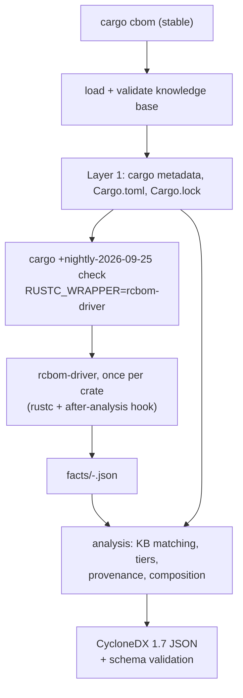

# cargo-cbom proof of concept: the complete workflow

*Written 8 October 2026 for cargo-cbom 0.1.0 (driver built on `nightly-2026-09-25`, rustc
1.100.0-nightly f7575a9da), knowledge base 0.1.0. Everything below describes the code in this
repository as it is; where a statement depends on the compiler version, the version is named.*

This document explains, from first principles, how the tool turns a Rust project into a
Cryptography Bill of Materials (CBOM). It assumes you can read Rust, but it does not assume you
know how Cargo drives the compiler, what happens inside `rustc`, what MIR is, or how CycloneDX
models cryptography. Part I builds that background. Part II follows one run of the tool from
the command line to the output file, step by step. Part III documents the formats (knowledge
base, facts, CBOM). Part IV works through a complete example with real compiler output. Part V
covers testing, evaluation and the design decisions.

Contents

- Part I. Background
  - 1. What the tool produces
  - 2. Packages, crates and Cargo
  - 3. How Cargo runs the compiler
  - 4. Toolchains, nightly features and the sysroot
  - 5. Inside rustc: from source text to machine code
  - 6. Source positions: spans
  - 7. Generics, traits and monomorphization
  - 8. MIR, the representation the tool reads
  - 9. Statics, consts and compile-time evaluation
  - 10. Crate metadata: what a compiled dependency carries
  - 11. Naming things across compilations
  - 12. Writing a compiler driver: rustc_driver, rustc_public and rustc_middle
  - 13. CycloneDX 1.7 and the Cryptography Registry
- Part II. One run, step by step
  - 14. Architecture
  - 15. Starting `cargo cbom`
  - 16. Layer 1: manifests and the build graph
  - 17. Preparing Layer 2
  - 18. The driver inside one compiler invocation
  - 19. The per-item scan
  - 20. Static and const initializers
  - 21. The reachability walk
  - 22. From span to file, line and column
  - 23. Argument origins (intraprocedural data flow)
  - 24. The analysis: from facts to assets
  - 25. Provenance classification
  - 26. Assembling and validating the CBOM
  - 27. `cargo cbom verify`
- Part III. Formats
  - 28. The knowledge base (`kb/seed.toml`)
  - 29. The facts files
  - 30. Reading the CBOM
- Part IV. A complete example
  - 31. One line of code, followed through every stage
- Part V. Testing, evaluation and design
  - 32. Tests, fixtures and scripts
  - 33. Design decisions and why
  - 34. Known limitations
  - 35. Glossary

---

# Part I. Background

## 1. What the tool produces

A **Software Bill of Materials (SBOM)** lists the components a piece of software is built from.
A **Cryptography Bill of Materials (CBOM)** extends this with *cryptographic assets*:
- the algorithms the software uses (AES-256-GCM, SHA-256, ...)
- their parameters (key size, nonce size, mode, curve)
- the protocols (TLS)
- the key material (a private key, a secret)

For each asset it records where in the source code it appears.

The tool writes the CBOM in **CycloneDX 1.7**, a JSON standard (section 13). For each asset it
records:

- the registry name and properties of the algorithm (`AES-256-GCM`, family `AES`, mode `gcm`, parameter set `256`);
- every place in the source where it appears: file, line, column, the function or static named there;
- what the code does with it at that place (encrypt, tag, keyderive, ...);
- whether that place is *reachable* from the program's entry point (`main`), or only *present* in a compiled crate;
- where the key material handed to it comes from (hard-coded, environment variable, random number generator, parameter, ...).

The tool has two layers, numbered as in the design document (`docs/rust-cbom-proposal2.md`):

- **Layer 1** reads the project's manifests and lockfile. It finds which cryptographic libraries are part of the build, which backend their features select, which native libraries they link, and the manifest line where each one enters the build. It runs no project code.
- **Layer 2** compiles the project with a modified compiler that records, in every crate, the places where code names a cryptographic function, type or constant. It then decides which algorithms these places are, with their parameters, uses, reachability and key provenance.

## 2. Packages, crates and Cargo

**Crate.** The unit the Rust compiler compiles in one invocation. A crate is a tree of modules
rooted at one source file (`src/main.rs` for a binary, `src/lib.rs` for a library). The compiler
turns one crate into one output file: an executable, or a library file (`.rlib`) that other
crates can use.

**Package.** The unit Cargo, Rust's build tool and package manager, works with. A package is a
directory with a `Cargo.toml` manifest. It contains one or more crates, called *targets*: at
most one library, plus any number of binaries, examples, tests and benchmarks. A package has a
*name* (`aes-gcm`) and a *version* (`0.10.3`). Its library crate has a *crate name*, which is
the package name with `-` replaced by `_` (`aes_gcm`), because `-` is not allowed in Rust
identifiers. The tool needs both names, and section 11 explains how they are linked.

**Workspace.** A set of packages built together, sharing one `Cargo.lock` and one output
directory (`target/`). The packages the user works on are the workspace *members*. Everything
else is a dependency.

**Dependencies** are declared in `Cargo.toml`:

```toml
[dependencies]
ring = "0.17"                                     # a version requirement
rustls = { version = "0.23", default-features = false, features = ["ring", "std"] }

[build-dependencies]                              # used only by the build script
cc = "1"

[dev-dependencies]                                # used only by tests, examples, benchmarks
proptest = "1"

[target.'cfg(unix)'.dependencies]                 # only on some platforms
libc = "0.2"
```

So there are three *kinds* of dependency:
- **normal:** linked into the program
- **build:** compiled for and run by the build script
- **development:** tests, examples and benchmarks only

A dependency can also be limited to some target platforms.

**Features** are named, optional parts of a package (`ring`, `std`, `tls12`). A package's
`[features]` table lists them, and the `default` feature lists those enabled unless a dependent
says `default-features = false`. Features can enable optional dependencies. For rustls 0.23.40,
for example, the default features are `aws_lc_rs`, `logging`, `prefer-post-quantum`, `std` and
`tls12`. The feature `aws_lc_rs` enables the dependency `aws-lc-rs`, the cryptographic backend.
Which features are enabled changes which algorithms are in the program, so Layer 1 reads them.

**Resolution and `Cargo.lock`.** A version requirement (`"0.17"`) admits many versions. Cargo
*resolves* all requirements of all packages into one concrete version per package, and writes
the result to `Cargo.lock`:

```toml
[[package]]
name = "ring"
version = "0.17.14"
source = "registry+https://github.com/rust-lang/crates.io-index"
checksum = "..."
dependencies = ["cc", "cfg-if", "getrandom", "libc", "untrusted", "windows-sys"]
```

Two incompatible requirements can make Cargo include two versions of the same package (Phase
0's realapp has `sha2` 0.10.9 and 0.11.0). They are two different crates to the compiler.

**Build scripts.** A package may have a `build.rs`. Cargo compiles it as a separate small
program (crate name `build_script_build`) and *runs* it before compiling the package, typically
to compile C code or generate Rust code. Build scripts execute arbitrary code on the build
machine. This is why Layer 2 must be run on trusted code, or inside a container.

**Procedural macros** are compiler plugins written in Rust (crate type `proc-macro`), loaded
into the compiler while it compiles the crates that use them. They also execute on the build
machine.

**`links`.** A package that binds a native (C) library declares `links = "name"` in its
manifest. ring declares `links = "ring_core_0_17_14_"`: it contains C and assembly code compiled
by its build script. The tool reports such packages as native components, because their code is
outside what it analyses.

**`cargo metadata`** prints, as JSON:
- every package in the dependency graph, with its manifest path, targets, `links` value and declared dependencies
- the *resolve* graph: for each package the concrete packages it depends on, with the dependency kinds, plus the features enabled for it

It runs no build script. With `--filter-platform <triple>` it drops dependencies that do not
apply to that platform. Layer 1 is built on this command.

## 3. How Cargo runs the compiler

Cargo does not compile anything itself. For every crate in the build it starts a separate
process of the Rust compiler, `rustc`, with a long command line. Cargo shows these with
`cargo build -v`. A typical one, shortened:

```
rustc --crate-name aes_gcm --edition=2021 src/lib.rs --crate-type lib \
      --emit=dep-info,metadata,link -C debuginfo=2 \
      -C metadata=8f7a... --out-dir target/debug/deps \
      --extern aead=target/debug/deps/libaead-1c2d....rmeta ... \
      --cfg 'feature="aes"' --cfg 'feature="alloc"' ...
```

The pieces the tool relies on:

- `--crate-name aes_gcm` and `--crate-type lib|bin|proc-macro|...` say what is being compiled. Build scripts are compiled with the crate name `build_script_build` (or `build_script_<name>`).
- `--emit` says what to produce. `cargo build` asks for `link` (the actual library or executable). `cargo check` asks only for `metadata` and `dep-info`: rustc analyses the code and writes a `.rmeta` file (section 10), but generates no machine code. `cargo check` is therefore much faster, and it is what the tool runs. Proc macros and build scripts are still fully compiled under `cargo check`, because they must run.
- `--cfg 'feature="..."'` passes the enabled features.

Cargo also sets **environment variables** for each rustc process. The tool reads:

| variable | value |
|---|---|
| `CARGO_PKG_NAME` | the package name (`aes-gcm`) |
| `CARGO_PKG_VERSION` | the package version (`0.10.3`) |
| `CARGO_MANIFEST_DIR` | the directory containing the package's `Cargo.toml` |
| `CARGO_PRIMARY_PACKAGE` | set (to `1`) only when the package is one the user asked to build: a workspace member, not a dependency |

**The working directory** of each rustc process is the workspace root for workspace members,
and the source file on the command line is relative to it (`src/main.rs`, or
`crates/foo/src/lib.rs` for a member in a subdirectory). For a registry dependency, the working
directory is the package's own directory, and the source file is given as an absolute path
(`/home/<user>/.cargo/registry/src/index.crates.io-.../ring-0.17.14/src/lib.rs`). Both are visible
in the facts files the driver writes: micro's records the working directory `fixtures/micro` and
files such as `src/main.rs`; ring's records `.../ring-0.17.14` and absolute file names. This
matters because rustc reports source positions with the path it was given (section 6).

**`RUSTC_WRAPPER`.** If this environment variable is set, Cargo runs
`$RUSTC_WRAPPER <path to rustc> <arguments...>` instead of `rustc <arguments...>`, for every
compiler invocation. That includes the version queries Cargo makes (`rustc -vV`,
`rustc - --print=file-names ...`). The wrapper can inspect and change the arguments, run the
real compiler, or replace it. Tools like Clippy, Miri and Kani use this mechanism, and so does
this one. Its driver (section 18) is installed as `RUSTC_WRAPPER`.

**Target directory and caching.** Cargo keeps outputs in a target directory and recompiles a
crate only when its inputs change: sources, flags, dependencies, environment. The tool uses a
separate target directory, so its builds never mix with the project's normal ones (section 17).

## 4. Toolchains, nightly features and the sysroot

A **toolchain** is a set of matching tools: `rustc`, `cargo`, the standard library, and optional
components. `rustup` installs toolchains side by side and selects one per invocation, with
`cargo +nightly-2026-09-25 ...` or `rustc +stable ...`.

- **stable** toolchains (`1.97.1`) only accept stable language features and compiler flags.
- **nightly** toolchains are built every night from the development branch. They accept unstable (`-Z...`) compiler flags and unstable library features (`#![feature(...)]`). A nightly is identified by its date: `nightly-2026-09-25`. The tool pins exactly one, because the compiler's internal interfaces change between nightlies.

**Components.** The toolchain's optional parts. The tool needs, for its pinned nightly:
- **`rustc-dev`:** the compiler's own libraries (`librustc_driver-*.so` and the `rustc_*` crates' metadata), so a program can link against the compiler and call it as a library. It also ships the compiler's sources, which is how this document's statements about rustc internals were checked.
- **`rust-src`:** the standard library's sources.
- **`llvm-tools`:** LLVM utilities, conventionally installed with rustc-dev.
- **`clippy`, `rustfmt`:** the lint and formatting tools, enforced on this repository.

**The sysroot** is the toolchain's root directory (`rustc --print sysroot`). It holds the
precompiled standard library (`lib/rustlib/<target>/lib/libstd-*.rlib` and friends) and the
compiler's shared library (`lib/librustc_driver-*.so`). A program that links the compiler
library needs two things:
- **`LD_LIBRARY_PATH`:** on Linux, set to `<sysroot>/lib`, so that the dynamic loader finds `librustc_driver-*.so`.
- **`--sysroot`:** the sysroot the compiler should use. Without the flag, rustc works it out itself (`rustc_session/src/filesearch.rs`, `default_sysroot`): if the program was started through a symbolic link, it looks two directories above that link; otherwise it looks two directories above the file of the loaded `librustc_driver` library. For the driver, the library comes from `<sysroot>/lib`, so the default would already be right. The driver passes `--sysroot` explicitly anyway, so that the standard library a crate is compiled against is always the one of the toolchain `cargo-cbom` asked `rustup` for. It does not then depend on how the dynamic loader found the library.

**`#![feature(rustc_private)]`** is the nightly feature that lets a crate use the compiler's
internal crates (`extern crate rustc_middle;`). The driver crate needs it, so it can only be
built with a nightly that has `rustc-dev`. Everything else in the repository builds on stable.

## 5. Inside rustc: from source text to machine code

rustc processes a crate in phases. Each phase produces a representation of the program that
the next phase consumes.

1. **Lexing and parsing.** The source text becomes tokens, then an **AST** (abstract syntax tree): a tree that mirrors the source syntax. Comments are discarded here; they never reach any later representation.
2. **Macro expansion and name resolution.** Macros (`vec![..]`, `println!(..)`, `#[derive(Clone)]`, attribute macros) are expanded into ordinary code, and every name is resolved to the item it denotes. Expansion records, for each generated piece of code, which macro produced it and where it was called (section 6).
3. **HIR** (high-level intermediate representation). A desugared AST. `for` loops, `?`, `async`, `if let` and similar constructs are rewritten into simpler forms (loops with `match`, calls to `Try::branch`, state machines).
4. **Type checking.** Every expression gets a type, every method call is resolved to the method it calls, and generic arguments are inferred. The result is stored alongside the HIR (*typeck results*).
5. **THIR, then MIR.** The typed tree is lowered to **MIR** (mid-level intermediate representation, section 8): a control-flow graph of simple statements, close to what the machine does but still with Rust types. Borrow checking runs on MIR.
6. **MIR optimization.** A pipeline of transformations: constant propagation, simplification, and at higher optimization levels inlining (section 8.6). The result is the *optimized MIR* of each function.
7. **Monomorphization collection.** Generic functions are turned into concrete copies, one per set of generic arguments actually used (section 7). The *mono item collector* walks from the entry points and decides which concrete functions must be generated.
8. **Code generation and linking.** Each concrete function's MIR is translated to LLVM IR, optimized by LLVM, and assembled to machine code; the linker produces the executable.

`cargo check` stops after step 6 (plus writing metadata). Steps 7 and 8 do not run.

**Queries and `TyCtxt`.** rustc does not run these phases as fixed passes over the whole crate.
It computes everything on demand through *queries*: "the type of this item", "the optimized MIR
of this function", "the vtable entries of this trait for this type". Queries are cached, and
can be asked for items of other crates (answered from their metadata, section 10). All queries
hang off one object, the **type context**, `TyCtxt<'tcx>`. A tool that has a `TyCtxt` can ask
the compiler anything the compiler knows about the crate being compiled and its dependencies.

**"After analysis".** rustc lets an embedding program run code at fixed points of a
compilation. The tool runs its analysis *after analysis*, the point at which type checking and
borrow checking of the whole crate have succeeded. At that point all MIR can be requested.

## 6. Source positions: spans

Every piece of every representation in rustc carries a **span**: the region of source code it
came from. A span is a pair of byte offsets, `lo` and `hi`, into one global address space that
concatenates all source files the compilation has loaded. It also holds a *syntax context*,
which records macro expansion (below).

The **source map** owns the loaded files and converts a byte offset into:
- a file name: the path as the compiler was given it, relative for the crate's own files, absolute for files of dependencies loaded from the registry;
- a line number, 1-based;
- a column, 1-based, counted in characters (not bytes) from the start of the line.

Two consequences:
- **Comments and formatting are irrelevant.** A span is an offset into the file as it is on disk. A comment spanning ten lines simply moves later code ten lines down, and the span reports the true line.
- **Every MIR statement knows its source position,** even after all the transformations of section 5.

**Macro expansion.** When a macro expands, its output tokens get spans too. Tokens the macro
*copied from its input* keep their original spans: in `hash_all!(data)`, the `data` inside the
expansion points at `data` in the call. Tokens the macro *wrote itself* get a span inside the
macro's definition, with a syntax context saying "produced by expansion E". For each expansion E
the compiler keeps **expansion data**:
- `call_site`: the span of the macro invocation (`hash_all!(...)`, `#[derive(Clone)]`)
- `kind`: one of three
  - `Macro(Bang, name)`: a function-like macro `name!(...)`
  - `Macro(Attr, name)`: an attribute macro
  - `Macro(Derive, name)`: a derive
  - `Desugaring(...)`: a compiler-introduced rewrite, such as `?`, `for` or `async`
- the macro's definition site

Expansions nest: `vec![...]` used inside `hash_all!` has a call site that is itself inside an
expansion. `span.from_expansion()` says whether a span was produced by expansion.
`span.source_callsite()` follows call sites outwards until it reaches the user's source: the
outermost invocation. Section 22 shows how the tool uses this.

## 7. Generics, traits and monomorphization

**Generic functions.** `fn seal<A: Aead + AeadCore + KeyInit>(key: &[u8], msg: &[u8]) -> Vec<u8>`
is written once for any type `A` implementing three traits. In its body, a call like
`A::new_from_slice(key)` cannot be resolved to a specific function: which `new_from_slice` runs
depends on `A`. The call is to the *trait method* `<A as KeyInit>::new_from_slice`.

**Instances.** At a call site `seal::<Aes256Gcm>(..)`, `A` is known. A (definition, generic
arguments) pair is an **instance**: `seal::<Aes256Gcm>` is one instance of `seal`,
`seal::<ChaCha20Poly1305>` another. **Monomorphization** substitutes the generic arguments into
the body ("instantiates" it). Inside `seal::<Aes256Gcm>` the call becomes
`<AesGcm<Aes256, U12, U16> as KeyInit>::new_from_slice`, which **resolves** to one specific
function: the `KeyInit` implementation for `AesGcm`.

This is why the tool reads monomorphized code. In RustCrypto the algorithm *is* a type
parameter, so in generic code the algorithm only exists per instance.

**Type aliases and defaults vanish.** `Aes256Gcm` is a type alias for
`AesGcm<Aes256, U12>`, and `AesGcm` has a third parameter with a default
(`TagSize = U16`). The compiler's types contain no aliases and always list every argument,
defaults included: `AesGcm<Aes256, UInt<UInt<UInt<UInt<UTerm, B1>, B1>, B0>, B0>, UInt<...>>`.

**typenum.** Older RustCrypto crates encode sizes as *types*, through the `typenum` crate, so
that sizes can be checked at compile time. A number is a binary chain: `UTerm` is 0, and
`UInt<U, B>` is `2 * U + B`, where `B` is `B0` (0) or `B1` (1). So:

```
UInt<UInt<UInt<UInt<UTerm, B1>, B1>, B0>, B0>
  = 2*(2*(2*(2*0 + 1) + 1) + 0) + 0
  = 2*(2*(2*1 + 1)) = 2*(2*3) = 12
```

That is the 12-byte nonce of AES-GCM. The analysis decodes these chains (section 24.4).

**Traits and trait objects.** A *trait object* `dyn Sealer` is a value whose concrete type is
only known at run time. It is a pair of pointers: one to the data, one to a **vtable**, a
table of function pointers, one per method of the trait, plus the type's size, alignment and
destructor. A call `s.seal(msg)` on a `dyn Sealer` jumps through the vtable: a *virtual call*.
Which functions *can* be called is decided where a concrete value is turned into a trait
object. That conversion is an **unsizing coercion**: `Box<AesSealer>` becomes
`Box<dyn Sealer>`, `&T` becomes `&dyn Trait`. At that point the compiler builds the vtable for
that concrete type. The tool does what rustc's own collector does: wherever it sees an unsizing
to `dyn Trait`, it adds every method of that vtable to the reachable set (section 21).

**Closures** are anonymous types implementing the `Fn`, `FnMut` or `FnOnce` traits. Calling a
closure is a call to `FnOnce::call_once` (or `call`, `call_mut`) on the closure type, which
resolves to the closure's body.

**Function pointers.** `let g: fn(&[u8]) -> Vec<u8> = hash;` turns the function item `hash`
into a pointer. This conversion is called **reification**, and it is a cast in MIR. Calling `g`
is an indirect call; to know what can be called, the tool records the reified function at the
cast.

**Drop glue.** When a value goes out of scope, its destructor runs: the `Drop` implementation if
any, then the fields'. The compiler generates this code, *drop glue*, per type
(`drop_in_place::<T>`).

**Shims.** Some instances have no body written by anyone; the compiler generates their MIR on
request. They are called *shims*:
- drop glue
- the *vtable shim* that adapts a by-value `FnOnce::call_once` to being called through a vtable
- the *closure-once shim* that calls an `Fn` closure as `FnOnce`
- function-pointer shims

`InstanceKind` distinguishes:
- `Item` (a user-written body)
- `Shim`
- `Virtual` (a vtable slot, resolved only at run time)
- `Intrinsic` (a compiler built-in such as `abort` or `atomic_xadd`)

## 8. MIR, the representation the tool reads

### 8.1 Bodies, locals, blocks

The MIR of a function (its **body**) consists of:

- **Locals**, numbered `_0`, `_1`, .... `_0` holds the return value; `_1` to `_n` are the function's `n` arguments; the rest are temporaries and user variables. Each has a type.
- **Basic blocks**, `bb0`, `bb1`, ...: straight-line lists of **statements**, each ending in one **terminator** that transfers control.

**Statements** include:
- `Assign(place, rvalue)`: compute a value, store it
- `StorageLive` / `StorageDead`: the life range of a local
- and a few others the tool ignores

**Terminators** include:
- `Call { func, args, destination, target }`: call `func` with `args`, store the result in `destination`, continue at `target`. **Every function call is a terminator**, so calls are easy to find.
- `Drop { place, ... }`: run drop glue on a place.
- `SwitchInt`: branch (from `if`, `match`).
- `Return`, `Goto`, `Assert`, `Unreachable`.

### 8.2 Places, operands, rvalues

- A **place** is a memory location: a local, plus a *projection* (field `.0`, dereference `*`, index `[i]`).
- An **operand** is a value used by a statement:
  - `Copy(place)` or `Move(place)`: read a place
  - `Constant(c)`: a constant
- An **rvalue** is the right-hand side of an assignment:
  - `Use(operand)`
  - `Ref(region, kind, place)`: `&place`, or `&mut place` when the kind is `Mut`
  - `AddressOf(kind, place)`: a raw pointer
  - `Cast(kind, operand, type)`
  - `Repeat(operand, n)`: `[x; n]`
  - `Aggregate(kind, operands)`: an array, tuple, struct or closure built from parts
  - `BinaryOp`, `UnaryOp`, `Discriminant`, `Len`, ...

**Casts that matter to the tool:**
- `PointerCoercion(ReifyFnPointer)`: a function item to a function pointer
- `PointerCoercion(ClosureFnPointer)`: a non-capturing closure to a function pointer
- `PointerCoercion(Unsize)`: an unsizing coercion, such as `Box<T>` to `Box<dyn Trait>`

### 8.3 Constants and allocations

A constant operand carries its own span and a value. The value can be:

- **evaluated** (`Val`): plain bytes, or, if the constant contains pointers, an **allocation**: a block of bytes plus **provenance**, the list of offsets in it that hold pointers, and what each pointer points to. Each pointer's target is a **global allocation**, one of:
  - `Static(def)`: a static item, such as `&ring::aead::AES_256_GCM`
  - `Function(instance)`: a function pointer
  - `VTable(type, trait)`: a vtable for that type and trait
  - `Memory(allocation)`: anonymous constant memory, which may itself contain pointers
- **unevaluated** (`Unevaluated`): a reference to a named `const` item, or to a *promoted* constant (below), whose value has not been computed into this body yet.

`const {alloc23: &ring::aead::Algorithm}` in printed MIR (section 31) is an evaluated
constant: a pointer whose provenance is allocation 23, which the compiler's MIR printer shows is
`(static: AES_256_GCM)`.

### 8.4 Promoted constants

In `let r = &[0u8; 12];` or `f(&AES_256_GCM)`, the compiler may move the referenced value
into a separate constant, so the reference can live forever (`'static`). This is called
**promotion**. The moved value becomes a small MIR body of its own, a *promoted*, numbered per
function (`main::promoted[0]`). The function then refers to it through an unevaluated constant.
Code that needs to see *what* a promoted refers to (a named `const`, for instance) must read
the promoted's own MIR.

### 8.5 Generic and monomorphic MIR

The MIR stored for a function is **generic**: it contains the generic parameters (`A`), and
calls like `<A as KeyInit>::new_from_slice` stay unresolved. To get the MIR of an *instance*,
the compiler substitutes the arguments into the generic MIR. `rustc_public`'s
`Instance::body()` does exactly that, and also evaluates every constant in it
("monomorphized and all constants evaluated").

### 8.6 MIR optimization levels: GVN and inlining

How much the MIR is optimized depends on the flag `-Zmir-opt-level`. When it is not given,
rustc uses 1 when the optimization level (`-C opt-level`) is 0, as in a debug build, and 2
otherwise (`rustc_session/src/config.rs`, `OptLevel::mir_opt_level`). Two passes that run only
at MIR opt-level 2 or higher change what the tool can see.

**GVN** (global value numbering, `rustc_mir_transform/src/gvn.rs`, enabled at level >= 2).
It finds operands whose value is known at compile time and replaces them by constants.
The constants it creates have no source position: `try_as_constant` builds them with
`span: DUMMY_SP`, the compiler's "no location" span. This includes the function operand of
every call, whose value, the function item, is always known. So at level 2 no call has a source
position. The printed MIR shows it: minisign's call `scrypt::scrypt(..)` at
`src/secret_key.rs:138` has its callee printed with `+ span: no-location` at level 2, and with
`+ span: src/secret_key.rs:138:9: 138:23` at level 1.

**The MIR inliner** (`rustc_mir_transform/src/inline.rs`) replaces a call by the callee's body,
and with it the call site. Its rule, unless `-Zinline-mir` overrides it:
- never at MIR opt-level 0 or 1;
- at level 2, only when the optimization level is 2 or 3 *and* incremental compilation is off;
- always at level 3 or higher.

A separate pass, `ForceInline`, always inlines functions marked `#[rustc_force_inline]`. That
is one of the compiler's internal `rustc_*` attributes (`rustc_feature/src/builtin_attrs.rs`),
not something crypto crates use.

**Why this matters.** A project can raise the optimization level even for debug builds;
minisign 0.10.0 has `[profile.dev] opt-level = 3`. Cargo compiles workspace members and other
path dependencies incrementally in the dev profile, and registry dependencies never. Under that
profile, *every* crate gets MIR opt-level 2, and each registry dependency is also inlined.

An experiment on minisign shows which pass matters. It used a copy of the driver without the
fixed MIR level, and counted the call sites recorded in the crates `minisign`, `scrypt` and
`pbkdf2`:

| MIR flags | minisign | scrypt | pbkdf2 |
|---|---|---|---|
| none (level 2, from the profile) | 0 | 0 | 0 |
| `-Zinline-mir=no` (level 2, no inliner) | 0 | 0 | 0 |
| `-Zmir-enable-passes=-GVN` (level 2, no GVN) | 4 | 9 | 2 |
| `-Zmir-opt-level=1` (what the driver passes) | 4 | 10 | 2 |

The calls are still in the MIR at level 2, but without positions, and the driver drops every
site that has no position (section 22). GVN alone accounts for all the missing calls; the
inliner additionally removes one call inside `scrypt`, which is not compiled incrementally. The
driver therefore always passes `-Zmir-opt-level=1` (section 18). That is the level of a debug build, at
which neither pass runs, whatever the project's profile.

## 9. Statics, consts and compile-time evaluation

- A **`static`** is a single memory location with a fixed address for the whole program: `pub static AES_256_GCM: Algorithm = Algorithm { ... };` in ring. Code that uses it holds a pointer to that one location. In MIR the pointer is a constant whose provenance is `Static(AES_256_GCM)`, so the static's identity survives into every function that names it.
- A **`const`** is a value, copied into every place that uses it: `pub const SHA256: Algorithm = Algorithm { ... };` in aws-lc-rs. After evaluation, a function using it contains a copy of the bytes, and nothing records that they came from `SHA256`. Only the MIR *before* evaluation still has `Unevaluated(SHA256)`, or a promoted constant whose body names it.

This difference is why the tool reads aws-lc-rs (consts) differently from ring (statics), and
why it reads MIR before evaluation in some places (sections 19 and 20).

**Compile-time evaluation (CTFE).** The initial value of a static or const is computed at
compile time by an interpreter inside rustc, which runs a special MIR body for the item
(`mir_for_ctfe`). The result is an allocation, available through `eval_initializer` /
`eval_static_initializer`. A static's evaluated value keeps pointers to other statics (rustls's
`DEFAULT_CIPHER_SUITES` points at its suites). But a value copied *by value* from another
static loses that name: rustls builds `TLS13_AES_256_GCM_SHA384` with
`RingHkdf(hkdf::HKDF_SHA384, hmac::HMAC_SHA384)`, copying ring's algorithm descriptors. To
recover such names the tool reads the static's `mir_for_ctfe` and its promoteds (section 20).

**Extern statics** declared in `extern "C" { static X: T; }` blocks belong to C code and have no
Rust initializer. Asking for their initializer makes rustc panic, so the tool never does.

## 10. Crate metadata: what a compiled dependency carries

When rustc compiles a library crate, it writes **metadata** (in the `.rmeta` file, and inside
the `.rlib`). This is everything a dependent crate needs to compile against it: item
signatures, types, trait implementations, spans and source file names.

Whether the metadata also holds a function's optimized MIR is decided per function by
`should_encode_mir` (`rustc_metadata/src/rmeta/encoder.rs`). For functions, methods and
closures it is written when:
- the flag `-Zalways-encode-mir` is set; or
- all three of these hold:
  - the compilation generates code: it was asked for a library, not only `--emit=metadata`;
  - the function is reachable from outside the crate;
  - dependents may need its body, because it is generic (it must be monomorphized in the crate that instantiates it) or it is *cross-crate inlinable*. That covers `#[inline]` functions, closures and constructors, plus, in optimized non-incremental builds, small functions rustc judges cheap enough (`rustc_mir_transform/src/cross_crate_inline.rs`).

Separately, the MIR used for compile-time evaluation (section 9) is always written for consts
and `const fn`s.

Two consequences:
- **Under `cargo check` nothing generates code**, so without the flag the dependencies' metadata would hold *no* optimized MIR at all, not even of generic functions. A `cargo check` does not need it, since it never monomorphizes. The driver passes **`-Zalways-encode-mir`** to every crate it compiles, so every function's optimized MIR is written even under `cargo check`. The reachability walk (section 21) reads it from there, for generic and non-generic functions of dependencies alike.
- **The standard library** is precompiled in the sysroot, with code generation, optimization, and without the flag. Its exported generic functions, `#[inline]` functions and small inlinable functions have MIR (that is how `Vec<T>`, iterators and `thread::spawn::<F>` get monomorphized in user crates). Its other non-generic functions do not. The walk can follow generic std code, but not non-generic std internals.

## 11. Naming things across compilations

The tool must recognise the same item in facts written by different rustc processes, and
match crates to Cargo packages. rustc offers several identifiers:

| identifier | example | stable across processes? | use in the tool |
|---|---|---|---|
| `DefId` | a pair (crate number, item index) of small integers, printed `DefId(c:i)` | **no**: crate numbers are assigned per compilation, in the order crates are loaded | only inside the driver |
| def path string | `ring::aead::AES_256_GCM` | yes, but not unique, and printed through *visible* paths (re-exports) | human-readable `path` and `symbol` |
| def-path hash | `f6ce076f005a77e65957e17b002ad5d4` (ring's `AES_256_GCM`) | **yes**: 128 bits; the first 64 are the crate's `StableCrateId`, the last 64 a hash of the item's path inside the crate | `id` of statics, consts, generic owners |
| `StableCrateId` | `f6ce076f005a77e6` (ring 0.17.14 in this build) | **yes**: a 64-bit hash of the crate name, the `-C metadata` values Cargo passes (which encode the package's identity and version), whether the crate is an executable, and the compiler version (`rustc_span/src/def_id.rs`, `StableCrateId::new`) | tells two versions of one crate apart |
| mangled symbol name | `_RNvCscTT69CrhWaT_5micro9ring_seal` (`micro::ring_seal`) | **yes**: the linker symbol of an instance (Rust v0 mangling), unique per instance | `id` of monomorphic function owners |
| crate name | `aes_gcm` | yes, but two versions share it | KB matching, together with the `StableCrateId` |

A **visible path** is the path a user would write, which may go through a re-export. The
`KeyInit` trait is defined in `crypto_common`, re-exported by `aead`, and again by `aes_gcm`
(`pub use aead::{..., KeyInit, ...}`); the micro fixture's CBOM prints its method as
`aes_gcm::KeyInit::new_from_slice`, and `Default::default` prints as `std::default::Default::default`
although it is defined in `core`. The tool therefore never relies on full printed paths for
matching. It matches on the crate (by name and `StableCrateId`) and on the item's last path
segment, or on regular expressions written with this in mind (section 28).

## 12. Writing a compiler driver: rustc_driver, rustc_public and rustc_middle

- **`rustc_driver`** is the library form of rustc. `run_compiler(args, callbacks)` runs a whole compilation with a command line and calls back into the embedding program at fixed points; the tool uses `after_analysis`. The callback can tell the compiler to continue (write outputs normally) or stop.
- **`rustc_middle`** is the compiler's internal crate holding `TyCtxt`, the internal MIR and types. It is fully capable and completely unstable: names and signatures change between nightlies.
- **`rustc_public`** (formerly `stable_mir`) is the compiler team's *tool-facing* API: a set of plain data types (Body, Ty, Instance, Span, ...) mirroring the internal ones, plus functions that answer queries. Its 2026 project goal is to be published on crates.io with compatibility guarantees. Today it still requires nightly and `rustc_private`. Its macro `run_with_tcx!(args, callback)` runs the compiler and calls `callback(tcx)` after analysis, inside a context where `rustc_public` calls work. `rustc_internal::internal(tcx, x)` and `rustc_internal::stable(x)` convert between `rustc_public` values and `rustc_middle` ones.

The driver uses `rustc_public` for everything it offers, and `rustc_middle` for what it does not
offer in this version:
- the macro call-site chain of spans (`source_callsite`, expansion data)
- the CTFE MIR and promoted MIR of statics and consts (`mir_for_ctfe`, `promoted_mir`)
- unevaluated const references in monomorphic bodies
- vtable entries (`vtable_entries`)
- the instantiated self type of an inherent method's impl (`impl_of_assoc`, `type_of`, `normalize_erasing_regions`)
- def-path hashes and `StableCrateId`s
- public-API visibility (`effective_visibilities`)

One behaviour of this `rustc_public` version matters: `Instance::has_body()` answers for the
instance's *definition*, not the instance. For a shim, the definition is a trait method without
a body (`FnOnce::call_once`), so it answers `false` even though `Instance::body()` builds the
shim's MIR without trouble. The walk uses `body()` instead (section 21). This was found when
xh's TLS setup, inside a `std::thread::spawn` closure, came out unreachable.

## 13. CycloneDX 1.7 and the Cryptography Registry

A CycloneDX document (a "BOM") is JSON with these top-level fields:

- `bomFormat: "CycloneDX"`, `specVersion: "1.7"`, `version: 1`, `serialNumber: "urn:uuid:..."`.
- `metadata`: the tool that wrote it (`tools.components`), the subject (`component`), and free `properties`.
- `components`: everything inventoried. Each has a `type` (`application`, `library`, `cryptographic-asset`, ...), a `name`, an optional `version`, a document-unique `bom-ref`, and optionally a `purl` (package URL: `pkg:cargo/ring@0.17.14` names a crate on crates.io), `evidence` and `properties`.
- `dependencies`: a list of `{ ref, dependsOn: [...], provides: [...] }` relating `bom-ref`s. `dependsOn` is "uses"; `provides` says a component *implements* the listed assets (ring provides `crypto:algorithm:AES-256-GCM`).

**Properties** are `{ name, value }` pairs for anything the standard has no field for. Names
should be namespaced; the tool uses the prefix `rcbom:`.

**Evidence occurrences** say where a component was found: `evidence.occurrences` is a list of
objects with the fields `location` (required, "the location or path to where the component was
found"; the format is not specified), `line`, `offset`, `symbol` and `additionalContext`
(free text).

**Cryptographic assets** (`type: "cryptographic-asset"`) carry `cryptoProperties`, whose
`assetType` is one of `algorithm`, `certificate`, `protocol` or `related-crypto-material`:

- `algorithmProperties`:
  - `primitive`: one of `ae` (authenticated encryption), `hash`, `mac`, `kdf`, `signature`, `key-agree`, `kem`, `block-cipher`, `drbg`, ...
  - `algorithmFamily`: a registry family (`AES`, `SHA-2`, `HMAC`, ...)
  - `parameterSetIdentifier`: e.g. `256`
  - `mode`: e.g. `gcm`
  - `ellipticCurve`: a registry curve id (`nist/P-256`, `other/Curve25519`)
  - `cryptoFunctions`: a subset of `generate`, `keygen`, `encrypt`, `decrypt`, `digest`, `tag`, `keyderive`, `sign`, `verify`, `encapsulate`, `decapsulate`, `other`, `unknown`
- `protocolProperties`: `type` (`tls`, ...), `version`, `cipherSuites: [{ name, algorithms, identifiers }]`, ...
- `relatedCryptoMaterialProperties`: `type` (`private-key`, `secret-key`, `public-key`, `nonce`, `salt`, ...), `size` in bits, `algorithmRef`, ...

The **Cryptography Registry** (a JSON file published with CycloneDX 1.7, vendored here as
`schema/cryptography-defs.schema.json`) fixes the vocabulary:
- **Families** and their *variant patterns*, such as `AES[-(128|192|256)][-(GCM|CCM)][-{tagLength}][-{ivLength}]`, `HMAC[-{hashAlgorithm}]`, `PBKDF2[-{hashAlgorithm}][-{iterations}][-{dkLen}]` and `Argon2(id|i|d)[-{memoryKiB}][-{passes}][-{parallelism}]...`. Bracketed parts are optional, so `AES-GCM`, `AES-256` and `AES-256-GCM` are all valid names, at different specificity.
- **Named elliptic curves.**

The JSON schema enforces `algorithmFamily` and `ellipticCurve` against these lists. The tool
names assets by these patterns, and validates every CBOM it writes against the official
schemas (section 26).

---

# Part II. One run, step by step

## 14. Architecture



| crate | built with | role |
|---|---|---|
| `crates/rcbom-facts` | both | the data types the driver writes and the analysis reads (JSON, versioned) |
| `crates/rcbom-driver` | pinned nightly | the `RUSTC_WRAPPER`; all compiler-facing code |
| `crates/rcbom-kb` + `kb/seed.toml` | stable | knowledge base: loader, validation, the seed |
| `crates/rcbom-manifest` | stable | Layer 1 |
| `crates/rcbom-analysis` | stable | matching, provenance, CycloneDX assembly |
| `crates/cargo-cbom` | stable | the command line, schema validation, `verify` |

**Why two toolchains.** Only the driver needs compiler internals, and therefore a pinned
nightly. Keeping it in its own Cargo project (`crates/rcbom-driver`, with its own
`rust-toolchain.toml`) keeps the unstable surface in one place. Everything else, including all
decisions about cryptography, builds on stable and is tested without a compiler. The driver
and the analysis communicate only through the facts files.

## 15. Starting `cargo cbom`

Cargo treats any executable named `cargo-<name>` on the `PATH` as a subcommand: `cargo cbom args`
runs `cargo-cbom cbom args`. The CLI (`crates/cargo-cbom/src/main.rs`) drops the extra `cbom`
argument, then parses:

| option | meaning |
|---|---|
| `--manifest-path P` | the project's `Cargo.toml` (default `./Cargo.toml`) |
| `--features a,b` | features to enable, as with cargo |
| `-o FILE` | output file (default: standard output) |
| `--driver PATH` | the driver binary. Without it, the first path that exists among: `$RCBOM_DRIVER`; `rcbom-driver` next to the `cargo-cbom` executable; `crates/rcbom-driver/target/release/rcbom-driver` and then `.../debug/rcbom-driver` in this repository. If none exists, the run stops with an error |
| `--manifest-only` | Layer 1 only: no compilation |
| `--no-walk` | no reachability walk (the ablation, section 21) |
| `verify CBOM [--self-test] [--manifest-path P]` | the position checker (section 27); it re-reads the workspace at `P` (default `./Cargo.toml`), so it must be run against the workspace the CBOM describes |

The run then:
1. loads the knowledge base (section 28), which is compiled into the binary from `kb/seed.toml`, and validates it;
2. asks `rustc -vV` for the host triple (`x86_64-unknown-linux-gnu`);
3. runs Layer 1 (section 16);
4. unless `--manifest-only`, runs Layer 2 (sections 17 to 23) and loads the facts;
5. runs the analysis (sections 24 and 25);
6. assembles the CBOM, validates it against the schemas and writes it (section 26);
7. prints a summary on standard error (one line per asset: name, reachable or present, number of occurrences, uses).

## 16. Layer 1: manifests and the build graph

Code: `crates/rcbom-manifest/src/lib.rs`.

**Step 1: run `cargo metadata`.**
`cargo metadata --format-version 1 --manifest-path <P> --filter-platform <host triple> [--features ...]`.
This resolves the dependency graph for the host platform with the requested features, executing
no project code.

**Step 2: compute the build graph and each package's scope.** Starting from the workspace
members (scope *required*), a breadth-first walk follows the resolved dependencies:

- a **normal** dependency of a package keeps that package's scope, unless the package is a procedural macro;
- a **build** dependency, or any dependency of a procedural macro, gets scope *build*: it runs on the build machine and does not ship;
- a **development** dependency is not followed.

A package reached by several routes keeps its strongest scope (*required* beats *build*). The
walk also remembers the first parent through which each package was reached, to report a chain
like `realapp -> age -> scrypt`.

**Step 3: knowledge-base lookup.** For each package in the build graph:
- If the knowledge base has an entry for this package name *and* a version range containing this version, the package gets that entry's **role** (`algorithm`, `trait` or `protocol`, section 28) and its **candidates**, and is marked *supported*.
- If the name matches but the version does not, the package still gets the role (it is a crypto crate) but is marked **unsupported-version**. Its APIs will not be matched, because they may differ (sha2 0.11 vs 0.10).

**Step 4: backend.** For a package whose knowledge-base entry has a `backends` table (rustls:
`{ ring = "ring", aws_lc_rs = "aws-lc-rs" }`, feature to backend package), the backend is the
first feature of the table, *in alphabetical order of feature names*, that is enabled for the
package in the resolve graph. The table is loaded into an ordered map (`BTreeMap`), so its order
in the file does not matter. If both `aws_lc_rs` and `ring` are enabled, the backend reported is
aws-lc-rs. The lookup uses the entry matched by name, so a package in an unsupported version
gets a backend too.

**Step 5: evidence positions.** For each crypto package:

- **Declarations.** For every workspace member that depends on it directly, the tool finds the dependency's key in that member's `Cargo.toml`. It looks in the table matching the dependency kind: `dependencies`, `build-dependencies`, `dev-dependencies`, or the same under `target.'<cfg>'.` when the dependency is platform-specific. Renamed dependencies (`foo = { package = "bar" }`) are found by the name actually written. The manifest is parsed with `toml_edit`, which records each key's byte range, so the position is exact whatever the layout: inline tables, `[dependencies.sha2]` headers, comments. The byte offset becomes a 1-based line and a 0-based character column. The context records the dependency kind, requested features and `default-features = false`.
- **Lockfile.** The line of `name = "<package>"` whose next line is `version = "<version>"` in `Cargo.lock`, with the chain from a member.
- **Native libraries.** For any package with `links`, the position of the `links` key in its own `Cargo.toml`.

**Step 6: locations.** A file path becomes a CBOM `location` string as follows (`Manifest::location`):
1. Normalize it lexically: `.` components are dropped, and `dir/..` is folded. rustls includes `src/crypto/aws_lc_rs/../ring/kx.rs` through a `#[path]` attribute, which becomes `src/crypto/ring/kx.rs`.
2. Find the package whose directory contains the file; the most specific one wins.
3. If that package is a dependency, write `<package>-<version>/<path inside the package>`, such as `rustls-0.23.45/src/crypto/ring/mod.rs`.
4. Otherwise write the path relative to the workspace root, such as `src/main.rs`.
5. A file in no package (the standard library, generated code) keeps its path.

`Manifest::resolve` is the inverse, used by `verify`.

The Layer 1 result is a list of packages, each with: name, version, directory, member or not,
scope, enabled features, `links`, role, supported, candidates, backend, evidence, chain, and
resolved dependencies.

## 17. Preparing Layer 2

Code: `run_driver` in `crates/cargo-cbom/src/main.rs`.

1. **Find the driver** binary (section 15).
2. **Find the sysroot** of the pinned toolchain: `rustc +nightly-2026-09-25 --print sysroot`. If the toolchain is missing, the run stops with the `rustup` command that installs it.
3. **Compute the crate lists** from the knowledge base:
   - `RCBOM_KB_CRATES`: every crate the knowledge base knows, as crate names (underscores);
   - `RCBOM_STOP_CRATES`: those with role `algorithm` or `trait`. The walk does not enter their function bodies; calls *into* them are the facts, their internals are the implementation (section 21).
4. **Choose directories.**
   - `<target dir>/rcbom/target` is a separate cargo target directory, so the tool's build never touches the project's own build;
   - `<target dir>/rcbom/facts` receives the facts files. Here `<target dir>` is the one `cargo metadata` reports, normally `<workspace>/target`.
5. **Invalidate stale facts.** A *stamp* file (`<target dir>/rcbom/stamp`) holds:
   - the driver's path and modification time
   - the knowledge-base crate list
   - the requested features
   - the `--no-walk` setting

   If the stamp differs from the current run, the whole `rcbom` directory is deleted. This matters because cargo recompiles only crates whose inputs changed, and the driver runs only when a crate is recompiled. Facts of unchanged crates are kept and reused, which makes a repeated run take under a second, but they must have been produced by the same driver, knowledge-base filter and options. The stamp does not record the stop-crate list, the knowledge-base roles or the toolchain: a change to a crate's role that keeps the crate list unchanged reuses the old facts until the `rcbom` directory is deleted by hand.
6. **Run cargo:**

   ```
   cargo +nightly-2026-09-25 check --workspace \
         --manifest-path <P> --target-dir <target dir>/rcbom/target [--features ...]
   ```

   with the environment:

   | variable | value |
   |---|---|
   | `RUSTC_WRAPPER` | the driver |
   | `RCBOM_OUT` | the facts directory |
   | `RCBOM_KB_CRATES`, `RCBOM_STOP_CRATES` | the lists above |
   | `RCBOM_SYSROOT` | the sysroot |
   | `LD_LIBRARY_PATH` | `<sysroot>/lib` prepended, so the driver can load `librustc_driver` |
   | `RCBOM_NO_WALK` | `1` with `--no-walk` |
   | `RCBOM_WALK` | `1` without `--no-walk`; the driver does not read it |

   `--workspace` analyses every member. If cargo fails, the run fails with "the project did not build with nightly-2026-09-25 and rcbom-driver".

## 18. The driver inside one compiler invocation

Code: `main` in `crates/rcbom-driver/src/main.rs`. Cargo starts the driver once per compiler
invocation, as `rcbom-driver /path/to/rustc <arguments>`.

1. **Remove the rustc path.** If the first argument names a file called `rustc`, it is removed and remembered.
2. **Decide whether to analyse.** The driver *passes through* (runs the real rustc with the arguments unchanged and exits with its status) when any of these holds:
   - there is no `--crate-name` (version queries such as `rustc -vV`);
   - the crate is a build script (`build_script_*`);
   - the crate type is `proc-macro`;
   - `RCBOM_OUT` is not set.

   Build scripts and proc macros run on the build machine and are not part of the program; analysing them would add noise and nothing else.
3. **Complete the command line** for analysed crates:
   - `--sysroot <RCBOM_SYSROOT>` unless already present (section 4);
   - `-Zalways-encode-mir`: all MIR goes into the metadata (section 10);
   - `-Zmir-opt-level=1`: the MIR of a debug build, whatever the profile, so that GVN does not erase call positions and the inliner does not remove calls (section 8.6).
4. **Run the compiler** with `rustc_public::run_with_tcx!(args, callback)`. rustc parses, expands, type-checks and borrow-checks the crate; at *after analysis* it calls the callback with the `TyCtxt`.
5. **In the callback:**
   - Swap the process panic hook for a silent one. rustc's own hook treats any panic as an internal compiler error (ICE) and fails the compilation, even when the analysis catches the panic. With the silent hook, a panic in the analysis of one item is caught by `catch_unwind`, counted, and reported as `rcbom-driver: <crate>: N items could not be analysed`; the user's crate still compiles.
   - Run `analyze(tcx)` (sections 19 to 21).
   - Restore the hook.
   - Return `Continue`, so the compiler finishes normally and writes the `.rmeta` that dependent crates need.
6. **Exit** with the compiler's status.

`analyze` builds a `CrateInfo` record:
- `name`: the crate name
- `stable_id`: the `StableCrateId` as 16 hex digits
- `package`, `version`, `manifest_dir`: from `CARGO_PKG_*`
- `cwd`: the current directory
- `primary`: whether `CARGO_PRIMARY_PACKAGE` is set
- `crate_types`

It then collects **sites** in three passes:
1. static and const initializers (section 20);
2. the per-item scan (section 19);
3. if there are roots, the reachability walk (section 21).

Sites that are identical in every field are kept once. A call seen by both the per-item scan and
the walk is *not* identical: the two copies differ in their tier (`Present` and `Reachable`), so
the facts file holds both, and the analysis merges them by position (section 24.3). The result
is written as JSON to `$RCBOM_OUT/<crate name>-<stable id>.json`; using the `StableCrateId`
keeps two versions of one crate apart.

Library crates that only build scripts use (`cc`, `shlex`, `version_check`) are ordinary library
crates to the compiler, so the driver analyses them too and writes their facts. Nothing in them
matches the knowledge base. Their sites go through the analysis like any other: Layer 1 lists
these packages (with scope *build*), and they have no knowledge-base role, so neither the
package lookup nor the role filter of section 24.3 removes them. They simply match nothing.

A **site** is one place in the source where code names something of interest. It records:
- the owner (the function or static whose body contains it)
- the span (section 22)
- the expansion, if the code came from a macro
- the target: a call, a static reference, or a const reference
- the tier: `Present`, or `Reachable` when found by the walk
- for sites inside generic instances, the chain of calls that created the instance (`via`)

## 19. The per-item scan

The per-item scan looks at every function of the crate being compiled, without following any
call. It answers "what does this crate's code name?". The walk (section 21) adds "and is that
code reachable from `main`?".

For every item that is a function and has a body (`rustc_public::all_local_items()`, kind
`Fn`, `has_body()`; closures are included):

1. **Body.** The item's MIR, `item.body()`. This is the optimized MIR *as stored*: generic code keeps its parameters, and named consts are not yet evaluated. The scan deliberately does not use the monomorphic instance body for non-generic functions: their types are the same, but evaluation would erase named consts (section 9).
2. **Owner id.**
   - A function that needs no monomorphization (no generic parameters) is converted to its single `Instance`, and its owner id is that instance's mangled symbol name. This is the same id the walk uses, so the analysis can tell whether a function seen here was also reached.
   - A generic function is identified by its def-path hash.
3. **Scanner** (`Scanner`, a `rustc_public` MIR visitor) records two kinds of site.

**Calls** (`visit_terminator`, for `Call` terminators whose function operand has type
`FnDef(def, generic args)`, a direct call to a known function):

- *Generic arguments as type trees.* Each type argument becomes a `TyTree` (section 29): ADTs (structs, enums, unions) with their crate (name and `StableCrateId`), path and arguments; references; slices; arrays with their length; tuples; `dyn` traits; generic parameters; anything else as text. Const arguments are evaluated to integers when possible.
- *Is it interesting?*
  - If the callee is in `core`, `std` or `alloc`, the call is kept only when it is `Default::default`, its `Self` type is an ADT of a knowledge-base crate, and the arguments are monomorphic. This is the one standard-library trait call that selects an algorithm and its parameters (`Argon2::default()`). `Result::unwrap`, `Vec::len`, `Clone::clone` or drop glue on a crypto value are not uses.
  - Otherwise the call is kept if the callee's crate is a knowledge-base crate (`aes_gcm`, `ring`, ...), or if any generic argument mentions an ADT of one (`seal::<AesGcm<..>>`).
- *Monomorphic only.* If any generic argument still contains a generic parameter (`<A as KeyInit>::new_from_slice` in the generic body of `seal`), the call is skipped. The walk will see the instantiated version.
- *Span.* The span of the callee operand itself: the path `UnboundKey::new`, or the method name `encrypt` in `cipher.encrypt(..)`. This is not the whole call expression, so that the position points at the name.
- *Recorded data:*
  - `callee`: the def path, the crate and the def-path hash
  - `method`: the last path segment
  - `self_ty` and `args`: the generic arguments, split by `split_self`:
    - for a trait method, `Self` is the first generic argument;
    - for a method of an inherent `impl`, the impl's self type is rebuilt from the impl's own generic arguments. `Hkdf::<Sha256>::new` has the generic arguments `[H, I]`, while its self type is `Hkdf<Sha256, Hmac<Sha256>>`.
  - `const_args`: for each value argument, its integer value if it is an integer constant (`2048`, `1_000`)
  - `arg_origins`: for each value argument, where it comes from (section 23)
  - `arg_lens`: for each value argument, the array length behind it if its type says so (`&mut [0u8; 32]` passed as `&mut [u8]`)

**Static references** (`visit_const_operand`, for evaluated constants): every static reached
through the constant's provenance, following anonymous `Memory` allocations up to depth 8, is a
candidate. A static is recorded only when it is *interesting* (`static_interesting`, memoized
per def-path hash):
- it belongs to a knowledge-base crate, or
- its evaluated value points, directly or through other statics, at a static that is interesting, or
- it is a local static or const whose initializer produced sites (section 20).

Foreign (extern) statics are never evaluated. The span is the constant operand's span: the
expression naming the static.

4. **Data references through MIR before evaluation** (`statics::fn_data_sites`). The same function's `optimized_mir` and its promoted bodies are read with `rustc_middle`'s MIR visitor, to find statics and *named consts* (`Unevaluated` references to `const` items) of knowledge-base crates or of the local crate. These become `Static` or `Const` sites. This is how a function using `&aws_lc_rs::digest::SHA256` records the name.

## 20. Static and const initializers

Code: `statics::local_data_sites`. For every static and const item of the crate (from the HIR
body owners), the driver reads the item's CTFE MIR (`mir_for_ctfe`) and every promoted body,
and records each static and named const they mention. Each one becomes a site owned by the
item: an *edge* from the item to what it mentions. All edges are kept, whatever crate the
target belongs to. rustls's `SUPPORTED_SIG_ALGS` reaches ring's descriptors only through
rustls-webpki's statics, so dropping edges to crates outside the knowledge base would break the
chain.

These edges form the **data graph** the analysis closes over (section 24.2). They also locate
algorithms used inside tables. rustls's `TLS13_AES_256_GCM_SHA384` names `hkdf::HKDF_SHA384`
at `tls13.rs:50`, and that is where the occurrence is reported.

## 21. The reachability walk

Code: `Walker` and `Edges`. The walk computes which concrete functions can run when the program
runs. It follows the same principles as rustc's mono item collector, and Kani's port of it.

**Roots.**
- A binary crate: its entry function, `main`, as an instance.
- A library that is a workspace member (`CARGO_PRIMARY_PACKAGE`), with no `main`: every function that is exported (public at the crate boundary, by rustc's effective visibilities) and needs no monomorphization. A public *generic* function cannot be a root, because it has no instance until something instantiates it.
- Dependencies: no roots. Their code is reached from the binary's walk, through their MIR in metadata.
- With `RCBOM_NO_WALK`: no roots.

**Worklist.** A first-in first-out queue of instances and a set of instances already seen.
`Virtual`, `Intrinsic` and LLVM-intrinsic instances are never queued: a virtual call is resolved
through vtables instead, and intrinsics have no meaningful body. When an instance is first
queued, the walk records which instance led to it and from which source position: its *parent*.
For a site inside a generic instance, the `via` chain lists the parents, starting from the
instance itself, while the instance has generic arguments: it stops at the first non-generic
instance, or after 4 steps. Its purpose is to say where the generic arguments came from.
Functions queued from a static's value (step 5) have no parent, so their sites have no `via`.

**Visiting an instance:**

1. If its definition's crate is a *stop crate* (role `algorithm` or `trait`), stop. Calls into it were recorded by the caller's scan; the walk does not enumerate an algorithm's internals.
2. Ask for its body with `Instance::body()`: monomorphic, constants evaluated. If there is none (no MIR in the metadata, as for most non-generic std functions, section 10), stop.
3. Record the instance's owner id among the walked functions (`fns`).
4. Scan the body with the same `Scanner` as section 19, but with tier `Reachable` and with the `via` chain. Generic code is now instantiated, so `<AesGcm<Aes256, ..> as KeyInit>::new_from_slice` is visible and recorded.
5. For every static the body references: remember it, and, if interesting, add it to the reachable statics. Also evaluate the static's initializer and walk the *function pointers and vtables* inside its value, and recursively the statics it points to, which are added to the reachable statics in the same way. rustls keeps its providers and cipher suites as `&dyn` objects inside statics; this is how their methods become reachable.
6. **Find the outgoing edges** (`Edges` visitor), each with the span where it occurs:
   - `Call` to a known function: `Instance::resolve(def, args)` gives the concrete callee. A trait method on a concrete type resolves to the right impl method; a `dyn` method resolves to `Virtual` and is dropped.
   - `Drop { place }`: the drop glue of the place's type, `Instance::resolve_drop_in_place(ty)`, unless it is an empty shim.
   - `Cast(ReifyFnPointer)` from a function item: `Instance::resolve_for_fn_ptr`.
   - `Cast(ClosureFnPointer)` from a closure: `Instance::resolve_closure(.., FnOnce)`.
   - `Cast(Unsize)`: find the (concrete type, `dyn Trait`) pair inside the source and target types, through references, raw pointers and smart pointers like `Box` or `Arc`. Then ask the compiler for the vtable entries of that trait for that type (`vtable_entries`) and add every method instance, plus the type's drop glue. Every method that a later virtual call could reach is thus walked. This over-approximates, which is safe: it can add a method that is never called, but cannot miss one called through this vtable.
   - Constants whose value contains `Function` pointers, `VTable`s or nested memory: those functions, and each vtable's methods. Unlike the `Unsize` case, a vtable found this way does not add the type's drop glue.
7. Queue every new callee.

The walk stops when the queue is empty, or after `RCBOM_MAX_INSTANCES` instances (default
200,000), in which case the facts say `truncated` and the CBOM carries a note.

**The `Reach` record** in the facts holds:
- `roots`: their names
- `instances`: how many were seen
- `truncated`
- `statics`: the interesting statics referenced from reachable code
- `fns`: the owner ids of all walked functions

**What a walked function can be:**
- the user's own code
- any dependency's code (thanks to `-Zalways-encode-mir`)
- generic standard-library code: iterators, `thread::spawn`, boxed closures
- shims: drop glue, the vtable shim of `Box<dyn FnOnce>`, closure-once shims

Standard-library functions whose MIR is not in the sysroot's metadata (most non-generic ones) are not walked (section 10).

**The `has_body` detail.** Step 2 uses `body()` rather than `has_body()`, because in this
`rustc_public` version `has_body()` answers `false` for shims (section 12). Before this was
fixed, every closure passed to `std::thread::spawn` was cut off at the thread's
`Box<dyn FnOnce>`. The `fixtures/threads` program guards against a regression.

## 22. From span to file, line and column

Code: `locate` and `raw_loc` in the driver.

**`raw_loc(span)`** asks the source map for:
- the file name, as given to the compiler (`prefer_local_unconditionally()`, which returns the path as written on the command line rather than a remapped one): relative for the crate's own files (`src/main.rs`), absolute for dependency files loaded from the registry
- the start and end line, 1-based
- the start and end column, 1-based, in characters

**`locate(span)`:**
- If the span is **not** from a macro expansion, the position is `raw_loc(span)`.
- If it **is**, the position is that of `span.source_callsite()`: the outermost invocation, in the user's source. The macro is described by the outermost expansion data, found by following call sites outwards while they are themselves inside expansions. Its kind decides the recorded name:
  - a function-like macro is recorded as `name!`, such as `hash_all!`, even when the code came from an inner `vec![..]`;
  - a derive is recorded as `derive:Name`, positioned at `Name` inside `#[derive(..)]`;
  - an attribute macro is recorded as `attr:name`;
  - a desugaring (`?`, `for`, `async`) gets an empty name: its call site is ordinary code.

  The original position inside the macro definition is kept as `expansion.def_site`.

A site whose line is 0 (a span with no location, as in compiler-generated shim code) is
dropped.

**The final CBOM position** is computed by the analysis:
- `location` is computed from the file (section 16, step 6), with relative names joined to the rustc process's working directory first;
- `line` is the start line;
- `offset` is the start column minus one, a 0-based character column. This follows CBOMkit's convention for the CycloneDX `offset` field.

## 23. Argument origins (intraprocedural data flow)

Code: `crates/rcbom-driver/src/origins.rs`. For every recorded call, each value argument gets an
**origin**: a small tree saying where the value comes from *within the enclosing function*.
"Intraprocedural" means the analysis never looks into the caller or the callees, with one
exception: closures defined in the same function.

**The def index.** For a body, the driver lists every definition of every local:

- `Assign(place, rvalue)`: a definition of `place.local`. Only the local counts, not the projection, so writing a field defines the whole local. This is conservative.
- the `destination` of a `Call`: a definition by that call;
- an **out-parameter**: when a call's argument is (through reborrows, casts and copies) a mutable reference or mutable raw pointer to a local `L`, that call also defines `L`. `rng.fill_bytes(&mut nonce)` defines `nonce`, and `pbkdf2_hmac(.., &mut out)` defines `out`.

**Computing the origin of an operand:**

| operand / definition | origin |
|---|---|
| a constant that is a pointer to a static | `Data { def }` (the static) |
| an unevaluated named const (`aws_lc_rs::aead::AES_256_GCM`) | `Data { def }` |
| a promoted constant (`&[42u8; 32]`) | `Const { len }`, literal data of this function |
| an integer constant | `Const { value }` |
| any other constant | `Const { len if the type is an array }`, with its span |
| a constant of closure type, outside a closure | follow the closure: build the def index of the closure's body, take the origin of its return local `_0`, and wrap it as `Call { callee: "<closure>", args: [that] }` |
| a constant of closure or function-item type otherwise | `Unknown` (it is code, not data) |
| a local that is argument `i` of the function | `Param { index: i - 1 }`; `Unknown` inside a followed closure, whose parameters are not the caller's |
| another local | the origins of all its definitions: one alone, or `Any([...])` |
| `Use`, `Cast` | the origin of the operand |
| `Ref`, `AddressOf`, `CopyForDeref`, `Reborrow` of a place | the origin of the place's local |
| `Repeat(constant, n)` (`[0u8; 12]`) | `Const { len: n }`, with the statement's span |
| `Aggregate` of constants only | `Const { len: number of parts }` |
| `Aggregate` with non-constant parts | `Any` of the parts' origins |
| a call result (or out-parameter) | `Call { callee path, crate, args: origins of its arguments }` |
| anything else | `Unknown` |

**Two refinements:**

- *Constant initializations of filled buffers are dropped.* If a local has an out-parameter definition, its definitions by a constant (`[0u8; 12]`, a constant `Use`, a constant aggregate) are ignored: the constant is only a buffer initialization. Without this, `let mut nonce = [0u8; 12]; rng.fill_bytes(&mut nonce);` would read as a hard-coded nonce.
- *A call is not the origin of its own arguments.* When computing the origins of the arguments of call C, out-parameter definitions *by C itself* are ignored. `RsaPrivateKey::new(&mut rng, 2048)` writes `rng`, but `rng` came from `thread_rng()` before the call.

**Bounds.** The limits behave differently:
- *Depth* (`MAX_DEPTH = 6`): a local reached deeper than 6 definitions down is `Unknown`.
- *Cycles:* a local already on the current path (`x = f(x)` in a loop) is `Unknown` the second time.
- *Width* (`MAX_ALTERNATIVES = 4`): at most 4 alternatives in an `Any`, at most 4 arguments in a `Call`, at most 4 parts of an `Aggregate`. Items beyond the fourth are *dropped silently*, not replaced by `Unknown`.
- A local whose every definition is skipped (by the two refinements above) becomes `Any([])`, an empty set of alternatives.
- A call through a function pointer or closure value (not a direct call) appears as `Call { callee: "<indirect>" }`.

The tree is knowledge-base agnostic: it says "the result of `std::env::var`", not
"environment". The analysis classifies it (section 25).

**Array lengths** (`arg_lens`) are found separately: the type of the operand, or, following
`Use`, `Cast`, `Ref`, `AddressOf` and `CopyForDeref` definitions, the type of the local behind
it. If that type is an array or a reference to one, its length is recorded.

## 24. The analysis: from facts to assets

Code: `crates/rcbom-analysis/src/lib.rs` and `matcher.rs`. The analysis runs on stable, after
the build. Its inputs are:
- the knowledge base
- the Layer 1 manifest
- every facts file in the facts directory; a file with a different `facts_version` is an error, and the message asks for the driver to be rebuilt

### 24.1 Crates and support

A map from (crate name, `StableCrateId`) to (package, version) is built from the facts files'
`CrateInfo`. A crate is **supported** when its package and version have a knowledge-base entry
(section 16, step 3). Every knowledge-base match requires the matched item's crate to be
supported. Every type tree carries crate identities, so a sha2 0.11 type never matches a
sha2 0.10 entry.

### 24.2 The data graph and the reachable data

- **Edges:** for every site owned by a static or const whose target is a static or const, an edge from the owner (by def-path hash) to the target.
- **Reached functions:** the union of all `Reach.fns`.
- **Seeds:**
  - every `Reach.statics`;
  - every static or const named by a function-owned site that is reachable: either tier `Reachable`, or owned by a function in the reached set. This includes consts the walk could not see, because their values were evaluated away.
- **Reachable data:** everything the seeds reach through the edges, a transitive closure.

### 24.3 From one site to occurrences

For each site of each facts file:

1. **File.** The span's file, joined to the facts file's `cwd` if relative.
2. **Tier.**
   - A site owned by a static or const is reachable if that item is in the reachable data, otherwise present.
   - A site owned by a function is reachable if its owner id is among the walked functions, otherwise it keeps its own tier.

   So a call recorded by the per-item scan in a function the walk also reached is reachable.
3. **Owning package** of the file (section 16, step 6). Files in no package (standard library) are skipped.
4. **Composition between descriptors.** If a static that matches a knowledge-base static names another one that does (ring's `ECDSA_P256_SHA256_FIXED` names `SHA256`), the second becomes a *component* of the first. This happens wherever the site is, even inside ring, but it only annotates assets that end up with evidence. Only static-to-static edges count: an edge to a const (aws-lc-rs's descriptors are consts) gives no composition.
5. **Implementation filter.** If the owning package has role `algorithm` or `trait`, the site is skipped. The code of aes-gcm or ring *is* the algorithm's implementation; evidence is where other code uses it.
6. **Protocols** (section 24.6).
7. **Matching:** `site_matches` gives a list of (asset, kind of evidence, use, symbol, details); sections 24.4 and 24.5.
8. **Provenance** of the call's key material (section 25), attached to each match except components: a key belongs to the asset called, not to its parts.
9. **Occurrences.**
   - One occurrence per (asset, location, line, column). If the same position is met again, as with the per-item scan and the walk both seeing a call, only the tier is upgraded to reachable if needed.
   - The details are added to the occurrence: the provenance; `expanded from <file>:<line>` for macro code; `instantiated by <caller> at <file>:<line>` for each `via` step.
   - The asset accumulates the match's parameters, components and providers (the packages implementing it).
   - **Usage** of crypto packages is updated: the providers, and the owning package if it is a crypto crate, become `Present` or `Reachable`.

### 24.4 Matching a static or const reference

1. If the referenced item matches a knowledge-base `[[static]]` entry, the reference is a **`static`** occurrence of that asset. Every other knowledge-base static in its closure (the data graph from this item) becomes a **`component`** occurrence at the same place, and is recorded as a component of the first.
2. If it matches no entry (rustls's `DEFAULT_CIPHER_SUITES`, the micro fixture's `DIGESTS` table), every knowledge-base static in its closure becomes a **`via-static`** occurrence at this place. The detail names the two ends only, the item referenced here and the descriptor, as paths without their crate: `crypto::ring::DEFAULT_CIPHER_SUITES -> ring::aead::quic::AES_128`. The statics in between are not listed.

A `[[static]]` entry matches when the item's crate is one of the entry's crates, the crate is
supported, and the entry's regular expression matches the item's *last* path segment. The
regular expression's capture groups fill the asset name: `^AES_(128|256)_GCM$` gives
`AES-{1}-GCM`, so `AES_256_GCM` becomes `AES-256-GCM`.

### 24.5 Matching a call

Several matchers run on the same call site, in order:

1. **Function entries** (`match_fn`, `[[fn]]` in the knowledge base). Two forms:
   - A plain entry matches when the callee's crate is the entry's, the crate is supported, and the entry's regular expression matches the callee path with its crate prefix removed (`scrypt::scrypt` becomes `scrypt`).
   - An entry with `self_type` matches a call whose `Self` type is an ADT named `self_type`, of the entry's crate and supported, when the regular expression matches the *full* callee path. `<Argon2 as Default>::default` has the callee `std::default::Default::default`.

   Parameters come from the entry's `params`:
   - `{ const_arg = N }`: the integer constant passed as value argument N;
   - `{ arg_len = N }`: the array length behind argument N;
   - `{ arg = N, asset = true }`: the asset found in generic argument N (section 24.5, step 2).

   The asset name is the entry's template filled with them: `PBKDF2-{hash}-{iterations}-{dk_len}` becomes `PBKDF2-SHA-256-1000-32`. The use is the knowledge base's use of the method (section 28), or else the entry's first default function. Evidence kind: **`call`**.
2. **Types** (`match_types`, `[[type]]` entries) over the `self_ty` (unless a `self_type` function entry already matched it) and the generic arguments. A depth-first walk of each type tree visits every ADT. An ADT matches an entry when the entry's crate is the ADT's crate, the entry's `name` is the ADT path's last segment, and the crate is supported. On a match:
   - each parameter is evaluated:
     - `{ arg = N, map = {...} }`: generic argument N is an ADT whose last segment is looked up (`Aes256` gives `256`);
     - `{ arg = N, typenum = true }`: generic argument N is a typenum chain or a const, decoded to an integer (section 7), optionally multiplied by `scale`;
     - `{ arg = N, asset = true }`: the first knowledge-base type found inside generic argument N, by name. This is how `HmacCore<Sha256..>` becomes `HMAC-SHA-256`;
     - `{ parent_arg = N, ... }`: the same on the *enclosing* type's argument N. In `CtVariableCoreWrapper<Sha256VarCore, U32, ..>` the output size 32 is an argument of the wrapper, not of the core, giving `SHA-{bits}` with `bits = 32 * 8 = 256`;
   - the asset name is the entry's template with the parameters filled. A placeholder left without a value is removed together with its leading `-`, because the registry patterns make trailing parts optional: `HMAC-{hash}` becomes `HMAC`;
   - parameters already spelled out in the name or the parameter set are not repeated as properties;
   - ADTs found *inside* a matched ADT's arguments are its **components** (SHA-256 inside HMAC-SHA-256), and the matched ADT records them.

   Each type match becomes an occurrence of one of three kinds:
   - if it is a component of an enclosing match, or of a function entry matched in step 1 (the hash inside `pbkdf2_hmac::<Sha256>`): **`component`**, with the detail `part of <outer>`;
   - else, if the callee belongs to a knowledge-base crate: **`call`**, with the use of the method, or the detail `<method>: setup, not a use` when the method is not a use (`new_from_slice`, `generate_nonce`);
   - else (the user's own generic function called with a crypto type, `seal::<Aes256Gcm>`): **`instantiation`**, with the detail `chosen as generic argument of seal`.
3. **ring / aws-lc-rs linking.** If nothing matched, and the callee belongs to a knowledge-base crate, the call's argument origins are searched for `Data` references to knowledge-base statics or consts. For each one found, the call becomes a **`call`** occurrence of that asset, when either the method is a use (`seal_in_place_append_tag` is `encrypt`) or the call has key-material roles (`UnboundKey::new(alg, key)`). The detail is `algorithm from <static> in the arguments`. This links a ring key's operations to the algorithm the key was built with.

### 24.6 Protocols

If a call matches a `[[protocol]]` entry (crate and supported, regular expression on the
callee path without its crate; for rustls, `ClientConfig::builder`, `ServerConfig::builder`,
`crypto::{ring,aws_lc_rs}::default_provider` and `CryptoProvider::install_default`):

- **Versions:** each entry version whose required feature is empty or enabled in the protocol package (rustls: 1.3 always, 1.2 with `tls12`).
- **Backend:** the Layer 1 backend, unless the callee path names one (`crypto::ring::default_provider` means ring).
- **Cipher suites:** the protocol crate's statics in the reachable data whose last segment matches the entry's `suites` regular expression, minus `*_INTERNAL` helpers.
- **Groups:** those matching `groups` that are *offered*, meaning referenced by a reachable static that is not itself a group. `X25519MLKEM768` is listed by `DEFAULT_KX_GROUPS` and counts; `MLKEM768`, referenced only by `X25519MLKEM768` as its post-quantum half, does not.
- **Occurrence** at the call, unless the call is inside the protocol crate itself (rustls calling its own builder).

### 24.7 After all sites

1. **Composition** from descriptor statics (step 4 of section 24.3) is added to assets that have evidence.
2. **Same-line merge.** When one source line has two assets of the same family and primitive, and one name is a prefix of the other, the less specific one is merged into the more specific one: its function, details and provenance are moved over, and its occurrence is removed. This happens with `Argon2` (from `hash_password`, parameters unknown) and `Argon2id-19456-2-1` (from `Argon2::default()` on the same line). Assets left without occurrences are dropped.
3. **Protocols** without occurrences are dropped; suites and groups are sorted; duplicate occurrences are merged, keeping the stronger tier.
4. **Occurrences** are sorted by package, location, line and column.
5. **Usage propagation:** a crypto package that a used crypto package depends on *directly* (in the Layer 1 graph, build dependencies included) is used at the same tier (aes, ctr and ghash under aes-gcm). This repeats until nothing changes, so usage flows along chains of crypto packages, but never through a non-crypto package in between. Crypto packages still without usage are `declared-not-used`.

## 25. Provenance classification

Code: `crates/rcbom-analysis/src/provenance.rs`.

1. **Roles.** Every `[[role]]` entry whose regular expression matches the callee path (with or without generic arguments) gives argument roles: argument index to `key`, `nonce`, `iv`, `salt`, `password`, `ikm` or `rng`. Method calls count the receiver as argument 0: in `cipher.encrypt(nonce, msg)`, the nonce is argument 1.
2. **Classification** of each role argument's origin tree, collecting a set of classes, each with a short detail:

   | origin | class |
   |---|---|
   | `Const` | **hard-coded**: "N bytes", "literal at line L" |
   | `Data` (any static or const) | **hard-coded**: "static P". The classification does not check whether the item is an algorithm descriptor; see section 34 |
   | `Param` | **parameter**: "argument i of the enclosing function" |
   | `Call` whose callee matches a `[[source]]` entry | that source's kind: **environment** (`std::env::var`, args), **file** (`std::fs::read`), **rng** (`thread_rng`, `RngCore::fill_bytes`, `getrandom`, `AeadCore::generate_nonce`, ring/aws-lc-rs `rand`, `OsRng`, ...) |
   | `Call` to a knowledge-base function whose primitive is `kdf` | **derived** |
   | `Call` with no arguments | **computed**: by code outside this function |
   | `Call` into `core`, `std` or `alloc` | the classes of its **receiver** only (argument 0), except for fallbacks |
   | `Call` to `unwrap_or`, `unwrap_or_else`, `or`, `or_else`, `map_or`, `map_or_else`, `get_or_insert`, `get_or_insert_with` | the classes of all its arguments |
   | `Call` to indexing or slicing (`Index::index`, `get`, `split_at`, ...) | the receiver only: in `&key[..32]` the range is not key material |
   | other `Call` with arguments (wrappers such as `SaltString::encode_b64`, `Nonce::assume_unique_for_key`, `<closure>`) | the classes of all its arguments |
   | `Any` | the union of its alternatives |
   | `Unknown` | nothing |
   | any origin more than 8 levels down | **unknown**, an explicit class that appears in `rcbom:provenance:<role>` |

   Why the receiver rule for std: in `derive_key_material(..).ok_or(DecryptError::KeyDecryptionFailed)?` the error constant is not the key; in `.expect("message")` the message is not the data. Fallbacks are the exception because they can supply the value (`env::var("K").unwrap_or_else(|_| "literal".into())` is "environment or hard-coded").
3. **Array lengths:** if the role argument's array length is known and a hard-coded class has no byte count yet, it is added.
4. **Recording:** each occurrence gets details like `nonce: hard-coded (12 bytes, literal at line 41)` and a list of (role, class) pairs. The asset aggregates these into `rcbom:provenance:<role>` properties, and adds `rcbom:finding = hard-coded-<role>` when a `key`, `nonce`, `iv`, `salt`, `password` or `ikm` is hard-coded in any occurrence.

## 26. Assembling and validating the CBOM

Code: `crates/rcbom-analysis/src/cbom.rs` and `crates/cargo-cbom/src/validate.rs`.

**Library and application components.**
- *Which packages:* workspace members (`type: application`), packages with a knowledge-base role, and packages with `links` (`type: library`).
- *Fields:* `bom-ref` and `purl` are `pkg:cargo/<name>@<version>`, plus `name` and `version`.
- *Evidence:* the Layer 1 occurrences.
- *Properties:*
  - `rcbom:scope`: `required` or `build-only`
  - `rcbom:crypto-role`
  - `rcbom:kb-coverage = unsupported-version` when applicable
  - `rcbom:backend`
  - `rcbom:native-links` and `rcbom:ffi-boundary`
  - `rcbom:usage`: `unknown` for any crypto package in an unsupported version (its uses could not have been seen), trait crates included; otherwise `reachable`, `present` or `declared-not-used`, except for trait crates, which get none

**Algorithm assets.**
- `bom-ref`: `crypto:algorithm:<name>`.
- `algorithmProperties`: `primitive`, `algorithmFamily`, `parameterSetIdentifier` and `mode` if known, `ellipticCurve` if known, and `cryptoFunctions`. The functions are the uses observed at occurrences if any (`rcbom:functions:source = observed`), otherwise the knowledge base's defaults (`knowledge-base`).
- Occurrences as in section 30.
- Properties:
  - `rcbom:detection:method = type-resolved`, `rcbom:confidence = high`
  - `rcbom:reachability`: `reachable` if any occurrence is reachable, else `present`
  - `rcbom:functions:source`
  - `rcbom:kb:version`
  - `rcbom:only-as-component = true` when the asset never appears directly
  - `rcbom:param:<name>` for each parameter not already in the name (`nonce_bytes = 12`)
  - `rcbom:note`
  - `rcbom:provenance:<role>`, `rcbom:finding`
  - `rcbom:occurrences`: the count

**Key-material assets.** When the knowledge-base entry has `material` (an RSA key from `RsaPrivateKey::new`, a JWT HMAC secret), the asset has `assetType: related-crypto-material` with `relatedCryptoMaterialProperties { type, size }`, and a property `rcbom:algorithm-family`. A key generated without a scheme has no registry algorithm name: RSA keys can serve PKCS#1, PSS or OAEP.

**Protocol assets.**
- `bom-ref`: `crypto:protocol:<name>`.
- `protocolProperties { type, version (the highest), cipherSuites: [{ name }] }`.
- Properties: `rcbom:protocol:versions`, `rcbom:protocol:groups`, `rcbom:backend`, `rcbom:reachability`.

**Candidate assets.** For a supported `algorithm`-role package in scope *required* that is
`declared-not-used`, each knowledge-base candidate not already an asset becomes an asset. It
has the bom-ref `crypto:candidate:<package>@<version>:<name>`. Its primitive and family come
from the crate's first `[[type]]` entry; if it has none, its first `[[static]]` entry; if none,
its first `[[fn]]` entry. It carries the Layer 1 evidence and the
properties `rcbom:detection:method = manifest`, `rcbom:confidence = low` and
`rcbom:usage = declared-not-used`. The micro fixture's unused `sha1` dependency produces one.

**Dependencies.**
- For every included package: `dependsOn` lists the included packages reachable from it through packages that are not included. So aes-gcm depends on aes even though both reach other non-crypto crates in between.
- `provides` lists the assets the package implements.
- For every asset with components: `dependsOn` lists the component assets.

**Metadata.**
- `tools`: cargo-cbom and its version.
- `component`: the workspace member that comes first when packages are sorted by name and version, with `type: application`, `name`, `version`, and the `bom-ref` `pkg:cargo/<name>@<version>#root`. It has no `purl`.
- Properties:
  - `rcbom:run:toolchain`, `rcbom:run:target`, `rcbom:run:features`
  - `rcbom:run:sandbox`
  - `rcbom:kb:version`
  - `rcbom:run:reachable-instances`
  - `rcbom:run:note`, e.g. a truncated walk

**Serial number.** The document is serialized without a serial number, and a 128-bit FNV-1a
hash of that text is formatted as a UUID (version digit 8). Identical inputs give an identical
document, serial included. A second run on unchanged code is byte-identical.

**Validation.** The document is validated against the vendored CycloneDX 1.7 schemas
(`schema/bom-1.7.schema.json` and the three schemas it references, the cryptography registry
included), with JSON Schema draft 7. References are resolved from the vendored copies, so
validation never needs the network. Any error stops the run, and nothing is written.

## 27. `cargo cbom verify`

Code: `crates/cargo-cbom/src/verify.rs`. It re-checks every occurrence that has a `line`,
independently of how the driver computed it.

1. **Load the CBOM**, and re-run Layer 1 with the features recorded in the CBOM (`rcbom:run:features`), to map locations back to files (section 16, step 6).
2. **For each occurrence:** read the file and take line `line`; the text from character `offset` on is *at*. The character before `offset` must not be a letter, digit, `_` or `:`, so the position starts a token. Then:
   - `[manifest]`: *at* must start with the symbol, or the quoted symbol; in `Cargo.lock`, with `name = "<symbol>"`.
   - `[macro m!]`: *at* must start with `m!`, optionally path-qualified.
   - `[derive D]`: *at* must start with `D`, optionally path-qualified (`serde::Serialize`); only `D`'s last path segment is compared.
   - `[attribute ..]`: *at* must start with `#`. This is the one case without the token-boundary rule.
   - otherwise (code): the expected identifier is the symbol's last path segment, after removing generic arguments (`seal::<AesGcm<..>>` gives `seal`). The whole file is searched for `IDENT as NAME` (the regular expression `\bIDENT\s+as\s+(\w+)`), to find import aliases such as `scrypt as scrypt_inner`; a cast such as `x as u64` matching the same pattern adds a harmless extra name. *at* must match a path ending in the identifier or one of these names: `^(<...>::)?(\w+(::<...>)?::)*NAME\b`. This accepts paths such as `aead::AES_256_GCM`, `<Hmac<Sha256> as Mac>::new_from_slice`, `seal::<Aes256Gcm>`, or a bare method name.
3. **Report** mismatches and fail if there are any.
4. **`--self-test`:** shift every position by +1 line, −1 line, +1 column and −1 column, and count how many shifted positions the check rejects. A shift that would leave the first line or column (line 0, offset −1) is skipped and not counted. A correct checker rejects nearly all shifted positions. The few that pass are identical identifiers on adjacent lines, as in rustls's suite tables. The self-test reports numbers; it never fails the command, in `verify` or in `scripts/e2e.sh`.

---

# Part III. Formats

## 28. The knowledge base (`kb/seed.toml`)

The knowledge base is data. It is compiled into the binary from `kb/seed.toml` and validated
at load time:
- every `primitive` and `cryptoFunctions` value must be a CycloneDX value;
- every entry's crate must have a `[[crate]]` entry;
- every regular expression must compile.

The seed has 30 crates, 12 types, 14 statics, 8 functions, 1 protocol, 16 roles, 3 sources and 8
uses.

**`version`.** Recorded in every CBOM (`rcbom:kb:version`).

**`[[crate]]`: Layer 1 catalogue.**

```toml
[[crate]]
package = "rustls"                 # Cargo package name
versions = ">=0.23, <0.24"          # semver requirement: which versions the entries describe
role = "protocol"                   # algorithm | trait | protocol
candidates = []                     # coarse assets reported if Layer 2 sees no use
backends = { ring = "ring", aws_lc_rs = "aws-lc-rs" }   # feature -> backend package
```

The roles:
- `algorithm`: crates that implement primitives (aes-gcm, ring, sha2, ...). Code inside them is not evidence, and the walk does not enter them.
- `trait`: RustCrypto's interface crates (aead, digest, cipher, crypto-common, universal-hash, password-hash). Calls go through them; they are also not entered.
- `protocol`: crates that configure primitives (rustls, jsonwebtoken). Their code is evidence and is walked.

**`[[type]]`: an ADT that is an algorithm** (RustCrypto style).

```toml
[[type]]
crate = "aes_gcm"                   # crate name of the ADT
name = "AesGcm"                     # last path segment of the ADT
asset = "AES-{key}-GCM"             # registry name template
family = "AES"
primitive = "ae"
mode = "gcm"
functions = ["encrypt", "decrypt"]  # defaults when no call reveals a use
parameter_set = "{key}"
params = { key = { arg = 0, map = { Aes128 = "128", Aes192 = "192", Aes256 = "256" } },
           nonce_bytes = { arg = 1, typenum = true },
           tag_bytes = { arg = 2, typenum = true } }
```

Parameter sources:

| form | meaning |
|---|---|
| `{ arg = N, map = {..} }` | generic argument N is an ADT; its last segment is looked up |
| `{ arg = N, typenum = true, scale = k }` | generic argument N is a typenum chain or const; decoded, times k |
| `{ arg = N, asset = true }` | the asset name of the first knowledge-base type inside generic argument N |
| `{ parent_arg = N, ... }` | as above, on the enclosing type's generic argument N |
| `{ const_arg = N }` | (function entries) the integer constant passed as value argument N |
| `{ arg_len = N }` | (function entries) the array length behind value argument N |

**`[[static]]`: a static or const that is an algorithm descriptor** (ring and aws-lc-rs
style).

```toml
[[static]]
crate = ["ring", "aws_lc_rs"]       # one crate or a list
name = "^ECDSA_P(256|384|521)_SHA(256|384|512)"   # regex over the item's last segment
asset = "ECDSA-P-{1}-SHA-{2}"       # {1}, {2}: capture groups
family = "ECDSA"
primitive = "signature"
functions = ["sign", "verify"]
curve = "nist/P-{1}"                # a registry curve id
```

**`[[fn]]`: a function or method that is an algorithm use.**

```toml
[[fn]]
crate = "pbkdf2"
path = "^pbkdf2_hmac(_array)?$"     # regex over the callee path without the crate prefix
asset = "PBKDF2-{hash}-{iterations}-{dk_len}"
family = "PBKDF2"
primitive = "kdf"
functions = ["keyderive"]
params = { hash = { arg = 0, asset = true }, iterations = { const_arg = 2 }, dk_len = { arg_len = 3 } }

[[fn]]
crate = "argon2"
self_type = "Argon2"                # matches a call whose Self is argon2's Argon2
path = "Default::default$"          # regex over the full callee path
asset = "Argon2id-19456-2-1"        # argon2 0.5: Argon2id, m = 19 MiB, t = 2, p = 1 (params.rs)
family = "Argon2"
primitive = "kdf"
functions = ["keyderive"]

[[fn]]
crate = "rsa"
path = "RsaPrivateKey::new$"
asset = "RSA-{bits}"
family = "RSA"
primitive = "pke"
functions = ["keygen"]
material = "private-key"            # key material, not an algorithm
size = "{bits}"
params = { bits = { const_arg = 1 } }
```

Optional fields shared by algorithm entries:
- `note`: becomes `rcbom:note`
- `unresolved`: a parameter that cannot be recovered statically; it is reported, not guessed. scrypt's work factor is one.

**`[[protocol]]`: a call that configures a protocol stack.**

```toml
[[protocol]]
crate = "rustls"
path = "(ClientConfig|ServerConfig)::builder|crypto::(ring|aws_lc_rs)::default_provider$|CryptoProvider::install_default$"
name = "TLS"
type = "tls"                        # CycloneDX protocolProperties.type
versions = { "1.3" = "", "1.2" = "tls12" }   # version -> feature that enables it ("" = always)
suites = "^TLS(13)?_[A-Z0-9_]+$"    # names of the crate's cipher-suite statics
groups = "^(X25519MLKEM768|...|SECP384R1|...)$"   # names of its key-exchange group statics
```

**`[[role]]`: key-material arguments.**

```toml
[[role]]
path = "LessSafeKey::(seal|open)_in_place"   # regex over the callee path
args = { "1" = "nonce" }                     # value argument index -> role
```

**`[[source]]`: calls whose result is external input or randomness.**

```toml
[[source]]
kind = "environment"
path = "^std::env::(var|var_os|vars|vars_os|args|args_os)$"
```

**`[[use]]`: what a method name means.**

```toml
[[use]]
function = "tag"                    # a CycloneDX cryptoFunction
primitives = ["mac"]                # only for assets of these primitives (empty: any)
methods = ["update", "chain_update", "finalize", "finalize_reset", "sign"]
```

`update` on a hash is `digest` and on a MAC is `tag`, by these primitive restrictions. A method
not listed (`new`, `new_from_slice`, `generate_nonce`) sets an asset up and is not a use.

## 29. The facts files

One JSON file per analysed crate, `<crate name>-<StableCrateId>.json`, with the types of
`crates/rcbom-facts/src/lib.rs` (version `FACTS_VERSION = 5`):

```text
CrateFacts {
  facts_version: 5,
  krate: { name, stable_id, package, version, manifest_dir, cwd, primary, crate_types },
  sites: [Site],
  reach: null | { roots: [String], instances, truncated, statics: [DefRef], fns: [String] },
}
Site {
  tier: "Present" | "Reachable",
  owner: { kind: "Fn" | "Static", name, id, krate: CrateRef },
  span: Loc,                                   // where the name appears (outermost macro call)
  expansion: null | { macro_name, def_site: Loc },
  target: Call | Static | Const,
  via: [{ caller, span: Loc }],                // calls that created this generic instance
}
Loc       { file, line, col, end_line, end_col }      // line, col: 1-based; col in characters
CrateRef  { name, stable_id }
DefRef    { krate: CrateRef, path, id }               // id: def-path hash
Target.Call   { callee: DefRef, method, self_ty: null | TyTree, args: [TyTree],
                const_args: [null | int], arg_origins: [Origin], arg_lens: [null | int] }
Target.Static { def: DefRef }
Target.Const  { def: DefRef }
TyTree = Adt { krate: CrateRef, path, args: [TyTree] } | Ref(TyTree) | Slice(TyTree)
       | Array(TyTree, null | int) | Tuple([TyTree]) | Const(null | int) | Dyn([path])
       | Param(name) | Other(text)
Origin = Const { value, len, span } | Data { def: DefRef } | Param { index }
       | Call { callee, krate, args: [Origin] } | Any([Origin]) | Unknown
```

Section 31 shows a real site.

## 30. Reading the CBOM

Each occurrence of an asset:

| field | content |
|---|---|
| `location` | the file: workspace-relative (`src/main.rs`), or `<package>-<version>/<path>` inside a dependency (`rustls-0.23.45/src/crypto/ring/mod.rs`, which lives under `~/.cargo/registry/src/index.crates.io-*/` on the analysing machine); for Layer 1, `Cargo.toml`, `Cargo.lock` or `<package>-<version>/Cargo.toml` |
| `line` | 1-based line in that file |
| `offset` | 0-based character column on that line |
| `symbol` | what is named there: the callee (`aes_gcm::aead::Aead::encrypt`), the static or const (`ring::aead::AES_256_GCM`), or for Layer 1 the dependency key or `links` |
| `additionalContext` | `[tier] [kind] [macro..]? in <enclosing item>; use: <function>; <details>` |

The tags, in order:
- **Tier:** `[reachable]` or `[present]`.
- **Kind:**
  - `[call]`: a call to a crypto API
  - `[instantiation]`: a crypto type chosen as generic argument of the program's own function
  - `[static]`: an algorithm descriptor named here
  - `[via-static]`: a table named here that leads to descriptors
  - `[component]`: part of another asset used here
  - `[manifest]`: Layer 1 evidence
- **Macro, optional:** `[macro m!]`, `[derive D]` or `[attribute a]` when the code comes from a macro called at this position.

Details that may follow:
- `use: encrypt`, or `new_from_slice: setup, not a use`
- `key: environment (std::env::var) or hard-coded (literal at line 17)`
- `part of HMAC-SHA-256`
- `algorithm from ring::aead::AES_256_GCM in the arguments`
- `instantiated by <caller> at <file>:<line>`
- `expanded from <file>:<line>`

**Why most occurrences of an application can be in dependencies.** A program that calls
`jsonwebtoken::encode` does its cryptography inside jsonwebtoken and ring. Realapp's
`src/main.rs` has 10 lines, while its CBOM cites `rustls-0.23.45/src/crypto/ring/mod.rs:181`:
line 181 of rustls's own 204-line file. The location always names the file the line belongs to.

---

# Part IV. A complete example

## 31. One line of code, followed through every stage

The micro fixture (`fixtures/micro/src/main.rs`) contains, at lines 37 to 43 (line numbers
added on the left; the file is unchanged):

```rust
37  // Pattern 3: ring selects the algorithm through a static constant.
38  fn ring_seal(key: &[u8], msg: &mut Vec<u8>) {
39      use ring::aead::{Aad, LessSafeKey, Nonce, UnboundKey, AES_256_GCM};
40      let k = LessSafeKey::new(UnboundKey::new(&AES_256_GCM, key).unwrap());
41      let nonce = Nonce::assume_unique_for_key([0u8; 12]); // hard-coded nonce, for provenance later
42      k.seal_in_place_append_tag(nonce, Aad::empty(), msg).unwrap();
43  }
```

**Stage 1: Cargo invokes the driver.** `cargo +nightly-2026-09-25 check` reaches the crate
`micro` and runs `rcbom-driver .../rustc --crate-name micro --crate-type bin src/main.rs ...`,
with `CARGO_PRIMARY_PACKAGE=1`, from `fixtures/micro`. The driver adds `--sysroot ...`,
`-Zalways-encode-mir` and `-Zmir-opt-level=1`, and runs the compiler.

**Stage 2: MIR.** After analysis, the optimized MIR of `ring_seal` is the following. It was
printed by the same compiler with the same MIR flags:

```
cargo +nightly-2026-09-25 rustc --bin micro -- \
      -Zunpretty=mir -Zmir-include-spans=yes -Zmir-opt-level=1 -Zalways-encode-mir
```

The output below is verbatim, except that three kinds of line were removed: the `debug` and
`scope` declarations, and the `+ const_:` lines that repeat each constant's type and value.

```text
fn ring_seal(_1: &[u8], _2: &mut Vec<u8>) -> () {
    let mut _0: ();                      // return place in scope 0 at src/main.rs:38:44: 38:44
    let _3: ring::aead::LessSafeKey;     // in scope 0 at src/main.rs:40:9: 40:10
    let mut _4: ring::aead::UnboundKey;  // in scope 0 at src/main.rs:40:30: 40:73
    let mut _5: std::result::Result<ring::aead::UnboundKey, ring::error::Unspecified>; // in scope 0 at src/main.rs:40:30: 40:64
    let _6: &ring::aead::Algorithm;      // in scope 0 at src/main.rs:40:46: 40:58
    let mut _8: [u8; 12];                // in scope 0 at src/main.rs:41:46: 41:55
    let _9: ();                          // in scope 0 at src/main.rs:42:5: 42:66
    let mut _10: std::result::Result<(), ring::error::Unspecified>; // in scope 0 at src/main.rs:42:5: 42:57
    let mut _11: &ring::aead::LessSafeKey; // in scope 0 at src/main.rs:42:5: 42:6
    let mut _12: ring::aead::Aad<[u8; 0]>; // in scope 0 at src/main.rs:42:39: 42:51
        let _7: ring::aead::Nonce;       // in scope 1 at src/main.rs:41:9: 41:14

    bb0: {
        _6 = const {alloc23: &ring::aead::Algorithm}; // scope 0 at src/main.rs:40:46: 40:58
                                         // mir::ConstOperand
                                         // + span: src/main.rs:40:47: 40:58
        _5 = UnboundKey::new(copy _6, copy _1) -> [return: bb1, unwind continue]; // scope 0 at src/main.rs:40:30: 40:64
                                         // mir::ConstOperand
                                         // + span: src/main.rs:40:30: 40:45
    }

    bb1: {
        _4 = Result::<UnboundKey, Unspecified>::unwrap(move _5) -> [return: bb2, unwind continue]; // scope 0 at src/main.rs:40:30: 40:73
                                         // mir::ConstOperand
                                         // + span: src/main.rs:40:65: 40:71
    }

    bb2: {
        _3 = LessSafeKey::new(move _4) -> [return: bb3, unwind continue]; // scope 0 at src/main.rs:40:13: 40:74
                                         // mir::ConstOperand
                                         // + span: src/main.rs:40:13: 40:29
    }

    bb3: {
        _8 = [const 0_u8; 12];           // scope 1 at src/main.rs:41:46: 41:55
        _7 = Nonce::assume_unique_for_key(move _8) -> [return: bb4, unwind continue]; // scope 1 at src/main.rs:41:17: 41:56
                                         // mir::ConstOperand
                                         // + span: src/main.rs:41:17: 41:45
    }

    bb4: {
        _11 = &_3;                       // scope 2 at src/main.rs:42:5: 42:6
        _12 = Aad::<[u8; 0]>::empty() -> [return: bb5, unwind continue]; // scope 2 at src/main.rs:42:39: 42:51
                                         // mir::ConstOperand
                                         // + span: src/main.rs:42:39: 42:49
                                         // + user_ty: UserType(0)
    }

    bb5: {
        _10 = LessSafeKey::seal_in_place_append_tag::<[u8; 0], Vec<u8>>(move _11, copy _7, const Aad::<[u8; 0]>([]), copy _2) -> [return: bb6, unwind continue]; // scope 2 at src/main.rs:42:5: 42:57
                                         // mir::ConstOperand
                                         // + span: src/main.rs:42:7: 42:31
                                         // mir::ConstOperand
                                         // + span: no-location
    }

    bb6: {
        _9 = Result::<(), Unspecified>::unwrap(move _10) -> [return: bb7, unwind continue]; // scope 2 at src/main.rs:42:5: 42:66
                                         // mir::ConstOperand
                                         // + span: src/main.rs:42:58: 42:64
    }

    bb7: {
        return;                          // scope 0 at src/main.rs:43:2: 43:2
    }
}
...
alloc23 (static: AES_256_GCM, size: 40, align: 8) {
```

How to read it:

- `_1` and `_2` are the arguments `key` and `msg`; `_0` is the return value (`()`). Every other local is a variable or a temporary, with its type and the span of the expression it holds: `_3` is `k` (40:9 to 40:10), `_7` is `nonce`.
- A position is written `line:column: line:column`, start and end, 1-based, columns in characters. The end column is exclusive: 40:47 to 40:58 covers the 11 characters `AES_256_GCM`.
- `// scope N at ...` after a statement or terminator is the span of the whole source expression it came from. `// + span: ...` under `mir::ConstOperand` is the span of one constant operand in it. For a call, the first constant operand is the function itself, so its span is the callee's name: `seal_in_place_append_tag` at 42:7 to 42:31, while the whole call `k.seal_in_place_append_tag(nonce, Aad::empty(), msg)` is 42:5 to 42:57. The driver records the callee operand's span (section 19).
- `const {alloc23: &ring::aead::Algorithm}` is a constant pointer. Its provenance is allocation 23, which the printer lists at the end as `(static: AES_256_GCM, ...)`: the pointer is `&AES_256_GCM`.
- `[const 0_u8; 12]` is a `Repeat` rvalue: the array literal `[0u8; 12]`, at 41:46 to 41:55.
- Every call is a terminator: `-> [return: bb1, unwind continue]` says where execution continues when the call returns, and that a panic unwinds to the caller.
- `Aad::empty()` is called at bb4 and stored in `_12`, but the call in bb5 passes `const Aad::<[u8; 0]>([])` instead of `_12`. `Aad<[u8; 0]>` wraps an empty array, so its values occupy zero bytes: it is a *zero-sized type*, and all its values are the same. The MIR pass `RemoveZsts` (`rustc_mir_transform/src/remove_zsts.rs`, enabled at MIR opt-level 1 and above) replaces every operand of a zero-sized type with a constant. The constant it creates has no source position (`+ span: no-location`). That is why the third argument's origin in the facts below has line 0.

**Stage 3: sites.** `ring_seal` is a non-generic function reached from `main`, so both the
per-item scan and the walk see it. Each records the same six sites, once as `Present` and once
as `Reachable` (section 18):

| site | position | why it is recorded |
|---|---|---|
| `Static ring::aead::AES_256_GCM` | 40:47 | a constant pointer to a static of the knowledge-base crate `ring` (`visit_const_operand`) |
| `Call ring::aead::UnboundKey::new` | 40:30 | the callee's crate, `ring`, is a knowledge-base crate |
| `Call ring::aead::LessSafeKey::new` | 40:13 | same |
| `Call ring::aead::Nonce::assume_unique_for_key` | 41:17 | same |
| `Call ring::aead::Aad::<[u8; 0]>::empty` | 42:39 | same; it matches nothing in the analysis |
| `Call ring::aead::LessSafeKey::seal_in_place_append_tag` | 42:7 | same |

The two `Result::unwrap` calls are not recorded: their callee is in `core`, and they are not
`Default::default` (section 19).

The `Reachable` copy of the `seal_in_place_append_tag` site, as written to
`fixtures/micro/target/rcbom/facts/micro-96455c7400928135.json` (the `Present` copy differs only
in its tier). Repeated crate records are elided as `...`:

```json
{
  "tier": "Reachable",
  "owner": { "kind": "Fn", "name": "micro::ring_seal", "id": "_RNvCscTT69CrhWaT_5micro9ring_seal",
             "krate": { "name": "micro", "stable_id": "96455c7400928135" } },
  "span": { "file": "src/main.rs", "line": 42, "col": 7, "end_line": 42, "end_col": 31 },
  "expansion": null,
  "target": { "Call": {
    "callee": { "krate": { "name": "ring", "stable_id": "f6ce076f005a77e6" },
                "path": "ring::aead::LessSafeKey::seal_in_place_append_tag",
                "id": "f6ce076f005a77e6884b201a82e58044" },
    "method": "seal_in_place_append_tag",
    "self_ty": { "Adt": { "krate": { "name": "ring", ... }, "path": "ring::aead::LessSafeKey", "args": [] } },
    "args": [ { "Array": [ { "Other": "u8" }, 0 ] }, { "Adt": { "path": "std::vec::Vec", ... } } ],
    "const_args": [ null, null, null, null ],
    "arg_origins": [
      { "Call": { "callee": "ring::aead::LessSafeKey::new", "krate": "ring", "args": [
        { "Call": { "callee": "std::result::Result::<T, E>::unwrap", "krate": "core", "args": [
          { "Call": { "callee": "ring::aead::UnboundKey::new", "krate": "ring", "args": [
            { "Data": { "def": { "path": "ring::aead::AES_256_GCM", ... } } },
            { "Param": { "index": 0 } } ] } } ] } } ] } },
      { "Call": { "callee": "ring::aead::Nonce::assume_unique_for_key", "krate": "ring", "args": [
        { "Const": { "value": null, "len": 12,
                     "span": { "file": "src/main.rs", "line": 41, "col": 46, ... } } } ] } },
      { "Const": { ... } },
      { "Param": { "index": 1 } }
    ],
    "arg_lens": [ null, null, null, null ]
  } },
  "via": []
}
```

How the argument origins were built:
- Argument 0 is `move _11`; `_11 = &_3`; `_3` is defined by `LessSafeKey::new(move _4)`; `_4` by `unwrap(move _5)`; `_5` by `UnboundKey::new(copy _6, copy _1)`; `_6` is the static pointer and `_1` is argument 0 of `ring_seal`. That chain is exactly the origin tree above.
- Argument 1 is `copy _7`; `_7` comes from `assume_unique_for_key(move _8)`; `_8 = [const 0_u8; 12]`, a `Repeat` of a constant, so `Const { len: 12 }` with the statement's span (41:46).
- Argument 2 is the constant `Aad::<[u8; 0]>([])` substituted by `RemoveZsts`: a constant that is neither a pointer nor an integer, so `Const` with no value or length, and with the empty span (line 0).
- Argument 3 is `copy _2`, the function's argument 1 (`msg`): `Param { index: 1 }`.
- `args` holds the call's two generic arguments, `[u8; 0]` (the `Aad` contents type) and `Vec<u8>` (the buffer type, with its allocator `Global`, elided above). `self_ty` is the `Self` of the inherent method, `LessSafeKey`.

**Stage 4: matching.** In the analysis, this call site:
1. matches no `[[fn]]` entry;
2. has no knowledge-base type in its self type (`LessSafeKey`) or arguments;
3. so the ring linking of section 24.5 applies. The origins contain `Data(ring::aead::AES_256_GCM)`, which matches the `[[static]]` entry `^AES_(128|256)_GCM$` (crate `ring`, supported: ring 0.17.14 is in `>=0.17, <0.18`), giving `AES-256-GCM`. The method `seal_in_place_append_tag` is listed under the use `encrypt`, so the occurrence is kind `call`, use `encrypt`.

Provenance:
1. The role entry `LessSafeKey::(seal|open)_in_place` gives argument 1 the role `nonce`.
2. Its origin is `Call(Nonce::assume_unique_for_key, [Const(len 12, line 41)])`. ring is not std and the callee is not a source, so the classification looks through the call into its argument: **hard-coded, 12 bytes, literal at line 41**.

**Stage 5: the CBOM occurrence** (`results/fixtures/micro.cbom.json`):

```json
{
  "location": "src/main.rs",
  "line": 42,
  "offset": 6,
  "symbol": "ring::aead::LessSafeKey::seal_in_place_append_tag",
  "additionalContext": "[reachable] [call] in micro::ring_seal; use: encrypt; algorithm from ring::aead::AES_256_GCM in the arguments; nonce: hard-coded (12 bytes, literal at line 41)"
}
```

`offset` 6 is column 7 minus one: line 42 starts with four spaces and `k.`, so the method name
begins at character index 6.

The asset `AES-256-GCM` in micro's CBOM has seven occurrences, all in `src/main.rs`:

| line | offset | context (abridged) |
|---|---|---|
| 12 | 17 | `[reachable] [call] in micro::seal::<..>; new_from_slice: setup, not a use; key: parameter (argument 0 of the enclosing function); instantiated by <micro::AesSealer as micro::Sealer>::seal at src/main.rs:25` |
| 13 | 16 | `[reachable] [call] in micro::seal::<..>; generate_nonce: setup, not a use; instantiated by ...` |
| 14 | 11 | `[reachable] [call] in micro::seal::<..>; use: encrypt; nonce: rng (aes_gcm::AeadCore::generate_nonce); instantiated by ...` |
| 25 | 8 | `[reachable] [instantiation] in <micro::AesSealer as micro::Sealer>::seal; chosen as generic argument of seal` |
| 40 | 29 | `[reachable] [call] in micro::ring_seal; algorithm from ring::aead::AES_256_GCM in the arguments; key: parameter (argument 0 of the enclosing function)` |
| 40 | 46 | `[reachable] [static] in micro::ring_seal` |
| 42 | 6 | the occurrence above |

Lines 12 to 25 are the RustCrypto path through the generic `seal`; lines 40 to 42 are the ring
path. The asset as a whole has:
- `algorithmProperties { primitive: ae, algorithmFamily: AES, mode: gcm, parameterSetIdentifier: 256, cryptoFunctions: [encrypt] }`
- `rcbom:param:nonce_bytes = 12` and `rcbom:param:tag_bytes = 16` (from the RustCrypto occurrences of the same asset)
- `rcbom:provenance:key = parameter`: in both `ring_seal` and `seal`, the key is the enclosing function's argument
- `rcbom:provenance:nonce = hard-coded,rng`: the ring use above, and the RustCrypto use whose nonce comes from `generate_nonce`
- `rcbom:finding = hard-coded-nonce`

**Stage 6: verification.** `cargo cbom verify` opens `fixtures/micro/src/main.rs`, takes line
42, checks that the character before index 6 (`.`) does not continue a token, and that the text
from index 6 starts with the identifier `seal_in_place_append_tag`. Shifted to line 41 or 43,
or to column 5 or 7, the check fails.

**The generic case, for contrast.** Lines 11 to 14 define `fn seal<A: Aead + AeadCore + KeyInit>`.
In its stored MIR, the calls are `<A as KeyInit>::new_from_slice(copy _1)` (at 12:18) and
`<A as AeadCore>::generate_nonce::<&mut OsRng>(move _7)` (at 13:17); `A` is still a parameter.
The per-item scan skips them (section 19). The walk reaches the instance
`seal::<AesGcm<Aes256, U12, U16>>` (U12 and U16 stand for the typenum chains of section 7) from
`<AesSealer as Sealer>::seal` (line 25), itself reached
through the vtable of `Box<dyn Sealer>`. Monomorphized, the calls carry the concrete type, so the
CBOM has:

```json
{ "location": "src/main.rs", "line": 14, "offset": 11, "symbol": "aes_gcm::aead::Aead::encrypt",
  "additionalContext": "[reachable] [call] in micro::seal::<..>; use: encrypt; nonce: rng (aes_gcm::AeadCore::generate_nonce); instantiated by <micro::AesSealer as micro::Sealer>::seal at src/main.rs:25" }
```

and the same line for ChaCha20-Poly1305 through `ChaChaSealer` (line 30). Without the walk
(`--no-walk`), these occurrences do not exist.

---

# Part V. Testing, evaluation and design

## 32. Tests, fixtures and scripts

**Enforced checks** (`scripts/check.sh`):
- `cargo fmt --check` and `cargo clippy --all-targets -- -D warnings`, for the stable workspace and for the driver;
- the unit tests:
  - knowledge-base parsing and validation
  - manifest key positions and lockfile lookup
  - path normalization
  - typenum decoding
  - AES-GCM parameter recovery
  - HMAC composition
  - template filling
  - version gating of type matches
  - generic stripping
  - schema validation with a negative control

**End-to-end** (`scripts/e2e.sh [--realapp]`, which runs `check.sh` first). It builds the driver and the CLI, then:

| program | what is checked |
|---|---|
| `fixtures/micro`, `fixtures/libonly`, `fixtures/threads` | the CBOM, the position check with self-test, and the golden file `expected.txt` (one line per occurrence: asset, location, line, offset, tier, kind, symbol); any difference prints the diff and fails the script |
| `fixtures/rusi/*` (three programs from rusi, MIT) | the CBOM, the position check, and the score against `labels.toml` (recall, precision, full names, provenance), which must all be perfect |
| `phase0/realapp` (with `--realapp`) | the CBOM, the position check, and its algorithm assets must equal the Phase 0 oracle (`phase0/cbom-realapp.json`) |

With `RCBOM_RESULTS=<dir>`, outputs are kept in `<dir>`; `results/fixtures` was made this way.

**Designed fixtures:**
- `micro`:
  - generic wrapper, `dyn` dispatch
  - ring statics, `Hmac<Sha256>` composition
  - a `macro_rules!` crypto call
  - comments and a multi-line method chain
  - an aliased import, a static table of algorithms
  - dead code, an unused dependency
- `libonly`: a library with public API roots, a public generic function, private dead code.
- `threads`: crypto reached only through `std::thread::spawn`, a `Box<dyn FnOnce>` and a function pointer.

**Labelled fixtures.**
- *Labels:* each `labels.toml` lists core and extended assets per line, components, uses, parameters, provenance per role, negative lines, capabilities and crates, each with a written reason.
- *Scoring:* `scripts/score.py labels.toml cbom.json` scores *any* CycloneDX CBOM:
  - **recall:** core (asset, line) pairs found with an accepted name
  - **precision:** reported pairs in `src/main.rs` that match a label
  - **fully named:** found with the label's full registry name
  - **provenance:** labelled (asset, line, role) origin sets stated exactly
- *Supporting scripts:*
  - `scripts/rusi_to_cbom.py` converts rusi's report so rusi can be scored the same way;
  - `scripts/review_sheet.py` prints the labels beside the source lines for a second annotator (`docs/rusi-fixtures-review.md`).

**Real projects** (`scripts/corpus.py <out> <projects> [--rusi <rusi>]`). For each project:
- the wall time of a plain `cargo check` (same toolchain, its own empty target directory) against the wall time and peak memory of `cargo cbom` (its `target/rcbom` removed first). The peak memory is that of the largest process in the tree, from `getrusage(RUSAGE_CHILDREN)`;
- the position check with self-test;
- asset, occurrence and finding counts;
- rusi's results.

**Ablation** (`scripts/ablation.py <out> <projects>`): each project with and without
`--no-walk`, counting occurrences, reachable ones, ones inside generic instances, and own-source
(asset, line) pairs.

All outputs behind `docs/poc-evaluation.md` are in `results/`; `results/README.md` explains how
to regenerate each part.

## 33. Design decisions and why

| decision | reason |
|---|---|
| A `RUSTC_WRAPPER` driver on `rustc_public` | the compiler already resolves every generic call, constant and static; re-implementing that from source text is what syntax-based tools cannot do (rusi reports `AES-GCM`, `Ring-AEAD` where this reports `AES-256-GCM`) |
| One pinned nightly | compiler internals change between nightlies; one pin makes builds reproducible |
| `cargo check`, not `cargo build` | MIR is complete after analysis; no machine code is needed, and checking is faster |
| A separate target directory | the tool's build (different flags, wrapper) never invalidates or pollutes the project's |
| Facts as versioned JSON; analysis on stable | the nightly surface stays small; matching logic is testable without a compiler |
| `-Zalways-encode-mir` | under `cargo check`, dependencies' metadata would otherwise hold no optimized MIR at all, and the walk could not enter them |
| `-Zmir-opt-level=1` | at level 2, GVN erases every call's position and the inliner removes calls (section 8.6); found on minisign |
| Silent panic hook during analysis | a caught analysis panic must not fail the user's build (found on xh's FFI statics) |
| Item bodies for the per-item scan, instance bodies for the walk | item bodies keep named consts (aws-lc-rs); instance bodies resolve generics |
| Static/const initializer MIR | values lose names when copied (rustls) and consts have no identity (aws-lc-rs) |
| Callee-name spans | positions point at the name a reader looks for (`encrypt`, `UnboundKey::new`) |
| Outermost macro call site | the position must be in the user's source, where the reader can see it |
| 0-based character column in `offset` | CBOMkit's convention for the same CycloneDX field |
| `<package>-<version>/<path>` for dependencies | portable, machine-independent, and resolvable back to a file |
| Stop crates | an algorithm's internals are not evidence of its use; walking them only costs time |
| Vtable over-approximation for `dyn` | sound for what is walked: a method callable through a vtable is never missed |
| Structural matching on type trees with crate identity | robust to printing, re-exports, aliases and elided defaults; respects version ranges |
| Registry names with optional segments | interoperability with other CBOM consumers; partial knowledge gives a shorter valid name instead of a guess |
| Provenance as origin trees, classified on stable | the driver stays knowledge-base agnostic; classification rules are data |
| Receiver-only rule for std calls | error values and messages (`ok_or(e)`, `expect(msg)`) are not data (found on age) |
| Out-parameter definitions, ignoring constant initialization | buffers filled by an RNG are not hard-coded (`[0u8; 12]` then `fill_bytes`) |
| `Instance::body()` instead of `has_body()` | `has_body()` hides shims in this `rustc_public` (found on xh) |
| `Default::default` as the only kept std trait call | it selects parameters (Argon2); `Clone`, `Drop` of crypto types are not uses (found on rage) |
| Deterministic serial number | the same input gives a byte-identical CBOM |
| Schema validation on every run | an invalid CBOM is never written |

## 34. Known limitations

- **Values do not prune reachability.** jsonwebtoken's `encode` matches on a run-time algorithm, so all its signing algorithms are reachable.
- **The walk is not proven sound.** It over-approximates what it walks, but can miss edges through standard-library code that has no MIR in the sysroot (section 10), or through function pointers it cannot see created. A missed use is reported `present`, never dropped.
- **Provenance is intraprocedural.** It stops at function boundaries (`parameter`, `computed`) and follows closures one level.
- **The knowledge base is a seed.** Self-implemented cryptography (minisign's Ed25519 and BLAKE2b) and crates outside it are invisible. Crypto crates in unsupported versions are flagged.
- **Execution.** Layer 2 compiles the project, so build scripts and proc macros run. Use trusted code, or a container.
- **Scope of one run.** The host platform only; default features unless `--features`; development dependencies are out of scope.
- **Labels.** The labelled set is small, with one annotator so far.
- **Descriptors counted as data.** Provenance classes every static or const in a role argument's origin as hard-coded (section 25), including algorithm descriptors. If a role argument (a key, say) is the result of a call that also took a descriptor such as `&AES_256_GCM` among its arguments, the classification looks through that call (section 25) and reports the descriptor as hard-coded data, with a `hard-coded-<role>` finding. None of the labelled fixtures or corpus projects triggers this, but it is a false-positive path.
- **Two backends.** When a protocol crate has more than one backend feature enabled, Layer 1 reports the alphabetically first one (section 16, step 4), not the one the program installs at run time.

## 35. Glossary

| term | meaning |
|---|---|
| ADT | algebraic data type: a struct, enum or union |
| allocation | a block of constant bytes with provenance (pointer targets) |
| CBOM | Cryptography Bill of Materials |
| crate | the unit rustc compiles in one invocation |
| CTFE | compile-time function evaluation: rustc's interpreter for const and static initializers |
| def-path hash | a 128-bit identifier of an item, stable across compiler processes |
| drop glue | compiler-generated destructor code for a type |
| facts | the JSON the driver writes per crate |
| HIR | high-level IR: the desugared, name-resolved syntax tree |
| instance | a function together with concrete generic arguments |
| ICE | internal compiler error: a panic inside rustc |
| knowledge base | the data mapping crate APIs to registry-named algorithms |
| MIR | mid-level IR: a control-flow graph of typed statements, the form the tool reads |
| monomorphization | creating a concrete copy of generic code for concrete arguments |
| occurrence | one position where an asset appears, in a CycloneDX `evidence.occurrences` entry |
| origin | where a value comes from inside a function: a tree over def-use chains |
| package | a Cargo unit with a `Cargo.toml`; contains crates |
| present / reachable | the tiers: code compiled in some crate / code the walk from the entry points reaches |
| promoted | a constant the compiler moved out of a function into its own small body |
| provenance (allocation) | which bytes of an allocation are pointers, and to what |
| provenance (key) | where a key, nonce, salt or password comes from |
| purl | package URL, `pkg:cargo/<name>@<version>` |
| registry | the CycloneDX Cryptography Registry of families, name patterns and curves |
| resolve | Cargo's choice of one version per package, and the graph between them |
| rustc_public | the compiler team's tool-facing API (formerly `stable_mir`) |
| shim | an instance whose MIR the compiler generates (drop glue, vtable and closure adapters) |
| site | one place in the source where code names something of interest, as recorded in the facts |
| span | a source region: byte range plus macro-expansion context |
| `StableCrateId` | a 64-bit identifier of a crate (name and version), stable across processes |
| stop crate | a crate whose function bodies the walk does not enter |
| sysroot | the toolchain directory with the precompiled standard library and compiler libraries |
| `TyCtxt` | the compiler's type context, through which all queries are made |
| typenum | the crate encoding integers as types (`UInt<UInt<UTerm, B1>, B0>` = 2) |
| vtable | the table of function pointers behind a trait object |
| workspace | a set of packages built together, with one `Cargo.lock` |
